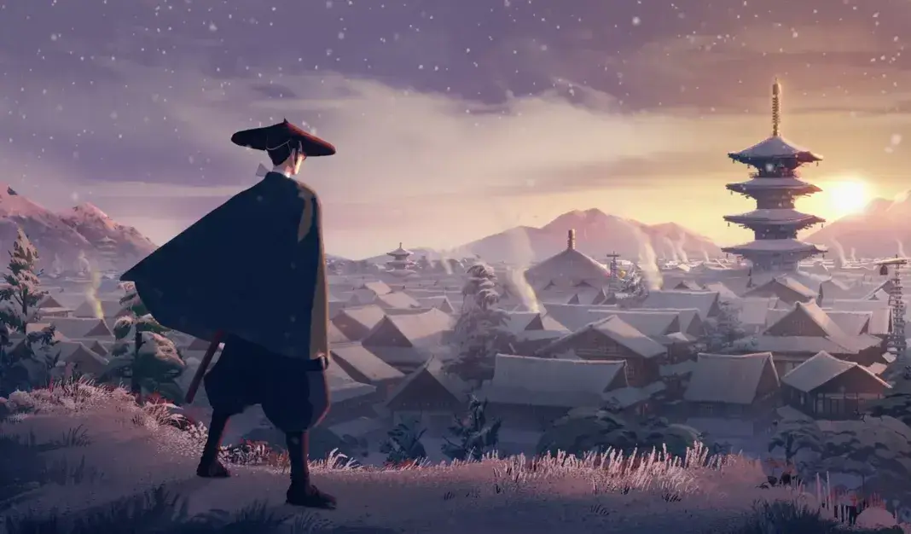
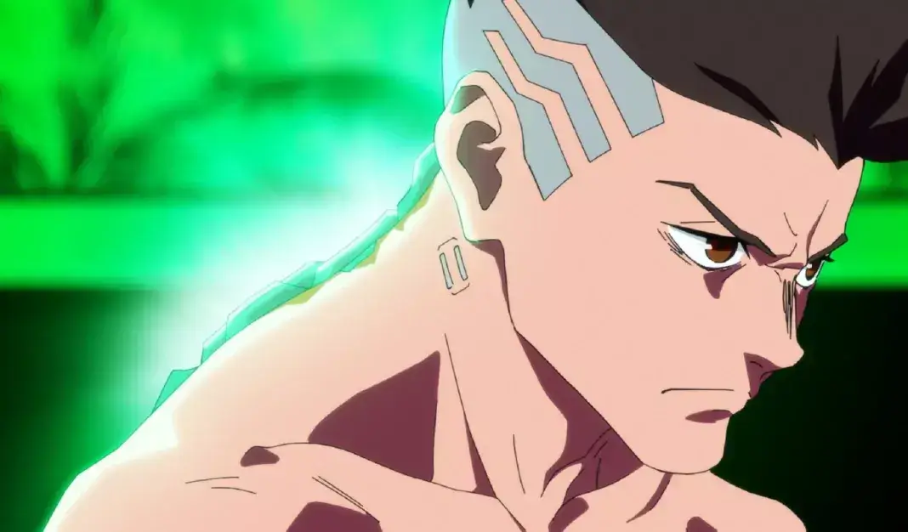
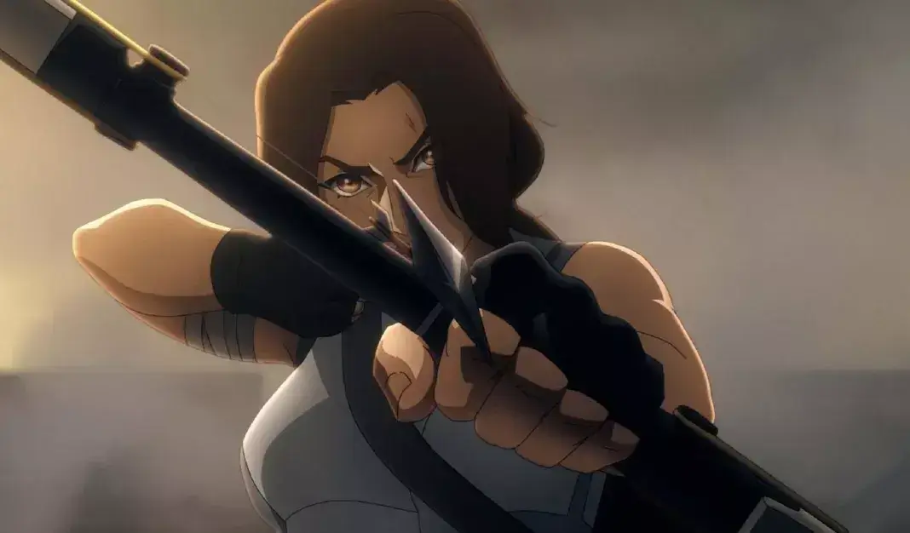
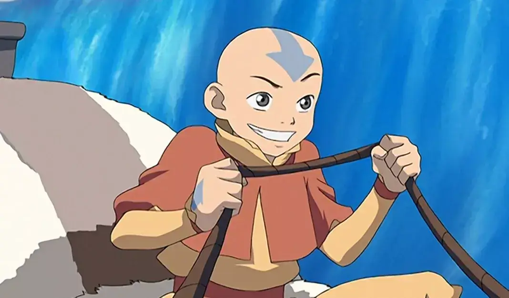
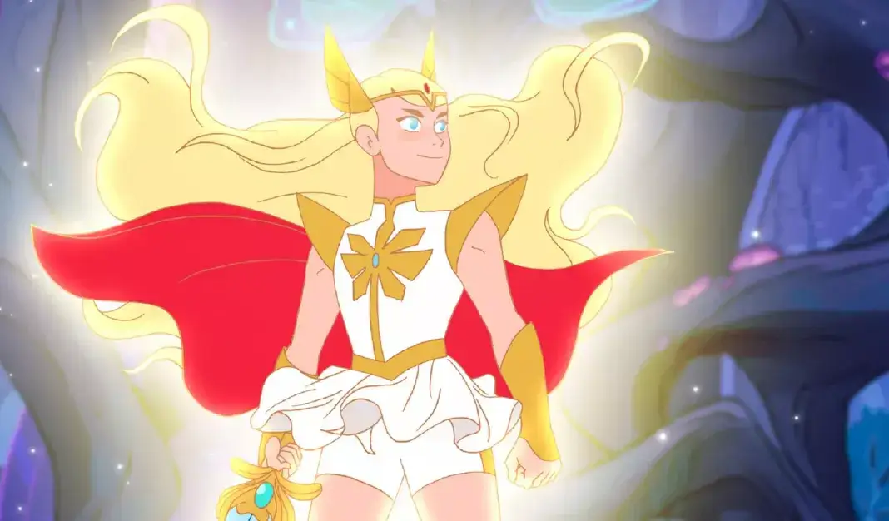

אתם שבורים מסיום הסדרה **Arcane** אחרי שתי עונות מדהימות? אל דאגה, יש לנו בדיוק את מה שיכול לנחם אתכם: **6 סדרות אנימציה דומות**, זמינות לצפייה ב-Netflix בישראל.

זהו, זה נגמר. הגיע הזמן להיפרד מ-Vi, Jinx, Caitlyn, Viktor, Jayce וכל הדמויות הפנטסטיות של Arcane. הסיום המרגש של הסדרה נחשף ב-Netflix ב-23 בנובמבר 2024, ואם אתם כבר מחפשים יצירות אנימציה נוספות שירפאו את ליבכם השבור אחרי שתי עונות יוצאות דופן, אנחנו כאן כדי לעזור.

הנה רשימה של **6 סדרות דומות ל-Arcane**, כולן זמינות לצפייה ב-Netflix בישראל.

## Blue Eye Samurai

דמויות נשיות עוצמתיות, מסע נקמה ואנימציה שפותחה על ידי סטודיו צרפתי… כדי להמשיך את החוויה אחרי **Arcane**, יש רק שם אחד: **Blue Eye Samurai**.

הסדרה, שיצאה בשנת 2023 בשקט יחסי, היא יצירת מופת של **Blue Spirit**, שלוקחת אותנו למסע בזמן ובמקום ליפן של תקופת אדו.

במרכזה נמצאת מיזו, לוחמת שמתחזה לגבר כדי להוציא לפועל את נקמתה בכל מחיר. כאן עוזבים את ה-Shimmer, ה-Hextech, והטכנולוגיות המתקדמות של Arcane, לטובת חזרה ליסודות של אומנויות לחימה מסורתיות.

מדובר ביצירה עוצמתית של 8 פרקים בלבד, ואנחנו כבר מחכים לעונה השנייה שהוזמנה על ידי Netflix.

https://www.youtube.com/watch?v=2rrRToCVm4I

## Cyberpunk: Edgerunners

אוהבים את העולם הסטימפאנקי הייחודי של **Arcane** ואת הסגנון הגרפי שמזכיר משחקי וידאו? אז כדאי לכם לבדוק את **[Cyberpunk: Edgerunners](https://techhorizons.co.il/cyberpunk-2077-mac-m4/)**, סדרה שמבוססת על משחק הווידאו המפורסם **Cyberpunk 2077**.

הסדרה, שיצאה בשנת 2022, עוקבת אחרי דיוויד מרטינז, נער צעיר מ-Night City שמתקבל לאקדמיה יוקרתית אך לא יכול להרשות לעצמו את העדכונים הטכנולוגיים הנחוצים. לאורך 10 פרקים, הוא נאלץ לשרוד בעולם האכזרי שבו הוא חי.

על אף שהעלילה סובלת לעיתים מקלישאות, האנימציה בסדרה היא פשוט מרהיבה. האיכות הגבוהה של הסדרה אפילו העניקה דחיפה משמעותית למשחק הווידאו עליו היא מבוססת.

ולמעריצים שבדרך: החדשות הטובות הן שבספטמבר 2024, **Netflix** הכריזה כי סיפור חדש ביקום של Cyberpunk נמצא בפיתוח וצפוי לצאת בעתיד הקרוב.

https://www.youtube.com/watch?v=x4ztgjvfU60

## Tomb Raider: La Légende de Lara Croft

מ-**Castlevania** ו-**The Witcher** ועד **Arcane**, Netflix ממשיכה להוביל את עולם עיבודי משחקי הווידאו לסדרות. אחת מהתוספות האחרונות בז'אנר הזה היא **Tomb Raider: La Légende de Lara Croft**, סדרת אנימציה חדשה שמחזירה את לארה קרופט האגדית להרפתקאותיה ברחבי העולם.

יותר מ-25 שנה לאחר מסעותיה הראשונים, לארה יוצאת שוב לגלות סודות עתיקים ולפתור תעלומות. אך כשחפץ מסוכן ועוצמתי נגנב, היא נאלצת להתמודד עם עברה.

הסדרה, המורכבת מ-8 פרקים מלאי אקשן, מהווה המשך עלילתי למשחק **Shadow of the Tomb Raider**, תוך שהיא מפתחת סגנון גרפי ייחודי משלה. פשוט, אבל מרשים ויעיל.

https://www.youtube.com/watch?v=Oe7CVCjgCzI&t=23s

## Avatar: The Last Airbender

כבר בעונתה הראשונה בשנת 2021, **Arcane** הפכה לאחת הסדרות הטובות ביותר ב-Netflix. אך ישנה סדרת אנימציה נוספת שיכולה להתחרות במעמד הזה: **Avatar: The Last Airbender**, סדרה אגדית שזכתה גם לעיבוד בלייב-אקשן בשנת 2024. כאן נתמקד ביצירה המקורית מ-2005, שכבשה את ילדותם של אלפי מעריצים.

הסדרה עוקבת אחרי אנג, נער צעיר שנועד להפוך לאווטאר ולהציל את העולם. כדי למלא את ייעודו, עליו ללמוד לשלוט בארבעת היסודות: מים, אדמה, אש ואוויר.

זו סדרה מופתית בת שלוש עונות בלבד, שמצליחה לרגש ולהסעי. אנחנו מבטיחים לכם שלא תתאכזבו.

https://www.youtube.com/watch?v=ooVvH2IYz0w

## Scott Pilgrim Takes Off

אוהבים את הקרבות הכוריאוגרפיים המושלמים של **Arcane**, אבל מחפשים סדרה קצת פחות מדכאת? **Scott Pilgrim Takes Off** היא הבחירה המושלמת עבורכם.

הסדרה מבוססת על הקומיקס של בריאן לי אומאלי ועל הסרט של אדגר רייט, שהפכו לקלאסיקות על-זמניות. היא עוקבת אחרי סקוט פילגרם, צעיר עם בגרות מוטלת בספק, שבשביל לזכות בליבה של רמונה פלאוורס, אהבת חייו, עליו להביס את שבעת האקסים המרושעים שלה.

בהשראת עולמות משחקי הווידאו ועם סיפור מפתיע, **Scott Pilgrim Takes Off** שואבת אותנו בקלות לעולם המשוגע והנוסטלגי שלה. למרות שהסדרה לא תחזור לעונה שנייה, אל דאגה: 8 הפרקים כוללים סיום מספק שיעשה לכם טוב על הלב.

https://www.youtube.com/watch?v=QKvNcDaoYpA

## She-Ra and the Princesses of Power

כדי לצאת מהאווירה האפלה והמטלטלת של **Arcane**, כדאי לנסות סדרה שמלאה בצבעים, דמויות קוויריות ואנרגיה חיובית: **She-Ra and the Princesses of Power**. הסדרה, שמוזכרת לעיתים קרובות כאחת מסדרות האנימציה הטובות של השנים האחרונות, פונה לקהל רחב בהרבה מאשר ילדים בלבד.

העלילה עוקבת אחרי אדורה וקטרה, חיילות של "ההורדה" שנחושות להציל את כוכבן מאיום קיומי. אך כאשר אדורה מגלה חרב קסומה, עולמה מתמוטט: היא מבינה שהיא בצד הלא נכון ובוחרת לערוק.

אנחנו ממליצים בחום לא לקרוא או לראות יותר מדי על הסדרה, ופשוט לצלול להרפתקה הייחודית הזו. עם מספר מרשים של דמויות להט"ביות, טרנסיות ונון-בינריות, הסדרה המורכבת מ-5 עונות היא מהפכה קטנה בפני עצמה.

**She-Ra** שופכת על הצופים גשם של קסם ושמחת חיים, והיא מושלמת כדי להתאושש מהסיום המטלטל של Arcane, עם נגיעה של קסם ופנאי מהנה.

https://www.youtube.com/watch?v=OuFQxsRzUws
