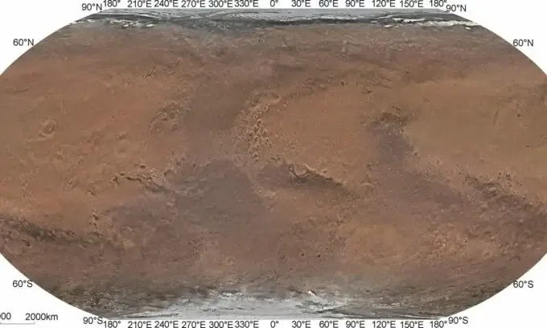

סין התמקדה בכוכב מאדים, והתוצאה מרשימה במיוחד. כל המישורים הנרחבים, כל מכתש, כל עמק וכל דיונה נחשפים על גבי המפה החדשה בחדות חסרת תקדים. זו המפה המדויקת והצבעונית ביותר שנוצרה עד כה. הישג קרטוגרפי זה פותח לרווחה את דלתות חקר מאדים בעתיד, ומספק לחוקרים ולחוקרי העתיד כלי שלא יסולא בפז.

## מ-Mariner 9 ועד Tianwen-1: התפתחות המיפוי של מאדים

נגמרו הימים של תמונות מטושטשות ואי דיוקים. המפה החדשה הזו, פרי עבודה מאומצת של צוות מדענים בהובלת הפרופסורים לי צ'ונלאי וז'אנג רונגקיאו, דוחקת את גבולות הדיוק עם רזולוציה מדהימה של 76 מטרים לפיקסל, ועולה בהרבה על כל הניסיונות הקודמים.

ההיסטוריה של מיפוי מאדים רוויה במשימות איקוניות. מהגשושיות Mariner ו-Viking ועד החלליות Mars Global Surveyor ו-Mars Reconnaissance Orbiter, כל משימה תרמה ליצירת התשתית. עם זאת, אף אחת לא השיגה את רמת הפירוט שהוצעה על ידי משימת Tianwen-1.

המשימה הסינית הזו, ששוגרה ביולי 2020, כוללת שישה רכיבים רובוטיים, כולל מקפת (Orbiter) שצילמה את התמונות ששימשו ליצירת המפה המהפכנית. במשך כמעט 1,300 ימי חקר, המקפת צברה אוצר של תמונות שכאשר הורכבו יחד, יצרו את המפה המרשימה שאתם יכולים לראות כאן.

© Science China Press

## דיוק שחוצה את גבולות הדמיון

הרזולוציה של המפה הזו, 76 מטרים לפיקסל, עשויה להישמע מופשטת, אך היא מייצגת קפיצה אדירה ביחס למפות קודמות. לשם השוואה, המפה הגלובלית המפורטת ביותר עד כה, שנוצרה ממשימת ויקינג, הציעה רזולוציה של "רק" 232 מטרים לפיקסל. ככל שהערך קטן יותר, כך הרזולוציה גבוהה יותר, מכיוון שכל פיקסל מכסה שטח קטן יותר והתמונה מפורטת יותר.

הצוות הסיני לא הסתפק רק בשיפור הרזולוציה הקרטוגרפית. באמצעות טכניקות מתקדמות לעיבוד תמונה והתאמת אלומות, הם הצליחו ליצור פסיפס גלובלי "ללא תפרים", שהקטין את הפערים בין התמונות לפחות מפיקסל אחד. כל תמונת לוויין של כוכב הלכת יושרה בקפידה עם התמונות האחרות, וכתוצאה מכך נוצרה תמונה אחידה של פני השטח של מאדים, ללא שיבושים נראים לעין בין התמונות השונות.

## דיוק שחוצה את גבולות הדמיון

מה שמייחד את המפה הזו ממפות קודמות הוא הדיוק הכרומטי שלה. על ידי שילוב הנתונים מהספקטרומטר המינרלוגי של מאדים עם טכניקות תיקון צבע, הצליחו החוקרים לשחזר את הגוונים האמיתיים של פני השטח של מאדים.

דיוק הצבעים הזה אינו רק משאלה אסתטית, אלא מהווה כלי חדש עבור מדענים לניתוח ההרכב הגיאולוגי של מאדים, ומאפשר הבנה מעמיקה יותר של ההיסטוריה והאבולוציה הגיאולוגית שלו.

השפעתה של המפה חורגת מתחום המחקר הטהור. היא עשויה למלא תפקיד מרכזי בתכנון משימות עתידיות למאדים, בין אם הן רובוטיות ובין אם הן מאוישות. כאשר נאס"א וסין שוקלות משימות מאוישות למאדים בעשורים הקרובים, המפה הזו עשויה להפוך לאטלס המוביל עבור חוקרי העתיד.

פרסום המפה מהווה אבן דרך משמעותית בגישתנו לחקר מאדים. היא מעידה לא רק על ההתקדמות הטכנולוגית המרשימה בתחום הדימות החללי, אלא גם על תפקידה הגדל של סין בחקר החלל. בעוד כמה עשורים, ייתכן מאוד שגיאולוגים בחליפות חלל יפסעו על אותם שטחים שאנחנו רואים היום על מסכינו, ויגעו בידיהם הממוגנות באבנים שאנחנו כרגע יכולים רק להתבונן בהן מרחוק. המפה הזו מקרבת אותנו יותר ויותר למציאות הזו.

- המפה החדשה של מאדים מציגה דיוק צבעים יוצא דופן, המאפשר למדענים לנתח את ההרכב הגיאולוגי של הכוכב באופן מדויק יותר.
- דיוק הצבעים והפרטים במפה עשוי לשמש כלי מרכזי לתכנון משימות עתידיות למאדים, כולל משימות רובוטיות ומאוישות.
- פרסום המפה מסמן התקדמות טכנולוגית מרשימה בתחום הדימות החללי ומדגיש את מעמדה ההולך וגדל של סין בתחום חקר החלל.
