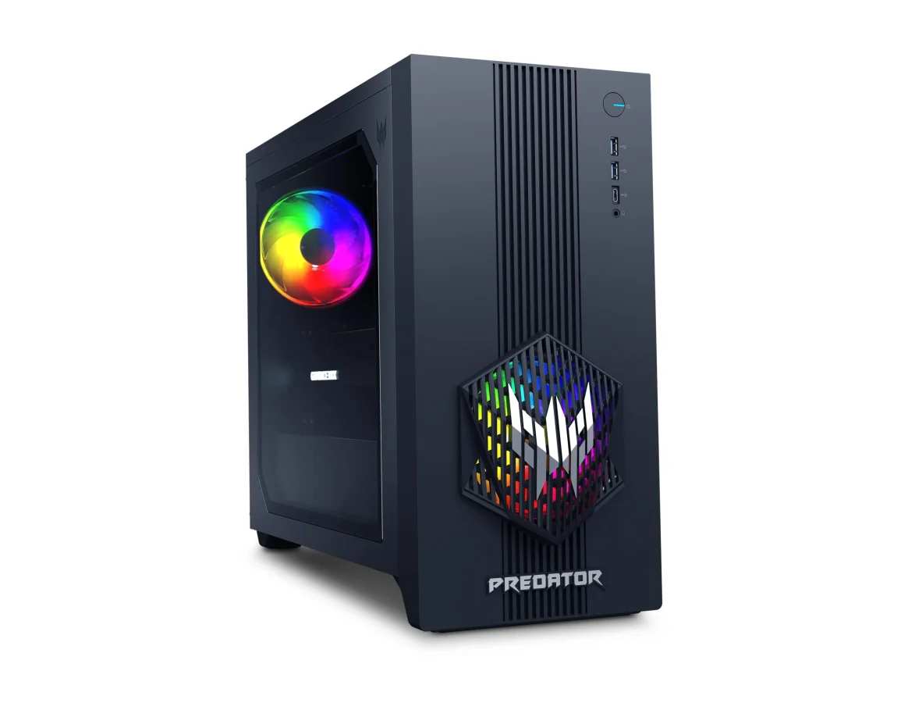
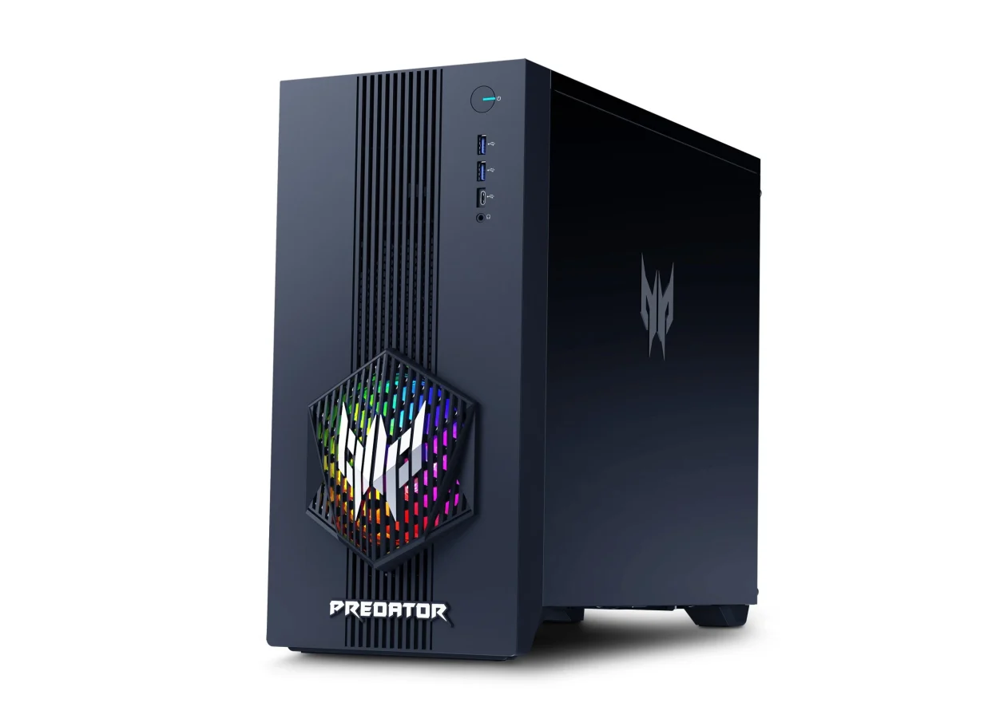

## **מה חדש ב-Predator ORION 3000?**

Acer הציגה את הדגם החדש בסדרת ORION – מחשב גיימינג קומפקטי אך רב עוצמה שנועד להציע חוויית משחק חלקה במיוחד.

- **מעבד:** Intel Core Ultra 7 265F – כולל 20 ליבות לביצועים עוצמתיים במשחקים ויישומים כבדים.
    
- **כרטיס מסך:** NVIDIA GeForce RTX 5070 עם 12GB VRAM, חלק מסדרת Blackwell החדשה של NVIDIA.
    
- **זיכרון RAM:** 8GB DDR5 במהירות 5600 MT/s, ניתן לשדרוג ל-16GB או 32GB.
    
- **אחסון:** SSD NVMe בנפח 2TB PCI-E 4.0, עם אפשרות להוספת כונן קשיח נוסף בנפח 2TB.
    

## **עיצוב קומפקטי עם זרימת אוויר משופרת**

ה-ORION 3000 מגיע במארז קומפקטי אך מרווח, עם חלון צדדי מזכוכית מחוסמת המאפשר לראות את הרכיבים הפנימיים.

- **מארז RGB:** תאורת RGB נרחבת דרך לוגו Predator ורשת קירור קדמית.
    
- **קירור:** שני מאווררי RGB בגודל 120mm, אחד בחזית ואחד מאחור, לשיפור זרימת האוויר.
    

 

## **חיבוריות מתקדמת**

למרות גודלו הקומפקטי, Predator ORION 3000 מציע מערך חיבורים מגוון:

- **קדמי:** USB Type-C Gen 2x2, 2x USB 3.2 Gen 2 Type A.
    
- **אחורי:** 4x USB 2.0, 2x USB 3.2, 1x LAN, 3x חיבורי אודיו.
    
- **אלחוטי:** WiFi 6E או WiFi 7 – תלוי בקונפיגורציה.
    

## **ספק כוח ושדרוגים עתידיים**

המחשב מופעל על ידי ספק כוח **850W** עם דירוג 80 Plus, המיועד להתמודד עם שדרוגים עתידיים.

- **אפשרויות הרחבה:** 2x M.2 SSD, PCI-E 3.0 x1, M.2 עבור WLAN.
    

## **מחיר וזמינות**

Acer Predator ORION 3000 יהיה זמין ביולי 2025 באזור EMEA במחיר של **€1,099 (כ-4,300 ש"ח)** לתצורה הבסיסית הכוללת 8GB RAM ו-2TB SSD.

באוסטרליה, המחשב יושק ברבעון השלישי במחיר של AUD 4,499 (כ-10,700 ש"ח).

האם זהו השדרוג שכל גיימר מחפש? נמשיך לעקוב ולעדכן בהתאם להתפתחויות.
