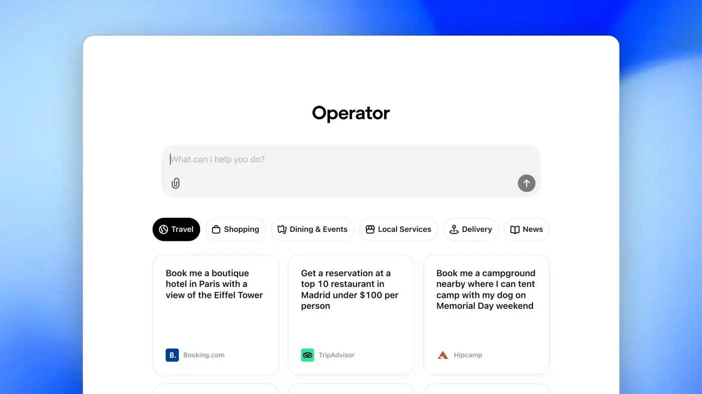
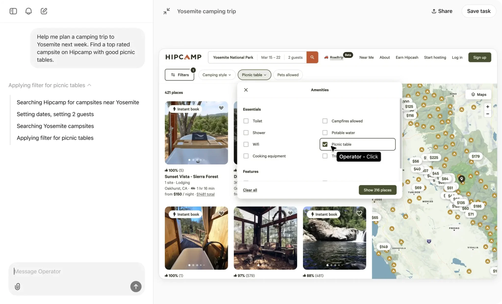
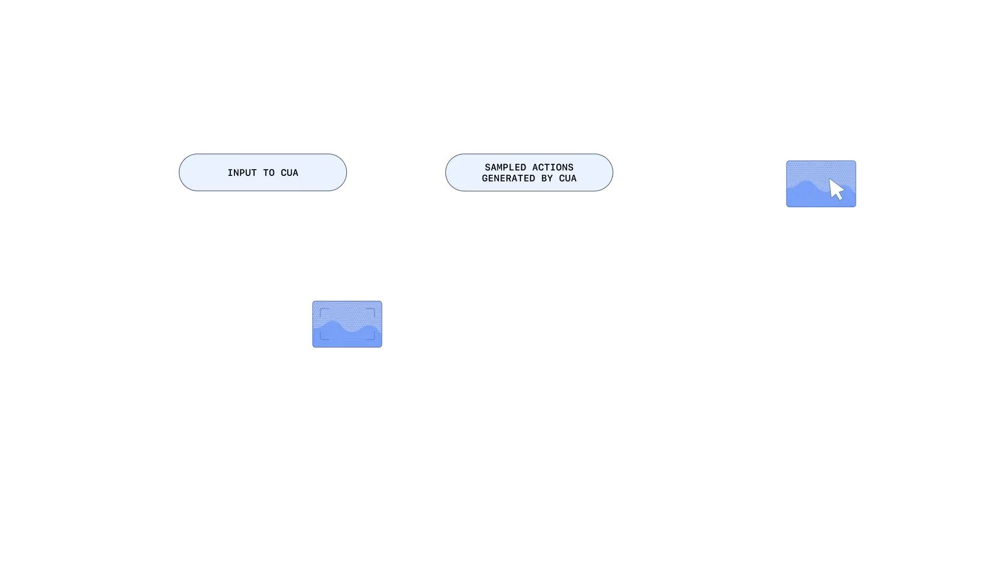

עם ההכרזה על **Operator**, OpenAI עושה צעד מהפכני ומעבירה את הבינה המלאכותית משלב של עוזרים פסיביים לסוכנים אוטונומיים. Operator הוא הסוכן הראשון של החברה שיכול לבצע משימות מורכבות על מחשב, בדיוק כמו משתמש אנושי.

## מה זה Operator?

Operator מבוסס על מודל חדשני בשם **Computer-Using Agent (CUA)**. המודל משלב את יכולות הראייה של **GPT-4o** עם יכולות חשיבה מתקדמות שנלמדו דרך **למידת חיזוק**. התוצאה? סוכן שיודע להבין ולעבוד עם ממשקים גרפיים כמו כפתורים, תפריטים ושדות טקסט, ולבצע פעולות בצורה עצמאית.

## מה Operator יכול לעשות?

- **ראייה חכמה**: הוא "רואה" את המסך דרך צילומי מסך.
- **אינטראקציה וניהול משימות**: הוא פועל כמו משתמש אנושי עם מקלדת ועכבר.
- **ביצוע פעולות יומיומיות**: החל מהזמנת מקום במסעדה ועד שליחת מיילים, היכולות שלו מרשימות.

בין הדוגמאות לשימושים:

- להזמין שולחנות דרך **OpenTable**.
- לבצע קניות אונליין דרך **Instacart**.
- לשלב קבצי PDF.
- לדחוס תמונות.
- לשלוח מיילים בצורה אוטומטית.

## מגבלות קיימות

חשוב לזכור ש-Operator עדיין נמצא בשלב מחקרי, והוא לא מושלם. לדוגמה, יש לו קושי עם ממשקים מורכבים כמו יצירת מצגות או ניהול לוחות שנה.

## איך Operator עובד בהשוואה ל-ChatGPT?

בעוד ש-ChatGPT מתמקד בתקשורת טקסטואלית ועוזר במתן תשובות לשאלות או יצירת תוכן, **Operator** לוקח את היכולות האלה צעד קדימה אל תחום הפעולה המעשית.

- **ראייה והבנה ויזואלית:**  
    Operator משתמש במודל **CUA** (Computer-Using Agent) כדי "לראות" את המסך דרך צילומי מסך. זה מאפשר לו לנתח ממשקי משתמש גרפיים (GUI) כמו כפתורים, תפריטים ושדות טקסט.
    
- **פעולה עצמאית:**  
    במקום להציע רק תשובות, Operator מבצע פעולות אקטיביות כמו מילוי טפסים, לחיצה על כפתורים ושימוש במקלדת ועכבר וירטואליים.
    
- **ביצוע משימות מורכבות:**  
    Operator מסוגל לפרק משימות גדולות לפעולות קטנות וברורות, מה שמאפשר לו להתנהל באופן אוטונומי גם בממשקים חדשים, ללא צורך באינטגרציות API ייעודיות.
    

בעוד ChatGPT מתאים בעיקר לתקשורת ולמידע, Operator נועד לפתור בעיות יומיומיות באמצעות פעולה ממשית, מה שהופך אותו לשותף טכנולוגי עם פוטנציאל עצום.

## זמינות ובטיחות

נכון לעכשיו, השירות זמין רק למנויי ChatGPT Pro בארה"ב, במחיר של **200 דולר לחודש**. בעתיד, OpenAI מתכננת להרחיב את הגישה למנויים בתוכניות Plus, Team ו-Enterprise.

כדי להבטיח שימוש בטוח, OpenAI שילבה כמה אמצעי הגנה:

- **התערבות משתמש**: בפעולות רגישות כמו הזנת פרטים אישיים או ביצוע תשלומים.
- **אישור מוקדם**: לפני שליחת מיילים או ביצוע פעולות משמעותיות אחרות.
- **דחיית בקשות מזיקות**: הוא מתוכנת לסרב לבקשות החורגות ממדיניות השימוש.

## 2025 נפתחת ב-200% עם AI

ההשקה של **Operator** ופרויקט **DIGITS** של NVIDIA מסמלים את המהפכה החדשה בעולם ה-AI. שתי הטכנולוגיות מקדמות סוכנים אוטונומיים שפועלים כמו משתמשים אנושיים, ומשנות את האופן שבו אנו מתקשרים עם מערכות דיגיטליות.

השאלה האם תיתכן שיתוף פעולה בין OpenAI ל-NVIDIA הופכת למרתקת. שילוב בין החומרה המתקדמת של NVIDIA למודלים החכמים של OpenAI עשוי להוביל לכלים פורצי דרך.

שנת 2025 כבר מציבה את ה-AI במרכז הבמה, עם פתרונות שמפשטים את חיינו. Operator ו-DIGITS הם רק ההתחלה למהפכה דיגיטלית חדשה.

- OpenAI חשפה את Operator, סוכן AI אוטונומי שמבצע משימות מורכבות כמו משתמש אנושי.
- Operator פועל על בסיס מודל חדשני (CUA) ויודע לנתח ממשקי GUI, למלא טפסים ולשלוח מיילים.
- שנת 2025 מתחילה עם דגש על אוטומציה ו-AI, כשפרויקטים כמו Operator ו-DIGITS מובילים את המהפכה.
