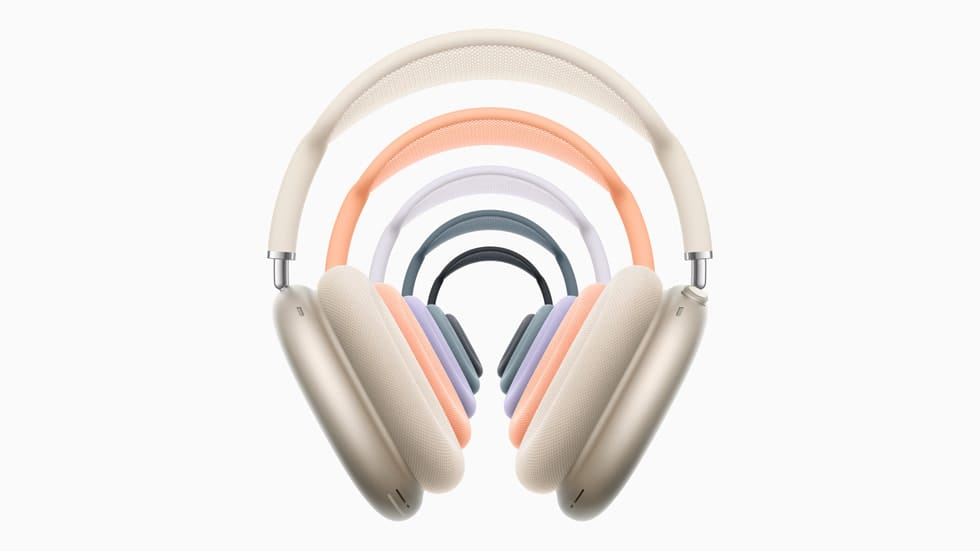

**אפל מפתיעה עם עדכון שהופך את האוזניות לפריט חובה לאודיופילים וגיימרים כאחד.**

בלי הכרזה מתוקשרת ובלי אירוע נוצץ, אפל מודיעה על עדכון תוכנה שיגיע באפריל עם iOS 18.4 ויביא שתי תכונות מרכזיות ל-AirPods Max בגרסת USB-C: **תמיכה באודיו Lossless** ו-**השיהיה אולטרה-נמוכה**.

## **אודיו Lossless אמיתי באוזניות של אפל**

אחרי שנים של ציפייה, AirPods Max USB-C יוכלו סוף־סוף להשמיע אודיו איכותי באמת – בפורמט 24bit ב-48kHz. המשמעות? **צליל מדויק, נקי ומפורט**, כפי שהאמן תכנן אותו באולפן.

גם אודיו מרחבי (Personalized Spatial Audio) יהנה מהשדרוג, עם חוויית שמיעה טבעית יותר ונטולת דחיסה. למשתמשי Apple Music מדובר בשדרוג של ממש – **יותר מ-100 מיליון שירים זמינים עכשיו באיכות Lossless מלאה.**

## **השהיה אולטרה-נמוכה לגיימרים וליוצרי תוכן**

העדכון החדש גם **מפחית משמעותית את זמן התגובה** של האוזניות, ברמה שתואמת את הרמקולים המובנים באייפון, אייפד ומק.

זה חדשות מצוינות לגיימרים, סטרימרים ויוצרי תוכן – **בלי דיליי בין התמונה לצליל**, המשחקים והשידורים הופכים להרבה יותר חלקים ואינטואיטיביים.

## **סוף־סוף: כבל חדש לחיבור עם שקע 3.5 מ״מ**

אפל משיקה כבל חדש – USB-C ל־3.5 מ"מ – במחיר של 39 דולר. הכבל הזה מאפשר **חיבור חוטי רגיל למקורות שמע מסורתיים** כמו פטיפון, מגבר או מחשב ישן.

זהו פיצ'ר שנעדר מהדגם הקודם של AirPods Max USB-C, ועכשיו סוף־סוף הופך לזמין – לטובת חובבי הסאונד האנלוגי.

## **איך לעדכן את ה-AirPods Max?**

העדכון מתבצע **באופן אוטומטי**, אבל כדאי לוודא שמתקיימים התנאים הנכונים:

1. חברו את ה-AirPods Max ל-iPhone או iPad.
    
2. ודאו שהאוזניות טעונות.
    
3. הניחו אותן בקרבת המכשיר המחובר ל-Wi-Fi.
    
4. התקינו את iOS 18.4 ברגע שהוא משתחרר (במהלך אפריל).
    

לא ניתן לכפות את העדכון ידנית, אבל כך תגדילו את הסיכוי שיתבצע מהר.  
לבדיקת גרסת הקושחה:

> **הגדרות > Bluetooth > AirPods Max > ⓘ > גרסה**

העדכון יגיע כחלק מ־iOS 18.4, iPadOS 18.4 ו-macOS Sequoia 15.4.

## **מה עם גרסת Lightning?**

שימו לב: **כל התכונות החדשות זמינות רק בגרסת USB-C של ה-AirPods Max.**  
אם יש לכם עדיין את גרסת ה-Lightning, זה אולי התירוץ שחיפשתם לשדרג.
