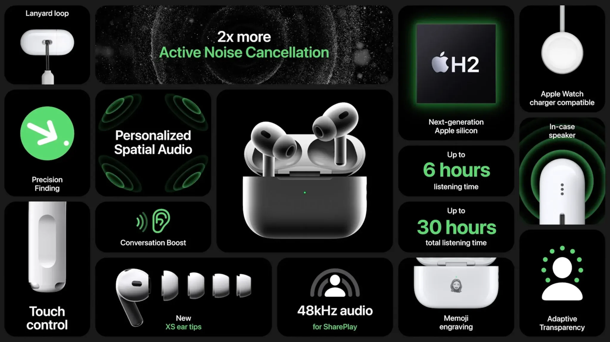
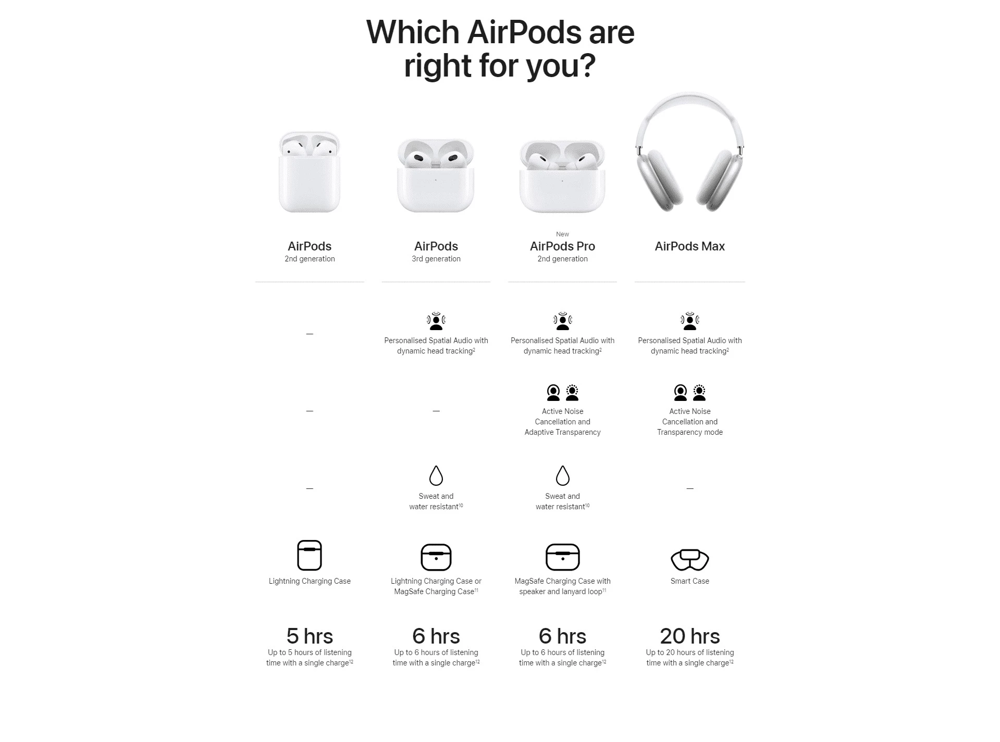
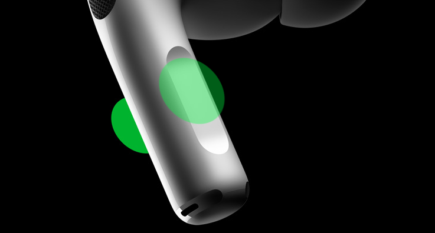
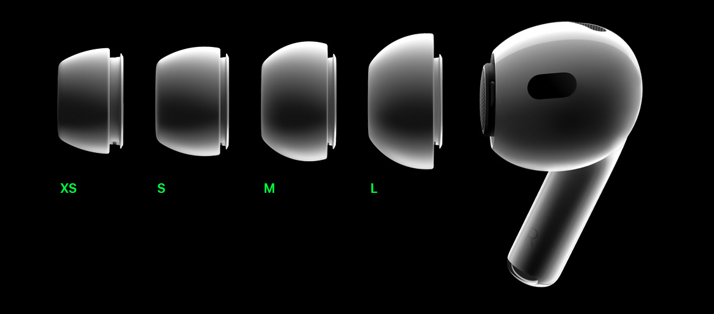
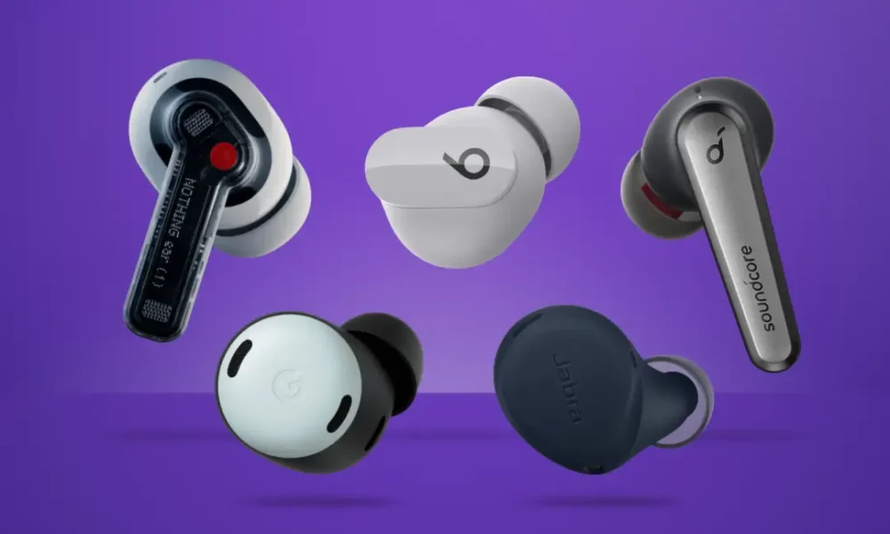

סוף השנה כבר כאן, ויחד איתו שפע של מבצעים שאסור לפספס – בלאק פריידי, סייבר מאנדיי ועוד. זו התקופה המושלמת למצוא את השדרוג שאתם צריכים, גם לעצמכם. אם אתם מחפשים איכות ונוחות, AirPods Pro 2 עשויים להיות בדיוק מה שאתם צריכים. עם שילוב של טכנולוגיה מתקדמת ועיצוב יוקרתי, הם מתאימים לכל אחד. המשיכו לקרוא וגלו למה כדאי לשים אותם בראש רשימת הקניות שלכם.

## למה זה הזמן המושלם לקנות?

נובמבר כאן, והוא מביא איתו את מבצעי השנה הגדולים ביותר. בלאק פריידי, סייבר מאנדיי וכל החודש שמכונה בלאק נובמבר הם הזדמנות שלא כדאי לפספס. בדיוק עכשיו, אחרי ההכרזה האחרונה של Apple, המחירים של AirPods Pro 2 מתחילים לרדת. זו הזדמנות נהדרת לשדרג את חוויית השמע שלכם במחיר משתלם במיוחד.

### **מה המחיר של AirPods Pro 2 בישראל כרגע?**

#### **המחירים ב-Zap**

באתר [Zap](https://www.zap.co.il/model.aspx?modelid=1208514&srsltid=afmboopl5fit4wiyazysmyaq_e5rffhuthy53rclmteu5v1qk6t3hy5j) המחירים של AirPods Pro 2 נעים בין 850 ל-1,000 ש״ח. עם זאת, כדאי לשים לב שמוצרים שמופיעים כזולים יותר עשויים לכלול עלויות משלוח נוספות, שיכולות להקפיץ את המחיר הסופי.

## מה מיוחד ב-AirPods Pro 2?

 אוזניות AirPods Pro 2 מבית Apple הן דגם מתקדם שמביא חוויית שמע חדשה. מדובר בשדרוג משמעותי לעומת הדגמים הקודמים – הן לעומת AirPods Pro הראשונות והן בהשוואה לאוזניות AirPods הרגילות.

### **מפרט טכני מפורט**

מפרט טכני מפורט
| **תכונה** | **פרטים** |
| --- | --- |
| **שבב** | H2 החדש של Apple, לשיפור ביטול רעשים ואיכות שמע |
| **ביטול רעשים אקטיבי** | חזק פי 2 לעומת הדגם הקודם, עם מצב "שקיפות" אדפטיבי |
| **שמע מרחבי** | מותאם אישית לפי מבנה האוזן, כולל מעקב דינמי אחרי תנועות הראש |
| **סוללה** | עד 6 שעות שימוש באוזניות בלבד, ועד 30 שעות עם הקייס |
| **טעינה** | חיבור USB-C ותמיכה בטעינה אלחוטית MagSafe ו-Qi |
| **חיישנים** | זיהוי עור, זיהוי מיקום, חיישני מגע לשליטה ישירה על עוצמת שמע ושיחות |
| **תקשורת** | Bluetooth 5.3 לחיבור יציב ומהיר |
| **עמידות במים וזיעה** | דירוג IPX4 לאוזניות ולנרתיק הטעינה, מתאים לפעילות ספורטיבית |
| **מתאמים לאוזן** | ארבעה גדלים של מתאמי סיליקון לנוחות מירבית |
| **שליטה במגע** | שליטה על ווליום, שיחות והפעלה ישירה מהממשק שעל האוזניות |

### **מה ההבדל בין AirPods Pro 2 לדגמים הקודמים?**

- **ביטול רעשים משופר**: האוזניות מציעות ביטול רעשים אקטיבי פי שניים מדגם ה-Pro הקודם.
- **סוללה חזקה יותר**: האוזניות מחזיקות עד 6 שעות שימוש, והקייס מספק 30 שעות נוספות.
- **שמע מותאם אישית**: טכנולוגיית שמע מרחבי שמביאה חוויית האזנה ייחודית.
- **עיצוב ונוחות**: מתאמים משופרים וממשק מגע לשליטה קלה.

### **למה דווקא AirPods Pro 2?**

האוזניות האלו הן לא רק שדרוג טכנולוגי אלא גם פתרון אידיאלי למי שמחפש שילוב של איכות ונוחות. הן מתאימות למשתמשים יומיומיים, לחובבי מוזיקה ולמי שצריך פתרון פרקטי ואמין לניהול שיחות. אם אתם מחפשים חוויית שמע מתקדמת – אלו האוזניות עבורכם.

## למה AirPods Pro 2 כל כך פרקטיות?

אוזניות AirPods Pro 2 עוצבו כדי לשדרג את חיי היומיום שלכם ולהתאים לכל סיטואציה. בין אם אתם בבית, בעבודה, באימון או בדרכים, הן מציעות פתרונות חכמים ונוחים במיוחד.

### **התאמה לסביבות משתנות**

ביטול הרעשים האקטיבי החזק פי שניים מאפשר לכם להתמקד במוזיקה או בשיחה גם בסביבות רועשות, כמו תחבורה ציבורית או משרד עמוס. במקביל, מצב השקיפות האדפטיבי מבטיח שתוכלו לשמוע את הסביבה מתי שצריך, בלי לוותר על חוויית השמע.

### **שליטה נוחה**

AirPods Pro 2 כוללות ממשק מגע מתקדם שמאפשר לשלוט על הווליום, המוזיקה והשיחות בקלות. ניתן להפעיל או להשתיק מוזיקה, לשנות את העוצמה או לענות לשיחה – הכל במגע אחד בלבד.

### **נוחות לכל משתמש**

האוזניות מגיעות עם ארבעה גדלים שונים של מתאמי סיליקון, כדי להתאים לכל מבנה אוזן. זה מבטיח לא רק נוחות מרבית, אלא גם אטימה מעולה שמשפרת את איכות השמע וביטול הרעשים. בנוסף, משקלן הקל והעיצוב המינימליסטי הופכים אותן לאידיאליות גם לשימוש ממושך.

### **סוללה חזקה**

הסוללה של AirPods Pro 2 עמידה לאורך יום שלם, עם עד 6 שעות באוזניות ו-30 שעות נוספות בעזרת הקייס. זה אומר שאתם יכולים לסמוך עליהן גם ביום עמוס של עבודה, אימונים או טיולים.

## למי AirPods Pro 2 מתאימות?

**אוזניות AirPods Pro 2 מתאימות למגוון רחב של משתמשים, בזכות העיצוב הרב-תכליתי והטכנולוגיה המתקדמת שלהן. הן אידיאליות לשימוש יומיומי, ספורטיבי או מקצועי, ומציעות חוויה איכותית לכל צורך.**

**משתמשי Apple** ייהנו מחיבור מהיר ואינטגרציה מלאה עם iPhone, iPad ו-Mac. האוזניות תומכות בתכונות מתקדמות כמו שמע מרחבי מותאם אישית ועובדות בצורה חלקה בתוך מערכת Apple.

**משתמשי Android** יכולים גם ליהנות מהאוזניות הודות לחיבור Bluetooth 5.3 היציב. עם זאת, תכונות כמו שמע מרחבי מותאם וזיהוי מיקום יעבדו בצורה חלקית מחוץ למערכת Apple.

**חובבי ספורט** ימצאו באוזניות פתרון מושלם בזכות דירוג IPX4 לעמידות במים וזיעה. הן נוחות לשימוש ממושך, יושבות בצורה יציבה באוזן ומתאימות לפעילות גופנית אינטנסיבית כמו ריצה או חדר כושר.

**למי שחשוב לו איכות שמע**, האוזניות מציעות חוויית שמע מתקדמת המשלבת ביטול רעשים אקטיבי חזק עם שמע מרחבי מותאם אישית. זה הופך אותן לבחירה המושלמת למי שמעריך דיוק ואיכות במוזיקה או פודקאסטים.

## מה האלטרנטיבות ל-AirPods Pro 2?

**אם אתם מחפשים אוזניות אלחוטיות מתקדמות, אך ה-AirPods Pro 2 אינן הבחירה המועדפת עליכם, קיימות אפשרויות נוספות שמתאימות לצרכים מגוונים.**

**Sony WF-1000XM5**  
אוזניות הדגל של Sony מציעות ביטול רעשים אקטיבי מהמובילים בשוק, איכות שמע מרשימה ועיצוב נוח. הן מגיעות עם סוללה שמספקת עד 24 שעות שימוש (כולל הקייס) ותומכות בקודקי שמע מתקדמים כמו LDAC, מה שמבטיח איכות שמע גבוהה במיוחד.

**Bose QuietComfort Earbuds II**  
Bose ידועה ביכולות ביטול הרעשים המתקדמות שלה, והדגם הזה לא מאכזב. האוזניות מציעות חוויית שמע מצוינת ונוחות מרשימה לשימוש ממושך. הן מתאימות למשתמשים שמחפשים איזון בין איכות שמע לביטול רעשים.

**Samsung Galaxy Buds 2 Pro**  
משתמשי Android, ובמיוחד בעלי מכשירי Samsung, יכולים לשקול את הדגם הזה. האוזניות מציעות חיבור מהיר ואיכות שמע גבוהה, כולל תמיכה בקודקים כמו Samsung Seamless Codec לאיכות ללא פשרות.

**Jabra Elite 7 Pro**  
אוזניות אלו מתאימות במיוחד לאנשי מקצוע ולמי שזקוקות לאוזניות לשיחות טלפון באיכות גבוהה. הן עמידות מאוד, עם דירוג IP57 לעמידות במים ואבק, וסוללה שמחזיקה עד 8 שעות בשימוש ישיר.

**למה לבחור באלטרנטיבות?**  
האלטרנטיבות עשויות להתאים למי שמחפש תכונות ייחודיות שלא קיימות ב-AirPods Pro 2, כמו קודקים ייעודיים, עמידות גבוהה יותר בתנאי שטח או מחיר משתלם יותר.

## סיכום

AirPods Pro 2 מציעות שילוב מרשים של טכנולוגיה מתקדמת ונוחות יומיומית. עם סוללה חזקה, ביטול רעשים מתקדם והתאמה אישית לכל משתמש, הן מתאימות לשימושים מגוונים כמו עבודה, פעילות ספורטיבית והאזנה איכותית למוזיקה או פודקאסטים.

תקופת סוף השנה, יחד עם המבצעים הרבים שמוצעים עכשיו, הופכת אותן לאוזניות שראוי לשים לב אליהן. אם אתם מחפשים מתנה או רוצים לשפר את חוויית השמע שלכם, AirPods Pro 2 הן בחירה שראוי לשקול.

- תקופת המבצעים של סוף השנה, כולל בלאק פריידי וסייבר מאנדיי, מציעה הזדמנות לקנות את AirPods Pro 2 במחירים אטרקטיביים.
- ביצועים מתקדמים עם שבב H2, ביטול רעשים אקטיבי חזק פי שניים, שמע מרחבי מותאם אישית וסוללה שמחזיקה עד 30 שעות.
- האוזניות מתאימות למשתמשי Apple ו-Android, לחובבי ספורט ולמי שמעריך איכות שמע גבוהה ונוחות בשימוש יומיומי.
