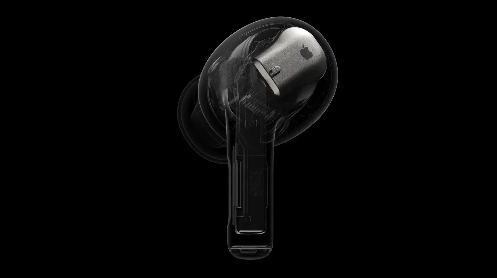
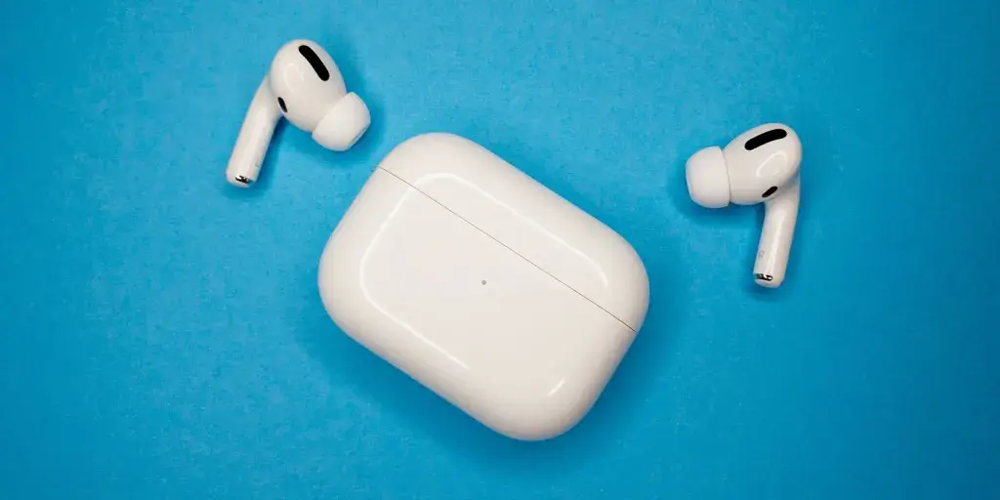
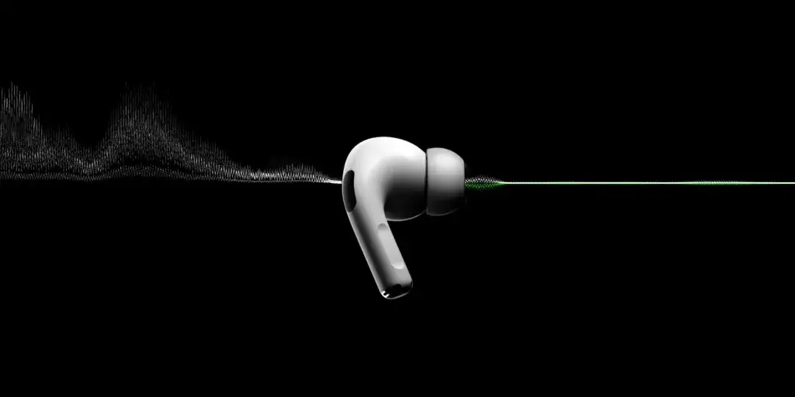
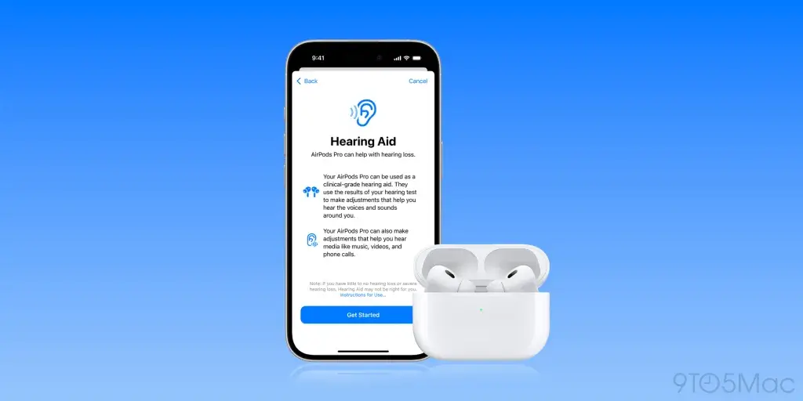

אחרי שלוש שנים מאז השקת AirPods Pro 2, Apple מתכננת להביא את הדור הבא – AirPods Pro 3 – בספטמבר הקרוב לצד סדרת iPhone 17. עם שבב חדש, עיצוב מעודכן ושיפורים טכנולוגיים, הנה כל מה שאנחנו יודעים על האוזניות המצופות הללו.

## שבב H3 חדש ומתקדם

AirPods Pro 3 יצוידו בשבב H3 חדש, שמגיע שלוש שנים לאחר הצגת שבב ה-[H2](https://www.apple.com/newsroom/2022/09/apple-announces-the-next-generation-of-airpods-pro/).

- **מה צפוי בשבב החדש?**
    - ביטול רעשים מתקדם, עד פי שניים יעיל יותר מהדור הקודם.
    - שדרוג איכות הסאונד: בס עשיר יותר, צלילים נקיים וטווח תדרים רחב יותר.
    - עיבוד נתונים מהיר יותר שמאפשר תכונות כמו Adaptive Transparency להפחתת רעשי סביבה חזקים.
    - יעילות אנרגטית משופרת שעשויה להאריך את חיי הסוללה.

## עיצוב חדש ומעודכן

על פי מארק גורמן מ-[Bloomberg](https://www.bloomberg.com/news/articles/2023-10-25/apple-airpods-plans-4th-generation-low-end-3rd-generation-pro-and-usb-c-max), AirPods Pro 3 יקבלו עיצוב רענן:

- **לא צפויים שינויים דרמטיים:** עיצוב ה-AirPods Pro הפך לפופולרי, ולכן Apple תתמקד בשיפורים קטנים.
    - ייתכן שינוי בגודל הזרוע ובצורת ההתאמה לאוזן לנוחות משופרת.
    - העיצוב החדש עשוי להיות בהשראת AirPods 4, שגם הם עברו עדכון לאחרונה.

## ביטול רעשים משופר עם ANC מתקדם

אחת התכונות הבולטות של AirPods Pro 2 הייתה ביטול הרעשים הפעיל (ANC).

- **ב-AirPods Pro 3:** ביטול רעשים חזק יותר, המופעל על ידי יכולות השבב H3.
- Apple ממשיכה לשפר את יכולות הביטול, והדור החדש מבטיח חוויה שקטה יותר בכל סביבה.

## תכונות בריאות חדשות: מדידת דופק ועוד

Apple שוקלת לשלב תכונות בריאות מתקדמות באוזניות:

- **מדידת דופק:** בדומה לשעון Apple Watch, תכונה זו עשויה להיכלל ב-AirPods Pro 3.
- **חיישנים נוספים:** תכונות נוספות עשויות לכלול מדידת טמפרטורה וחיישנים פיזיולוגיים מתקדמים.
- **אתגרים רגולטוריים:** חלק מהתכונות עשויות להתעכב בשל דרישות רגולציה מחמירות.

כדאי לציין כי Apple כבר שילבה תכונות בריאות ב-AirPods Pro 2, כמו מבחן השמיעה, שנסקר בעבר אצלנו בבלוג. ([למעבר למאמר הקודם על מבחן השמיעה](https://techhorizons.co.il/airpods-pro-2-hearing-test/)). תכונות אלה מצביעות על המגמה הברורה של החברה להפוך את האוזניות שלה לכלי בריאותי מתקדם.

## סיכום:

AirPods Pro 3 מביאות איתן שדרוגים משמעותיים בעולמות הסאונד, העיצוב והבריאות. עם שבב H3 חדש, עיצוב משופר ותכונות מתקדמות, 2025 מסתמנת כשנה מרגשת עבור משתמשי Apple. נותר רק לחכות לספטמבר ולראות כיצד האוזניות החדשות עומדות בציפיות הגבוהות.
