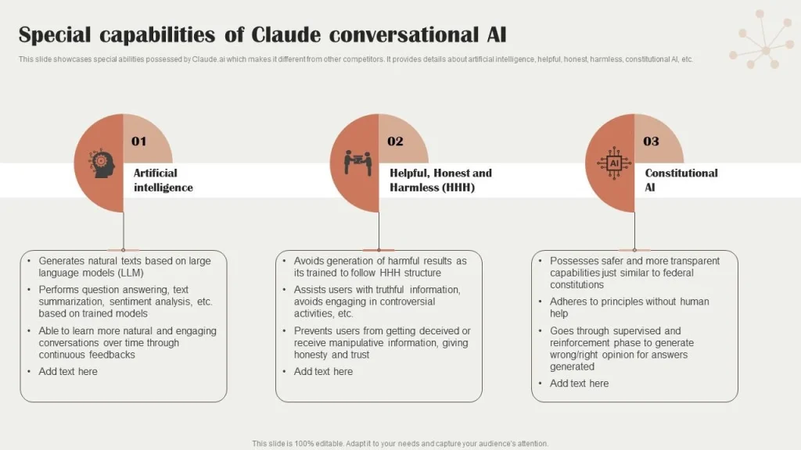

אמזון הכריזה על עדכון משמעותי לשירות שלה. מעכשיו, **Claude, הבינה המלאכותית של Anthropic, תהיה המנוע החדש מאחורי העוזרת הקולית**. המהלך הזה מבטיח **שיחות זורמות יותר, הבנת שפה טובה יותר והתאמה אישית חכמה יותר**.

אבל האם זה באמת שינוי פורץ דרך, או פשוט דרך חדשה להפוך את השירות למנוי בתשלום?

## **למה אמזון בחרה דווקא ב-Claude?**

בעשור האחרון, עוזרים קוליים התחילו להראות סימני חולשה. מול קפיצת המדרגה של הבינה המלאכותית הגנרטיבית, הפתרונות המסורתיים הפכו לפחות רלוונטיים – עם הבנה שטחית של פקודות ומגבלות בשימור מידע לאורך זמן.

במקום לפתח מודל חדש מאפס, **אמזון שילבה את Claude**, הנחשב לאחד מהמודלים המתקדמים ביותר כיום.

למה דווקא הוא?

- **הבנת שפה טבעית ועמוקה**, שמאפשרת ניהול שיחות מדויק יותר.
- **שמירה על הקשר בשיחה**, כך שלא תצטרכו לחזור על מידע שכבר נאמר.
- **רמת בטיחות גבוהה יותר**, עם סינון משופר למניעת שגיאות ומידע שגוי.

המטרה של אמזון ברורה: **להפוך את השירות לכלי אינטראקטיבי וחכם יותר**.

## **מה ישתפר ב-Alexa+ עם Claude?**

Alexa+ לא תהיה סתם גרסה מעודכנת, אלא שדרוג משמעותי.

| **תכונה** | **Alexa הישנה** | **Alexa+ עם Claude** |
| --- | --- | --- |
| **מהירות תגובה** | לפעמים איטית ולא מדויקת | תגובות מהירות ומותאמות להקשר |
| **ניהול שיחה** | לעיתים קרובות מאבדת את ההקשר | שיחה רציפה וחכמה יותר |
| **משימות מורכבות** | דורש פקודות פשוטות | יכול לבצע כמה פעולות באותה בקשה |
| **התאמה אישית** | בסיסית מאוד | זוכר העדפות אישיות ומציע המלצות |
| **אבטחה וסינון מידע** | עלול לספק תשובות לא מדויקות | מערכת מסננת תכנים בעייתיים |

השינוי הגדול הוא בכך ש-Alexa+ תוכל **לנהל שיחות אמיתיות**, להבין הקשרים ולבצע משימות מורכבות, כמו הזמנת משלוח או תכנון לו"ז יומי – והכול בפעולה אחת.

## **Claude מול ChatGPT ו-Gemini: מי יותר טוב?**

כיום, בשוק ה-AI יש כמה מתחרים חזקים, וכל אחד מהם מתמחה במשהו אחר.

| **השוואה** | **Claude (Anthropic)** | **GPT-4.5 (OpenAI)** | **Gemini (Google)** |
| --- | --- | --- | --- |
| **הבנת שפה** | אחת הטובות ביותר, מדויקת וטבעית | חזקה, אך לפעמים מייצרת תשובות לא רלוונטיות | טובה מאוד, אך עם ביקורת על סינון יתר |
| **ניהול שיחות** | שומר על הקשר לאורך זמן | טוב, אך לעיתים שוכח מידע קודם | משתפר, אך לא תמיד עקבי |
| **התאמה אישית** | זוכר מידע והעדפות | ניתן לכוון, אך לא תמיד מדויק | מותאם אישית דרך מערכת Google |
| **אבטחה ופילטרים** | מסנן מידע מסוכן ומצמצם טעויות | מסנן חלק מהתכנים, אך לא תמיד ביעילות | נוטה לצנזר מידע מעבר לנדרש |

**Claude נחשב טוב במיוחד בשמירה על רצף שיחה ובהבנת שפה טבעית**, ולכן הוא מתאים מאוד לשדרוג Alexa. לעומת זאת, **GPT-4.5 חזק יותר ביצירת תוכן** ו-Gemini מצטיין במולטימדיה.

## **Alexa+ הופכת לשירות בתשלום – מה זה אומר?**

אמזון מחלקת את Alexa+ לשתי רמות:

- **גרסת חינם – Alexa Classique**: תישאר עם היכולות הבסיסיות של Alexa הנוכחית.
- **גרסת מנוי – Alexa+ Remarquable**: בינה מלאכותית מתקדמת, שיחה טבעית יותר והתאמה אישית, במחיר של **₪20-₪40 לחודש ($5-$10)**.

זה מהלך מעניין, שמזכיר את **Google Gemini Advanced (₪75/חודש, $20)** ואת **ChatGPT Pro (₪750/חודש, $200)**.

אבל האם המשתמשים יסכימו לשלם? הרבה אנשים התרגלו להשתמש ב-Alexa בחינם, כך שהשאלה הגדולה היא **האם השדרוג מצדיק את התשלום**.

## **שורה תחתונה: מה מצפה למשתמשי Alexa?**

המעבר ל-Claude הופך את Alexa+ לחכמה יותר, מהירה יותר ואינטראקטיבית יותר. היא תוכל **להבין בקשות מורכבות, לזכור העדפות ולתת המלצות חכמות**.

אבל… המודל החדש של המנוי עלול להקשות על חלק מהמשתמשים. מי שרוצה ליהנות מכל היתרונות יצטרך **לשלם דמי מנוי חודשיים**, מה שלא היה קיים בעבר.

השינוי הזה מראה ש-Amazon מתקדמת לכיוון חדש – **Alexa+ הופכת לשירות פרימיום**, ולא רק עוזרת קולית בסיסית. השאלה היא **האם המשתמשים יהיו מוכנים לשלם, או שיחפשו חלופות אחרות**.
