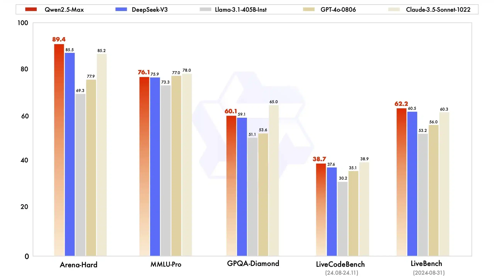

לפי דיווחים ממקורות שונים, עליבאבא חשפה את **Qwen2.5-Max**, מודל בינה מלאכותית חדש שלטענתה עולה בביצועיו על מערכות מתחרות כמו **DeepSeek-V3**, **GPT-4** של OpenAI ו-**Llama** של Meta במבחני ביצועים שונים. בכך, החברה מחריפה את התחרות בתחום הבינה המלאכותית, שמתפתח במהירות.

## ביצועי שיא של Qwen2.5-Max

**Qwen2.5-Max**, שאומן על יותר מ-20,000 מיליארד טוקנים, הציג ביצועים מרשימים במבחני ביצועים מרכזיים. המודל השיג **89.4** ב-**Arena-Hard**, ועקף את **DeepSeek-V3** שקיבל **85.5**. בנוסף, הוא קיבל **62.2** ב-**LiveBench**, מעל **60.5** של **DeepSeek12**.

במבחן **MMLU-Pro**, Qwen2.5-Max השיג **76.1**, מעט מתחת ל-**78.0** של **Claude Sonnet34**. תוצאות אלו מדגישות את היתרון התחרותי של המודל בטיפול במשימות מורכבות ואת הפוטנציאל שלו לאתגר שחקנים מבוססים בעולם הבינה המלאכותית.

## אפשרויות גישה ל-Qwen2.5-Max

Alibaba הפכה את **Qwen2.5-Max** לזמין במספר פלטפורמות, כדי לענות על הצרכים של מפתחים ומשתמשים.

🔹 **למפתחים** – המודל נגיש דרך **Model Studio** של **Alibaba Cloud**, עם API תואם ל-**OpenAI** שמשתלב בקלות במערכות קיימות.

🔹 **למשתמשים** – ניתן לתקשר עם **Qwen2.5-Max** דרך **Qwen Chat**, ממשק שיחה המדגים את יכולות המודל.

### **איך להתחיל?**

✅ הירשמו לחשבון **Alibaba Cloud** והפעילו את **Model Studio**  
✅ צרו **מפתח API** לאימות  
✅ השתמשו בכתובת הבסיס שסופקה ובשם המודל **"qwen-max-2025-01-25"** בבקשות API  
✅ בדקו את הביצועים בעזרת כלים כמו **Apidog** לפיתוח ודיבאג יעיל

הגישה הרב-פלטפורמית הזו ממחישה את המחויבות של **Alibaba** להפצת טכנולוגיית הבינה המלאכותית שלה, ומאפשרת למשתמשים לחקור את יכולות **Qwen2.5-Max** בהסקת מסקנות ותמיכה בשיחות מרובות שלבים.

## השפעת Qwen2.5-Max על שוק הבינה המלאכותית

השקת **Qwen2.5-Max** יצרה סערה בתעשיית הבינה המלאכותית, במיוחד בשוק הסיני. ההחלטה האסטרטגית של **Alibaba** לחשוף את המודל במהלך חגיגות השנה הסינית החדשה מדגישה את הגישה האגרסיבית של החברה במירוץ לעליונות ב-AI, תוך הצבת אתגר ישיר להצלחתו של **DeepSeek12**. מהלך זה החריף את התחרות המקומית, כאשר **Alibaba** מתבססת כמתחרה משמעותית מול ענקיות טכנולוגיה מבוססות וחברות סטארט-אפ חדשניות בתחום הבינה המלאכותית.

ההשפעה חורגת מעבר לשוק הסיני – העליונות הנטענת של **Qwen2.5-Max** מול מודלים בינלאומיים כמו **GPT-4o** של **OpenAI** והפתרונות של **Meta** מעידה על שאיפותיה הגלובליות של **Alibaba** להתחרות בחזית הבינה המלאכותית.

התפתחות זו עשויה לשנות את מאזן הכוחות בתחום, להשפיע על אמון המשקיעים, ולעודד השקעות נוספות במחקר ופיתוח. ככל שהתחרות מתעצמת, הביצועים המרשימים של **Qwen2.5-Max** עשויים לדחוף חברות אחרות להאיץ את מאמצי החדשנות שלהן – מהלך שעתיד להוביל לפריצות דרך נוספות לטובת המשתמשים.

## המפרט הטכני של Qwen2.5-Max

בהתבסס על מסגרות AI מתקדמות, **Qwen2.5-Max** עושה שימוש בארכיטקטורת **Mixture-of-Experts** לניהול יעיל של משימות רחבות היקף. פיתוח המודל משלב **למידה מפוקחת** וטכניקות של **למידת חיזוק עם משוב אנושי (RLHF)**, מה שמשפר את יכולותיו בהסקת מסקנות.

כחלק ממשפחת **Qwen2.5**, המודל הזה הוא המתקדם ביותר בסדרה, העומד בראש קו מוצרים הכולל גרסאות עם **מ-3 מיליארד ועד 72 מיליארד פרמטרים**. היצע רחב זה מאפשר פתרונות גמישים וניתנים להתאמה עבור מגוון יישומי בינה מלאכותית.

## סיכום

השקת **Qwen2.5-Max** מחזקת את מעמדה של **Alibaba** כשחקנית מרכזית בתחום הבינה המלאכותית, עם יכולות שעשויות להשפיע על השוק הגלובלי.

**ומה לגבי ישראל?** עם האימוץ הגובר של פתרונות AI מתקדמים בתעשיות ההייטק, הפינטק והשירותים הדיגיטליים המקומיים, כל התקדמות משמעותית בתחום עשויה להוביל לשילוב טכנולוגיות חדשות בשוק הישראלי – בין אם דרך כלי פיתוח מתקדמים ובין אם באמצעות שירותי ענן מותאמים.

למעשה, התחרות המתגברת בעולם ה-AI מזכירה את **הבהלה לזהב** או **המרוץ לחלל** – כשכל ענקית טכנולוגיה מנסה להשיג יתרון, **אנחנו, המשתמשים, הם המרוויחים הגדולים**. יותר חדשנות, יותר כלים מתקדמים, ושיפור מתמיד בביצועים – כל אלו הופכים את העתיד הדיגיטלי שלנו למרתק מתמיד.
