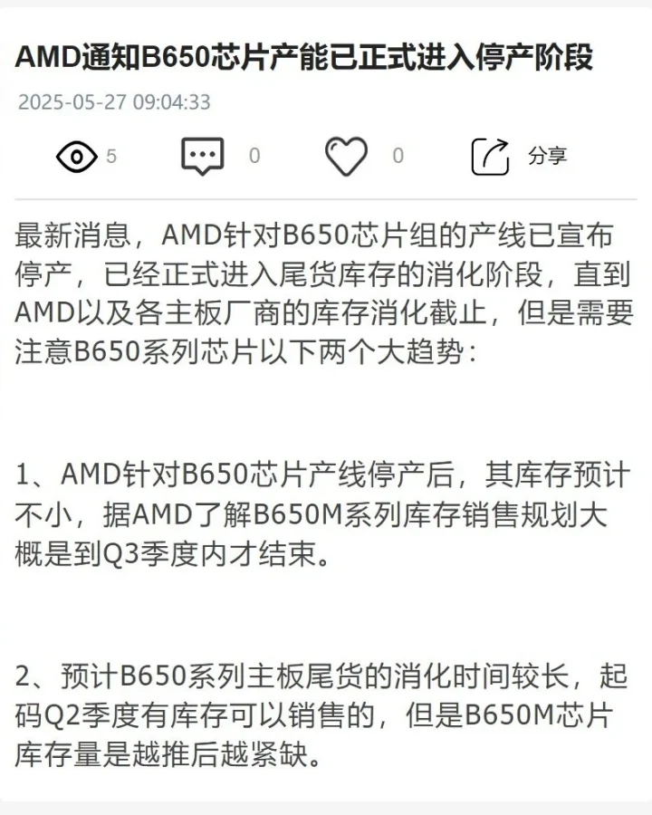

**ערכת השבבים האהובה על בוני מחשבים בתקציב – בדרך החוצה.**

לפי דיווחים חדשים, AMD הפסיקה את ייצור ערכת השבבים **B650**, ששימשה לוחות אם עבור מעבדי **Ryzen 7000 ו־9000**. מדובר באחת מערכות השבבים הנפוצות ביותר עבור פלטפורמת **AM5**, בזכות איזון מעולה בין מחיר לביצועים.

## **🛑 B650 – סוף פס ייצור**

- AMD הפסיקה לייצר את B650 באופן רשמי
    
- מלאים קיימים ימשיכו להימכר במהלך הרבעון השני
    
- **B650M**, גרסת המיקרו-ATX הזולה, צפויה להישאר בשוק גם ברבעון השלישי
    

## **🆕 ממשיכים עם B850 – החלפה הדרגתית**

החלופה היא ערכת השבבים החדשה **B850**, שכבר זמינה בשוק ומציעה:

- תמיכה מקורית ב־**PCIe 5.0**
    
- תמיכה מלאה ב־**Ryzen 7000 ו־9000X3D**
    
- אפשרות ל־**אוברקלוק למעבד ולזיכרון**
    
- תכונות מתקדמות יותר לעומת B650 – אך גם תג מחיר גבוה יותר
    

## **💸 למה זה משנה? כי המחירים עומדים להשתנות**

B650 הייתה הפתרון המשתלם ביותר למשתמשי Ryzen בשנים האחרונות.  
עם יציאתה מהשוק, סביר ש־**מחירי הלוחות הקיימים ירדו** בתקופת הניקוי – **הזדמנות מצוינת לשדרוג בתקציב מוגבל**.

מצד שני, **לוחות אם עם B850 או X870/X870E** כבר יקרים יותר – ולכן מי שלא צריך את הפיצ'רים הכי חדשים, ירצה להספיק לרכוש B650 לפני שייעלם לגמרי.

## **❓ ומה לגבי שאר סדרת 600?**

AMD לא הודיעה על סיום חיי כל ערכות השבבים מסדרת 600, אבל:

- ל־**X670/X670E** כבר קיימים יורשים בסדרת 800 (X870/X870E)
    
- ייתכן שגם סדרות נוספות יגיעו ל־EOL בהמשך השנה
    
- היצע הלוחות הבינוניים־זולים **ילך ויצטמצם** ככל שהמעבר לדור הבא יתגבר
    

## **📌 סיכום**

אם אתם מתכננים להרכיב מחשב מבוסס Ryzen בתקופה הקרובה:

- **B650 עדיין זמינה – במחיר נוח**
    
- **העתיד שייך ל־B850 – עם תוספות טכניות ותג מחיר גבוה יותר**
    
- מי שרוצה לחסוך – **כדאי למהר לפני שהמלאי אוזל**
