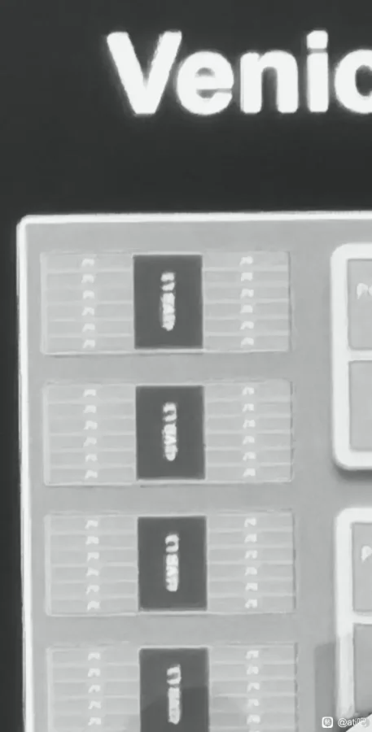

## **AMD EPYC Venice : קפיצה קדימה עם Zen 6 ו-Zen 6C**

המידע הראשוני על מעבדי **EPYC Venice** של AMD, המבוססים על ארכיטקטורות **Zen 6 ו-Zen 6C**, נחשף. השבבים עשויים להגיע עד **256 ליבות** בדגם Zen 6C, כלומר פי שניים מהדור הקודם.

אלו יהיו המעבדים הראשונים של AMD שייוצרו בתהליך **2 ננומטר של TSMC**, מה שיאפשר להגדיל את כמות הליבות תוך שיפור היעילות האנרגטית.

## **שתי ארכיטקטורות נפרדות : Zen 6 לעומת Zen 6C**

AMD מחלקת את הסדרה לשני דגמים:

- **Zen 6 :** עד **96 ליבות** ו-**192 נימים**, ממוקד בביצועים פר ליבה.
    
- **Zen 6C :** עד **256 ליבות** ו-**512 נימים**, מותאם לדחיסות גבוהה עבור מרכזי נתונים.
    

המעבדים יתמכו בתושבות **SP7** (מתקדמים) ו-**SP8** (לרמות כניסה):

- **SP7 :** צריכת חשמל עד **600W**, עלייה משמעותית ביחס ל-Zen 5 (400W).
    
- **SP8 :** צריכת חשמל בין **350W ל-400W**, לפתרונות חסכוניים יותר.
    

## **מבנה CCD וזיכרון מטמון : עד 128 מגה-בייט ל-CCD**

הליבה של EPYC Venice מבוססת על מבנה **8 CCDs**, כאשר כל CCD כולל עד **12 ליבות Zen 6**. התצורה כוללת :

- **Zen 6 :** 8 CCDs x 12 ליבות = **96 ליבות ו-192 נימים**
    
- **Zen 6C :** 8 CCDs x 32 ליבות = **256 ליבות ו-512 נימים**
    

כל CCD כולל **128 מגה-בייט זיכרון מטמון L3**, כלומר 2 מגה-בייט לליבה בדגם Zen 6C. מדובר בהגדלה משמעותית ביחס ל-EPYC Turin.

> SP8: up to 128 Zen 6C cores with 128MB per CCD (96 cores for Zen 6 models), 350-400w  
>   
> SP7: upto 256 Zen 6C cores, ~600w [https://t.co/CQodEenhBk](https://t.co/CQodEenhBk)
> 
> — Bionic\_Squash (@SquashBionic) [May 10, 2025](https://twitter.com/SquashBionic/status/1921031867379118183?ref_src=twsrc%5Etfw)

## **דליפות ביצועים וניהול תרמי**

לפי מידע של **Bionic\_Squash**, צריכת החשמל של מעבדי Zen 6 עשויה להגיע ל:

- **SP7 (Zen 6C)** : עד **600W**, ודורשת פתרונות קירור מתקדמים.
    
- **SP8 (Zen 6)** : בין **350W ל-400W**, בדומה ל-EPYC Turin.
    

לשם השוואה, Zen 5C הנוכחי מגיע עד **500W**, מה שמדגיש את העלייה המשמעותית ב-Zen 6C.

## **מערך מלא עבור מרכזי נתונים ו-HPC**

סדרת EPYC Venice מיועדת למגוון רחב של יישומים :

- **EPYC 9006 "Venice" Zen 6C :** 256 ליבות / 512 נימים / 8 CCDs
    
- **EPYC 9006 "Venice" Zen 6 :** 96 ליבות / 192 נימים / 8 CCDs
    
- **EPYC 9005 "Turin" Zen 5C :** 192 ליבות / 384 נימים / 12 CCDs
    

המעבדים מכוונים לשימוש במרכזי נתונים, **חישוב עתיר ביצועים (HPC)** ויישומי בינה מלאכותית, עם דגש על ניהול תרמי ויעילות אנרגטית.

## **AMD מכוונת לגבוה עם Venice**

עם הכפלת כמות הליבות ב-Zen 6C ושיפור במבנה המטמון, AMD ממצבת את EPYC Venice כמעבדי על לביצועים כבדים, אך גם כמעבדים שצורכים יותר חשמל. דליפות נוספות צפויות לחשוף יותר על הביצועים וההשוואה מול המתחרים.
