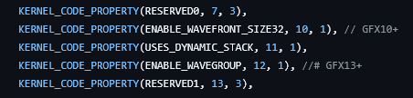
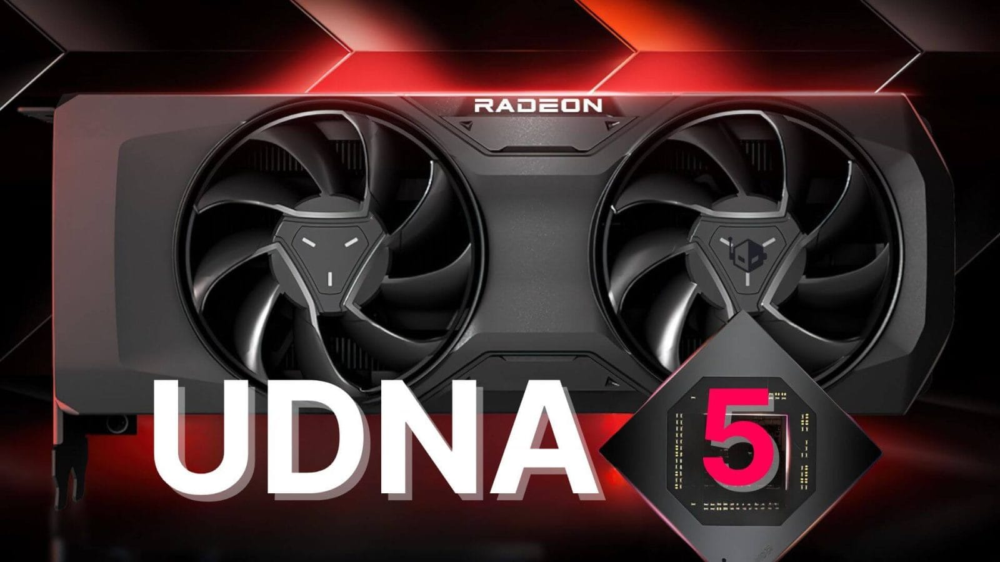

## **GFX13 – הצצה לארכיטקטורה הבאה של AMD**

דליפה בקוד ליבה מגלה את שם הקוד GFX13, שלפי הדיווחים הוא הארכיטקטורה החדשה של AMD לדור הבא של ה-GPU. השם UDNA הוא כנראה גרסת ה-"Unified" של RDNA, אך AMD טרם אישרה רשמית את השם.

לפי המקור [@Kepler\_L2](https://x.com/Kepler_L2/status/1922109005389840884), ה-GFX13 עשוי לשמש כשם קוד עבור UDNA או RDNA 5. הדליפה גם חושפת תכונה חדשה בשם **Wavegroup**, שנועדה לנהל קבוצות של Threads, בדרך כלל בקבוצות של 32 או 64. זהו שינוי משמעותי לעומת המערכות הנוכחיות של AMD.

## **השפעות על השוק – UDNA מגיעה גם ל-CPUs?**

כיום, ארכיטקטורת RDNA 4 מיועדת אך ורק לכרטיסי מסך ייעודיים, אך לפי הדיווחים, AMD מתכננת להרחיב את UDNA גם ל-CPUs.

בינתיים, Zen 6 עשוי לשלב גרפיקה מבוססת RDNA 3.5, כפי שנחשף במעבדי Strix Point, Strix Halo ו-Krackan Point.

עם זאת, לא ברור אם UDNA תשולב ב-Zen 6 כבר כעת, אך הדיווחים מצביעים על שימוש אפשרי בתהליך N3E המתקדם של TSMC הן עבור Zen 6 והן עבור כרטיסי UDNA.

## **מתי נראה את UDNA בשוק?**

לפי המידע העדכני, כרטיסי המסך מבוססי UDNA עשויים להיכנס לייצור המוני ברבעון השני של 2026.

עד אז, AMD תמשיך להרחיב את סדרת RX 9000 המבוססת על RDNA 4, כאשר הכרטיס הבא בסדרה – RX 9060 XT – צפוי להיחשף ב-Computex 2025.

## **Wavegroup – תכונה חדשנית לניהול Threads**

אחת התכונות המסקרנות שנחשפו היא ה-Wavegroup, שמיועדת לניהול מקבילי של Threads בצורה יעילה יותר. אם המידע נכון, מדובר בצעד נוסף של AMD לכיוון ארכיטקטורת GPU אוניברסלית שתוכל לפעול גם בכרטיסי מסך ייעודיים וגם במעבדים.

האם UDNA תהיה הארכיטקטורה שתשנה את כללי המשחק עבור AMD? נמשיך לעקוב ולעדכן בהתאם להתפתחויות.
