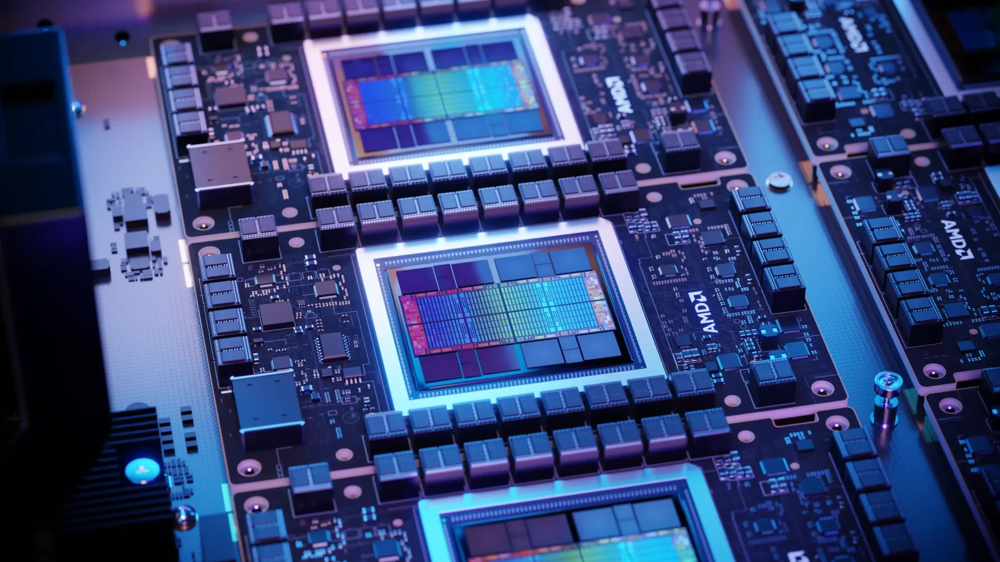

## **שיפור דרמטי בביצועים – והכרזה השבוע**

בכנס ISC25 חשפה AMD כי סדרת מאיצי הבינה המלאכותית החדשה שלה, **Instinct MI350**, תושק רשמית ביום חמישי הקרוב. מדובר באחד השדרוגים המשמעותיים ביותר של החברה עד כה, עם **שיפור של פי 35 ביכולות האינפרנס** (הסקת מסקנות בזמן אמת) – בהשוואה לדור הקודם.

המאיץ MI350 מיועד להתמודד ראש בראש עם **סדרת Blackwell** של NVIDIA, וצפוי להביא לראשונה את **ארכיטקטורת CDNA 4** של AMD.

## **פרטים טכניים: 3 ננומטר, 288GB של HBM3E**

למרות ש-AMD לא חשפה את כל המפרט, ההדלפות והשמועות מעידות כי המאיץ החדש יבוסס על תהליך ייצור **3 ננומטר**, ויכלול עד **288 גיגה-בייט של זיכרון HBM3E** – מה שהופך אותו לאחד מהמאיצים החזקים בשוק מבחינת נפח ומהירות זיכרון.

סדרת MI350 תמוקם בין גרסאות Blackwell ו-Blackwell Ultra של NVIDIA, עם מטרה ברורה להוביל בתחום **הביצועים מול וואט** (Perf/Watt).

## **יעילות אנרגטית פי 30 עד סוף השנה**

במהלך המצגת, הציג מארק פייפרמסטר – ה-CTO של AMD – את תוכנית החברה להגיע ליעילות אנרגטית גבוהה במיוחד עם דגם עתידי נוסף: **Instinct MI355X**, שמיועד לסוף 2025. היעד: **שיפור של פי 30 ביעילות האנרגטית** ביחס לדורות הקודמים.

הוא ציין שההישג נובע מהתקדמות בארכיטקטורה ובחדשנות אריזת השבבים, ושהמגמה תמשיך גם בדורות הבאים.

> As part of [#ISC25](https://twitter.com/hashtag/ISC25?src=hash&ref_src=twsrc%5Etfw) opening keynote, Mark Papermaster says [@AMD](https://twitter.com/AMD?ref_src=twsrc%5Etfw) will launch Instinct MI350 GPU series on Thursday, claiming achievement of goal to reach 30x improvement in energy efficiency by 2025. [pic.twitter.com/mbXAlCgGbq](https://t.co/mbXAlCgGbq)
> 
> — Addison Snell (@addisonsnell) [June 10, 2025](https://twitter.com/addisonsnell/status/1932343016129200475?ref_src=twsrc%5Etfw)

## **תמיכה נרחבת ותחרות ישירה ב-NVIDIA**

למרות ש-NVIDIA שולטת בשוק מאיצי ה-AI עם CUDA, AMD שמה דגש בשנים האחרונות על בניית אלטרנטיבה מבוססת **ROCm** – פלטפורמת קוד פתוח שצוברת תאוצה בקרב שותפים, בעיקר בענן ובמרכזי נתונים.

ההכרזה הזו מגיעה בתקופה שבה הלקוחות הגדולים ביותר מחפשים חלופות ל-NVIDIA, ו־AMD כבר הכריזה על **מחשב-על מבוסס 1.2 מיליון GPUs**, שיתמוך במודל AI ענק.

## **סיכום: מהפכה ב-AI בדרך**

Instinct MI350 עשוי להיות נקודת המפנה של AMD בתחום הבינה המלאכותית – עם שילוב של ביצועים, גמישות, ותמחור אטרקטיבי יותר. עם פתיחת הדלת לשותפים ותמיכה רחבה יותר ב־ROCm, ייתכן ש־AMD תאתגר סוף סוף את הדומיננטיות של NVIDIA.
