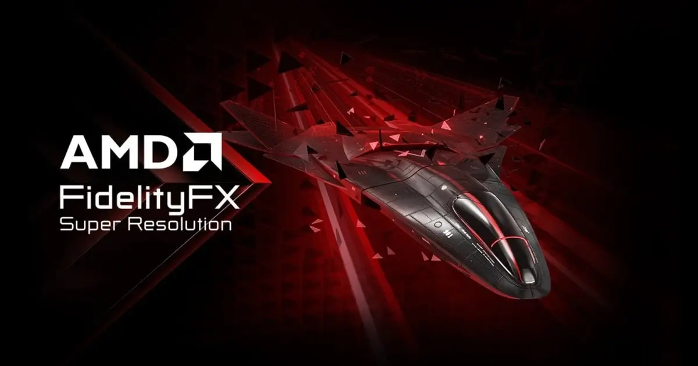

אחרי שנה רגועה יחסית בתחום כרטיסי המסך ב-2024, AMD מתכוננת להשקה של ארכיטקטורת **RDNA 4** – הדור הבא של כרטיסי המסך השולחניים שלה. הארכיטקטורה החדשה תחליף את **RDNA 3**, שהוצגה לראשונה בשנת 2022 עם סדרת **Radeon RX 7000**.

למרות שהמידע שדלף עד כה מוגבל, יש בידינו מספיק פרטים כדי להבין את האסטרטגיה של AMD בהתמודדות מול המתחרות המרכזיות, **Nvidia** ו-**Intel**.

## מה המפרט של Radeon RX 9000?

נכון לעכשיו, יש מעט מאוד מידע זמין על המפרט הטכני של כרטיסי המסך השולחניים החדשים של **AMD**. ייתכן שהחברה יודעת להגן טוב יותר על שרשראות הייצור שלה מפני הדלפות, או שהעניין מצד המדליפים נמוך יותר לעומת Nvidia.

**מה אנחנו יודעים?**  
AMD, שבשלב זה החליטה לשים בצד את שוק הפרימיום, מתמקדת במעבדים בקטגוריית הביניים בארכיטקטורת **RDNA 4**.

**שינוי הנומנקלטורה**  
במקום סדרת **RX 8000**, AMD עברה ישירות ל-**RX 9000** בשנת 2025. המותג אימץ נומנקלטורה שמזכירה את זו של Nvidia, על מנת למנוע בלבול בין כרטיסי המסך למעבדים. סדרה זו כוללת את **Radeon 9070 (XT)**, **9060**, ו-**9050** למחשבים שולחניים וניידים.

**התמקדות בדגם ביניים**  
AMD זנחה את ה-**GPU Navi 41** ומתמקדת ב-**Radeon 9070 XT** ובגרסה הרגילה שלו. דגמים נוספים בסדרה צפויים להגיע ברבעון הראשון של 2025.

**פרטים טכניים על הזיכרון**  
לפי מידע מ-[**VideoCardz**](https://videocardz.com/newz/amd-radeon-rx-8000-rdna4-leak-reveals-four-gpu-variants-three-memory-configurations) ו-**[Kepler\_L2](https://x.com/Kepler_L2/status/1828223002586050648)**, AMD מתכננת ארבע גרסאות שונות בשנת 2024:

- שתי גרסאות עם ממשק **256-bit** ומהירות שעון של **18 ו-20 Gbps**.
- גרסה נוספת עם ממשק **192-bit** ומהירות שעון של **19 Gbps**.

**זיכרון GDDR6 ולא GDDR7**  
בניגוד ל-Nvidia שמתכננת לעבור לזיכרון **GDDR7** מהיר יותר, AMD בחרה להישאר ב-**GDDR6** מסיבות של עלויות ייצור, מה שמעלה שאלות לגבי התחרותיות שלה בטווח הארוך.

**מסקנה:**  
המעבר של AMD ל-**RX 9000** וארכיטקטורת **RDNA 4** מצביע על שינוי גישה והתמקדות בשוק הביניים, אך הוויתור על שוק הפרימיום והשימוש ב-GDDR6 עשויים להשפיע על מעמדה בתחרות מול Nvidia.

## כרטיס הדגל של הסדרה: Radeon RX 9070 XT

ה-**Radeon RX 9070 XT** צפוי להיות הדגם המוביל בסדרת **RX 9000** החדשה של AMD. לפי מבחני ביצועים ראשוניים, הכרטיס ממוקם קרוב ל-**RTX 4070 Ti** של Nvidia, אך רחוק מהביצועים של ה-**RTX 4080**, כפי שציינו שמועות קודמות.

אחת ההפתעות המרשימות היא צריכת האנרגיה של הכרטיס, שצפויה להיות נמוכה ב-**25%** לעומת ה-**RX 7900 XTX**, עם צריכה משוערת של **270W** בלבד. לשם השוואה, ה-**RTX 4080** של Nvidia צורך עד **305W**.

**מפרט טכני לפי הדלפות**

| **מודל** | **AMD Radeon RX 9070 XT** | **AMD Radeon RX 9070** |
| --- | --- | --- |
| **יחידות עיבוד** | 64 | 56 |
| **מעבדי זרימה** | 4,096 | 3,584 |
| **מהירות זיכרון** | 20 Gbps | 18 Gbps |
| **זיכרון וידאו** | 16GB GDDR6 | 16GB GDDR6 |

**מה צפוי בדגמים אחרים?**  
לשם השוואה, ה-**RX 7800 XT** כולל 60 יחידות עיבוד, בעוד שה-**RX 6800 XT** הציע 72. דגם ה-**RX 9060** החדש עשוי להגיע ל-**48 יחידות עיבוד** (בהשוואה ל-32 בשלוש הדורות הקודמים) ולכלול **12GB של זיכרון וידאו**.

זו מגמה שמדגישה את מאמצי AMD להתחרות עם Nvidia, בעיקר בקטגוריית כרטיסי המסך הזולים יותר.

**חדשנות ב-Ray Tracing**  
אחת מהתכונות המצופות בארכיטקטורת **RDNA 4** היא שדרוג משמעותי של יחידות ה-Ray Tracing. בעוד ש-RDNA 3 הייתה גרסה משופרת בלבד של RDNA 2, נראה ש-AMD חידשה לחלוטין את הגישה שלה בתחום.

לפי דיווחים, כרטיסי המסך החדשים של AMD יציגו ביצועים חזקים יותר במשחקים התומכים ב-Ray Tracing. ראינו רמז לכך בקונסולת **PS5 Pro**, שמבוססת גם היא על מעבדי AMD ומבטיחה מהירות חישוב קרני אור מהירה פי 2 עד 3 לעומת הדור הקודם.

**מה הלאה?**  
בשלב זה, המידע על סדרת **Radeon RX 9000** עדיין דליל, ולכן קשה לקבוע תמונה מלאה של המפרט. עם זאת, ברור ש-AMD מתמקדת ביצירת כרטיסים יעילים יותר מבחינת צריכת חשמל ומביאה חידושים משמעותיים בתחום התאורה. נמשיך לעדכן את המאמר ככל שייווספו פרטים נוספים על הסדרה.

## טכנולוגיות ופיצ’רים

Nvidia. השדרוג מתחיל בטכנולוגיית **FSR (Fidelity Super Resolution)**, שמטרתה להגדיל את ביצועי המשחקים באמצעות שחזור גרפיקה ברזולוציה נמוכה והצגתה ברזולוציה טבעית של המסך, תוך שימוש באלגוריתמים מתקדמים.

למרות ההתקדמות המרשימה בגרסאות הקודמות, ה-FSR נשארה מאחור מול הפתרונות של Nvidia ואפילו Intel, בעיקר כי היא לא עושה שימוש בבינה מלאכותית (AI) ובמכונה לומדת (Machine Learning). כתוצאה מכך, ה-FSR לא יכולה להשתפר עם כל עדכון וסובלת מבעיות שהיו גם אצל המתחרים בשלבים מוקדמים:

- **ארטיפקטים בתנועה**
- **נצנוצים**
- **אפקטי Ghosting** ועוד

שיפורים אלו צפויים להציג אתגר אמיתי ל-Nvidia ו-Intel במרוץ אחר טכנולוגיות upscaling מתקדמות לגיימרים.

גרסת ה-**FSR 4** של AMD צפויה לשנות את כללי המשחק באמצעות שימוש ביחידות חומרה ייעודיות לבינה מלאכותית (AI) שישולבו בכרטיסי המסך הבאים שלה. הכלים ל-**upscaling** ולייצור תמונות יתבססו על **machine learning**, כשהמטרה של AMD ברורה:

- לשפר את יעילות צריכת האנרגיה במחשבים ניידים.
- להעצים את חוויית השימוש בקונסולות ניידות המשתמשות ב-**APU** שלה, כמו ה-**Z1 Extreme**.

ידוע כבר כי **FSR 4** יוטמע במשחק **Call of Duty: Black Ops 6**, לפי דברי AMD.

**פתרון חדש לשיפור Ray Tracing**  
AMD גם מפתחת פתרון חדש בדומה ל-**Ray Reconstruction** של Nvidia, שמטרתו לבצע **denoising** ולשפר את איכות התצוגה במשחקי Ray Tracing. הטכנולוגיה החדשה תשמש לשתי מטרות עיקריות:

- תיקון פגמים בתצוגת Ray Tracing.
- שיפור ביצועים באמצעות טכניקת **supersampling**.

נראה כי הפתרון הזה ישולב עם כרטיסי המסך הבאים של החברה, ויספק ביצועים ואיכות גרפית טובים יותר במשחקים המשתמשים בטכנולוגיית Ray Tracing.

## איזה מחיר צפוי ל-Radeon RX 9000?

העמדה המחירית של כרטיסי המסך בארכיטקטורת **RDNA 4** הייתה אחת מהמידע הראשוני שדלף לגביהם.  
למרות שלא פורסמו עדיין טווחי מחירים מדויקים, ידוע כי AMD תתמקד בעיקר בקטגוריית הביניים התחרותית במטרה לצמצם את הפער הגדול מול Nvidia.

מדובר כאן על GPU שאינם מיועדים בהכרח למשחקי **4K** ו-Ray Tracing / Path Tracing, אלא עבור גיימרים עם תקציב נמוך יותר, המשחקים ברזולוציה שזוכה לפופולריות הרבה ביותר ב-Steam: **1440p**.

בהתאם לכך, ניתן לצפות לכרטיסי מסך בקטגוריית הכניסה / ביניים שינועו בין **1,150 ל-2,700 ש"ח**, בהתאם לדגמים.  
עם זאת, מדובר בשלב זה בהשערות בלבד, המתבססות על המגמות והתמחור בשוק כיום, ונחכה להדלפות נוספות שיספקו מידע קונקרטי.

## מתי ה-Radeon RX 9000 יושקו?

בדומה ל-Nvidia, גם **AMD** אישרה את השתתפותה ב-**CES 2025** בלאס וגאס, שם היא תכריז על "הדור הבא של GPUs המבוססים על ארכיטקטורת RDNA 4".

הכנס של AMD יתקיים ביום שני, **6 בינואר 2025**, בשעה 20:00 לפי שעון צרפת. במהלך האירוע, החברה צפויה לחשוף לא רק את כרטיסי המסך החדשים שלה, אלא גם את יכולות הבינה המלאכותית המשולבות בהם, כולל טכנולוגיות **Inference** ושדרוג גרפי באמצעות **FSR 4**.

נראה ש-AMD מכוונת להציג חידושים משמעותיים, גם בתחום ה-AI וגם בביצועי הגרפיקה, כדי להתחרות בצורה ישירה יותר מול Nvidia בשוק כרטיסי המסך.

> Save the date 🗓️  
>   
> Join us for the [@AMD](https://twitter.com/AMD?ref_src=twsrc%5Etfw) Press Event on Monday, January 6, at 11 AM PT.  
>   
> Excited to share the stage with some incredible special guests as we unveil our next generation of innovation across gaming, AI PC, and commercial. You won’t want to miss it! 🎮💻✨  
>   
> Catch the… [pic.twitter.com/IadsTDZfTx](https://t.co/IadsTDZfTx)
> 
> — Jack Huynh (@JackMHuynh) [December 3, 2024](https://twitter.com/JackMHuynh/status/1863946658381222214?ref_src=twsrc%5Etfw)

לפי מידע שדלף מ-Chiphell, **AMD** צפויה להתחיל את הייצור ההמוני של **Radeon RX 9070 XT** באמצע דצמבר 2024. הדבר מרמז על תאריך השקה רשמי בישראל שיחול כנראה במהלך המחצית השנייה של ינואר 2025.

הדגמים האחרים, בעיקר אלו הזולים יותר, צפויים להגיע לשוק בשלבים נוספים, עם השקות שמתרחשות עד לסוף החורף של 2025.

מגמה זו עשויה לאפשר ל-AMD לפרוס את ההשקות שלה באופן אסטרטגי, כדי לענות על ביקוש שונה בכל קטגוריות המחיר.

- מפרט טכני חדשני: AMD Radeon RX 9000 מציעה שיפורים ב-FSR וב-Ray Tracing לעומת הדורות הקודמים.
- כרטיס דגל: ה-RX 9070 XT צפוי להציע ביצועים קרובים ל-RTX 4070 Ti בצריכת חשמל נמוכה.
- טווח מחירים: כרטיסי הביניים והכניסה ינועו בין 1,150 ל-2,700 ש"ח, תלוי בדגם.
- תאריך השקה: ייצור המוני יתחיל בדצמבר 2024, והשקה רשמית בישראל במחצית ינואר 2025.
- אירוע CES 2025: AMD תכריז רשמית על ארכיטקטורת RDNA 4 ב-6 בינואר, עם חידושי AI ו-FSR 4.
