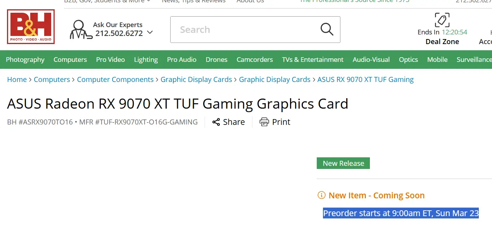

**עדכון 15/02/2025: כרטיס המסך AMD Radeon RX 9070 XT יושק ב-6 במרץ, יום לאחר השקת ה-RTX 5070.**

| תאריך | אירוע |
| --- | --- |
| 19 בפברואר | ביקורות MSRP ל- GeForce RTX 5070 Ti |
| 20 בפברואר | ביקורות non-MSRP ל- GeForce RTX 5070 Ti ומכירות כרטיס המסך |
| 28 בפברואר | הכרזה על סדרת Radeon RX 9070 |
| 5 במרץ | תחילת מכירות GeForce RTX 5070 |
| 6 במרץ | תחילת מכירות Radeon RX 9070 XT |

## **השוואת כרטיסי מסך: AMD Radeon RX 9070 / 9070 XT מול NVIDIA GeForce RTX 5070 / 5070 Ti**

| מאפיין | **AMD Radeon RX 9070 XT** | **AMD Radeon RX 9070** | **NVIDIA GeForce RTX 5070 Ti** | **NVIDIA GeForce RTX 5070** |
| --- | --- | --- | --- | --- |
| **ליבת GPU** | Navi 48 | Navi 48 | GB203-300 | GB205-300 |
| **ליבות** | 4096 | 3584 | 8960 | 6144 |
| **תדר מירבי** | ~2.97GHz | ~2.52GHz | ~2.47GHz | ~2.52GHz |
| **זיכרון** | 16GB GDDR6 | 16GB GDDR6 | 16GB GDDR7 | 12GB GDDR7 |
| **רוחב באס זיכרון** | 256-bit | 256-bit | 256-bit | 192-bit |
| **מהירות זיכרון** | 20Gbps | 20Gbps | 28Gbps | 28Gbps |
| **רוחב פס זיכרון** | 640GB/s | 640GB/s | 896GB/s | 672GB/s |
| **צריכת חשמל מירבית** | TBC | TBC | 300W | 250W |
| **חיבור PCIe** | PCIe 5.0×16 | PCIe 5.0×16 | PCIe 5.0×16 | PCIe 5.0×16 |
| **מחיר (MSRP)** | TBC | TBC | 749$ | 549$ |
| **תאריך הכרזה ראשון** | 6 בינואר | 6 בינואר | 6 בינואר | 6 בינואר |
| **תאריך הכרזה שני** | 28 בפברואר | 28 בפברואר | \- | \- |
| **תאריך השקה** | תחילת מרץ | תחילת מרץ | 20 בפברואר | 5 במרץ |

\----------------------------------

לפי מידע עדכני, ההזמנות המוקדמות של כרטיסי המסך **Radeon RX 9070** ו-**RX 9070 XT** מבית AMD יחלו ב-**23 במרץ 2025**. מידע זה נחשף באתר הקמעונאי האמריקאי **B&H Photo**, אשר פרסם לזמן קצר דגמים של ASUS בסדרה החדשה.

## פרטים על ההשקה

- **תאריך ההשקה:** יום ראשון, 23 במרץ 2025, בשעה 16:00 לפי שעון ישראל.
- **דגמים צפויים:**
    - RX 9070 Prime.
    - RX 9070 TUF Gaming.
    - RX 9070 XT Prime.
    - RX 9070 XT TUF Gaming.
- ההשקה תואמת את ההצהרות הקודמות של AMD לגבי שחרור הסדרה במרץ 2025.

## הקשר ושמועות

במקור, היו ציפיות להשקה מוקדמת בינואר, אך AMD דחתה את המועד, ככל הנראה עקב:

- **משא ומתן על מחירים** עם קמעונאים.
- סיום פיתוח טכנולוגיית **FSR 4** – מערכת ה-Upscaling החדשה של החברה.
- התאמת אסטרטגיה למול ההשקה הצפויה של כרטיסי **NVIDIA RTX 5000**.

## מפרט טכני משוער

למרות ש-AMD טרם חשפה נתונים רשמיים, הדלפות מרמזות על המפרט הבא ל-RX 9070 XT:

- **זיכרון VRAM:** 16GB.
- **ליבות:** 4,096.
- **יחידות חישוב:** 64 CU.

הדגם RX 9070 הסטנדרטי צפוי להיות בעל נתונים מעט נמוכים יותר.

## האם כדאי לחכות ל-AMD?

אם אתם גיימרים תחרותיים שמחפשים **ביצועים גולמיים** ויחס **ביצועים-מחיר** אטרקטיבי, ללא תלות בטכנולוגיות כמו **DLSS 4** של NVIDIA, ההמתנה לכרטיסי AMD עשויה להשתלם מאוד.  
הסדרה החדשה צפויה להציע ביצועים חזקים במחירים תחרותיים, במיוחד עבור מי שמעדיף כוח עיבוד טהור על פני תכונות בינה מלאכותית. אם זה מה שחשוב לכם, בהחלט כדאי לשקול לחכות להשקה של RX 9070 ו-RX 9070 XT.

## סיכום

כרטיסי **Radeon RX 9070** ו-**RX 9070 XT** מסמנים את הכניסה של AMD לקטגוריית שוק תחרותית במיוחד ב-2025. עם מפרט חזק, שיפורי טכנולוגיה כמו FSR 4, ואפשרות למחירים אטרקטיביים, הסדרה החדשה צפויה לעורר עניין רב. מידע נוסף ייחשף בקרוב – מומלץ לעקוב אחרי העדכונים!

## ניצוץ של תקווה לעתיד האנרגיה?​

למרות שכור ההיתוך של נאזורדין אינו מסוגל ליצור היתוך גרעיני אמיתי – הוא לא פולט נייטרונים – ההישג שלו עדיין יוצא דופן. הוא מדגים כיצד דמוקרטיזציה של הבינה המלאכותית וגישה לרכיבים זולים יכולים לאפשר לאנשים חדורי מוטיבציה לדחוף את גבולות המדע.

הניסוי הזה עשוי להיות צעד ענק במסע אחר אנרגיה בלתי מוגבלת. הוא מוכיח שפריצות דרך משמעותיות יכולות לצמוח מיוזמות אישיות, מחוץ למעבדות הגדולות. ההצלחה הבלתי צפויה הזו עשויה לעורר השראה אצל מוחות מבריקים נוספים להתמודד עם אתגר ההיתוך הגרעיני. מי יודע? אולי פריצת הדרך הגדולה הבאה בתחום האנרגיה הנקייה תבוא מחדרו של סטודנט אמיץ שאין לו פחד מכישלון.

- ההזמנות המוקדמות ל-RX 9070 ו-RX 9070 XT יתחילו ב-23 במרץ 2025.
- הכרטיסים מציעים 16GB VRAM וביצועים תחרותיים מול RTX 5070 של NVIDIA.
- לגיימרים שמעדיפים ביצועים גולמיים ויחס ביצועים-מחיר, ההמתנה בהחלט שווה.
