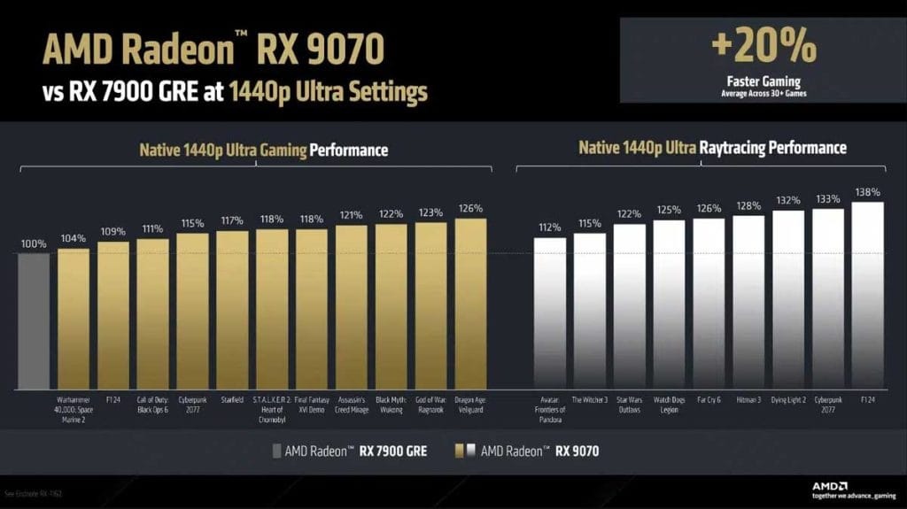

AMD הכריזה על כרטיסי המסך החדשים **Radeon RX 9070 XT ו-RX 9070**, המבוססים על **ארכיטקטורת RDNA 4**. עם ביצועים חזקים יותר, תמיכה משופרת ב-**Ray Tracing**, ושימוש בטכנולוגיות בינה מלאכותית מתקדמות, AMD מציגה **חלופה אטרקטיבית לדגמי RTX 5070 ו-5070 Ti של NVIDIA**. אך הדבר שמושך את תשומת הלב הוא **אסטרטגיית התמחור האגרסיבית**, שיכולה להפוך את הכרטיסים האלו למשתלמים במיוחד.

## **תמחור תחרותי מול סדרת RTX 50 של NVIDIA**

AMD הציגה מחירים תחרותיים במיוחד, שנמוכים משמעותית מהמחירים הצפויים של NVIDIA:

| **דגם** | **מחיר (דולר)** | **מחיר מוערך בשקלים (כולל מע"מ)** | **תחרות מול NVIDIA** |
| --- | --- | --- | --- |
| **RX 9070 XT** | **599 $** | **~2,250 ₪** | RTX 5070 Ti (749 $) |
| **RX 9070** | **549 $** | **~2,050 ₪** | RTX 5070 (549 $) |

בעוד ש-NVIDIA מתמחרת את **ה-RTX 5070 Ti ב-749 דולר**, בפועל המחירים בפועל כבר חצו את **4,000 ₪** בישראל עקב מחסור במלאי. AMD מקווה **לספק אלטרנטיבה עם ביצועים דומים או טובים יותר, במחיר משתלם יותר ועם זמינות רחבה יותר**.

עם זאת, נותר לראות **האם המחירים הללו יישמרו בישראל** לאחר ההשקה או שמא גם כאן המחסור במלאי יוביל לעליות מחירים מהירות.

## **ביצועים גולמיים: AMD מדגישה כוח עיבוד ללא טריקים של שדרוג תמונה**

AMD בחרה להציג **ביצועים גולמיים, ללא שימוש בטכנולוגיות שדרוג כמו DLSS של NVIDIA**.

| **דגם** | **שיפור מול דגם קודם** | **השוואה מול NVIDIA** |
| --- | --- | --- |
| **RX 9070 XT** | **51%+ מול RX 6900 XT** | **26%+ מול RTX 3090** |
| **RX 9070** | **38%+ מול RX 6800 XT** | **26%+ מול RTX 3080** |

AMD **לא כללה השוואות ישירות מול RTX 5070 ו-5070 Ti**, מה שמעורר שאלות לגבי ביצועי הכרטיסים החדשים מול הדור החדש של NVIDIA. האם מדובר בטקטיקה שיווקית או שהביצועים ב-**Ray Tracing** עדיין נחותים?

<figure>

<figcaption>

benchmark-amd-radeon-rx-9070-vs-rx7900

</figcaption>

</figure>

<figure>

<figcaption>

benchmark-amd-radeon-rx-9070-vs-rx7900-1

</figcaption>

</figure>

## **טכנולוגיות חדשות ב-RDNA 4: שיפור בינה מלאכותית, FSR 4 ו-Ray Tracing מתקדם**

המעבר ל-**RDNA 4** מביא עימו **שיפורים טכנולוגיים משמעותיים**, שנועדו **לצמצם את הפער מול NVIDIA** בתחום עיבוד הווידאו, הבינה המלאכותית וה-Ray Tracing.

✔ **FSR 4 (FidelityFX Super Resolution 4)**

- נתמך רק על כרטיסי **RDNA 4**
- זמין ב-**30 משחקים כבר בהשקה ו-75 עד סוף 2025**
- מציע **שיפור באיכות התמונה, הגדלת קצב הפריימים ושיפור חדות**

✔ **מאיצי בינה מלאכותית מתקדמים**

- **מהירים פי 8** לעומת הדור הקודם (RDNA 3)
- משפרים **ביצועים באפליקציות AI ושימושים גרפיים מתקדמים**

✔ **Ray Tracing מתקדם יותר**

- חומרה ייעודית חדשה להאצת Ray Tracing
- שיפור של **פי 2 בביצועים לעומת RDNA 3**

שיפורים אלו נועדו **להציע חוויית גיימינג חלקה יותר ולצמצם את היתרון של NVIDIA בטכנולוגיות Ray Tracing ושדרוג תמונה מבוסס AI**.

## **האם AMD מצליחה לספק את החלופה המושלמת?**

AMD מנסה **לשבור את ההובלה של NVIDIA**, עם **כוח עיבוד גולמי חזק ומחירים נמוכים יותר**, אך כמה שאלות נותרו פתוחות:

- **האם מבחני ביצועים עצמאיים יאששו את ההבטחות?**
- **האם המחירים הנמוכים יישארו יציבים, או שהמחסור במלאי יגרום לעלייה מהירה?**
- **למה AMD נמנעה מהשוואה ישירה ל-RTX 5070 ו-5070 Ti?**

📅 **הכרטיסים יהיו זמינים החל מה-6 במרץ 2025**. אם AMD תצליח **לשמור על הביצועים והמחירים**, ה-RX 9070 XT עשוי להפוך **לחלופה החזקה ביותר לכרטיסי NVIDIA** בשוק הגיימינג הישראלי.

השאלה הגדולה היא **האם AMD סוף סוף הצליחה לערער את ההובלה של NVIDIA?** נמתין לתגובות ולמבחנים בלתי תלויים.
