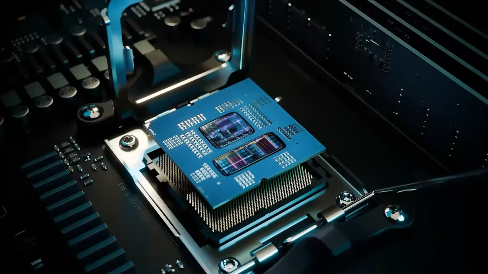

## **AMD כובשת את שוק השרתים**

לפי נתוני Mercury Research, AMD רשמה צמיחה מרשימה בנתח השוק שלה בשרתים ברבעון הראשון של 2025.

- **נתח שוק יחידות:** 27.2% – עלייה של 1.5 נקודות אחוז מול הרבעון הקודם.
    
- **נתח שוק הכנסות:** 39.4% – עלייה של 3.1 נקודות אחוז מול הרבעון הקודם.
    

העלייה בנתח השוק נובעת בעיקר מהמכירות של מעבדי **Zen 4 Genoa ו-Bergamo**, שהמשיכו להראות ביקוש גבוה בשוק הדאטה סנטרים.

## **מעבדי Zen 4 ו-Zen 5 – המנועים לצמיחה**

הצלחת AMD בשוק השרתים נובעת גם מההשקה ההדרגתית של מעבדי **Zen 5 Turin**, המספקים שיפורים משמעותיים בביצועים וביעילות אנרגטית.

- Zen 5 מציע ליבות עוצמתיות יותר ומתמקד ביעילות אנרגטית גבוהה יותר.
    
- AMD צופה כי נתח השוק שלה ימשיך לגדול ככל שההשקה של Zen 5 Turin תתרחב לאורך 2025.
    

## **עלייה בנתח השוק של מעבדי השולחן והניידים**

גם בשוק המחשבים השולחניים AMD רשמה עלייה בנתח השוק שלה:

- **מחשבים שולחניים:** 28% – עלייה של 6.4 נקודות אחוז בהכנסות בהשוואה לשנה שעברה.
    
- **מחשבים ניידים:** 22.5% – עלייה של 7.3 נקודות אחוז בהשוואה לשנה שעברה.
    

בין המעבדים המובילים בתחום הגיימינג ניתן למצוא את **Ryzen 7 7800X3D** ו-Ryzen 7 9800X3D, שהציגו ביצועים גבוהים במיוחד בגיימינג ובתוכנות גרפיקה.

## **מה צופן העתיד?**

AMD לא מתכוונת להוריד את הרגל מהגז. החברה כבר עובדת על השקת **מעבדי Zen 6** שצפויים להגיע ב-2026, ולפי הדיווחים הם יכללו שיפורים משמעותיים בתחום הביצועים והחיסכון בחשמל.

האם AMD תצליח לשמור על ההובלה בשוק השרתים ולהמשיך להגדיל את נתח השוק שלה? נמשיך לעקוב ולעדכן.
