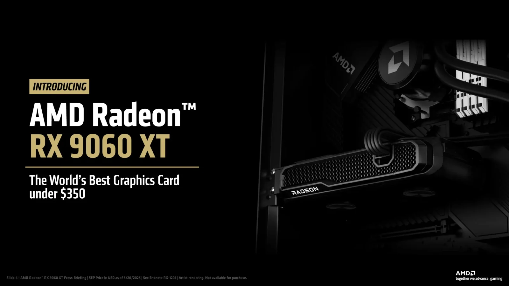
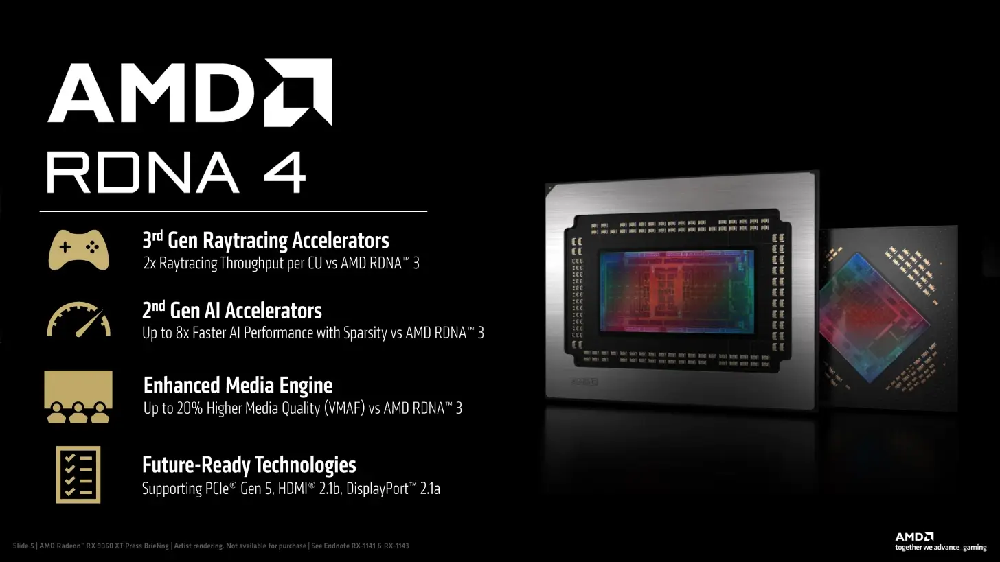
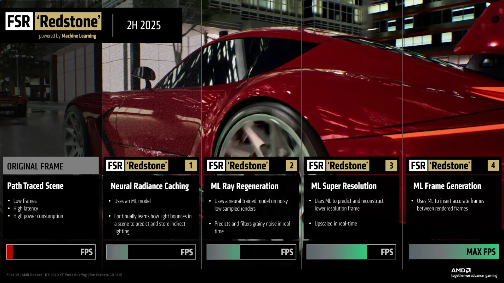

## **כרטיס חדש, תמחור אגרסיבי, מטרה ברורה – ה-RTX 5060**

AMD השיקה רשמית את כרטיס המסך **Radeon RX 9060 XT**, שמגיע בשתי גרסאות זיכרון:  
**8GB במחיר של $299** ו-**16GB במחיר של $349**.

המטרה ברורה: לתת פייט ישיר לסדרת **RTX 5060** של NVIDIA, ולתפוס מחדש את **פלח השוק המרכזי**, בו משחקים רוב המשתמשים – ברזולוציית **1080p ו-1440p**.

## **RDNA 4: ליבה קטנה, תדרים גבוהים, ביצועים מדויקים**

ה-RX 9060 XT מבוסס על ליבת **Navi 44**, ארכיטקטורת **RDNA 4** החדשה, ומיוצר בתהליך של **4nm מבית TSMC**.

**נתונים עיקריים:**

| מאפיין | RX 9060 XT |
| --- | --- |
| ליבות עיבוד (CU) | 32 (2048 מעבדים) |
| מאיצי Ray Tracing | 32 |
| מאיצי AI | 64 |
| תדר Boost | עד 3.13GHz (!) |
| זיכרון | 8GB / 16GB GDDR6 במהירות 20Gbps |
| רוחב פס | 128-bit |
| צריכת חשמל (TBP) | 150W ל-8GB / 182W ל-16GB |
| חיבור תצוגה | HDMI 2.1b + DP 2.1a |
| חיבור למחשב | PCIe 5.0 x16 |

## **ביצועים: טוב יותר מה-RTX 5060 – בפחות כסף**

לפי מבחני ביצועים מוקדמים, גרסת ה-16GB של RX 9060 XT:

- **מהירה ב-6% מ-RTX 5060 Ti 16GB**
    
- **יעילה ב-15% יותר ביחס למחיר** (performance per dollar)
    
- **גרסת ה-8GB מנצחת את RTX 5060 ב-9%** בבדיקות 1080p על פני 40 משחקים
    
- **מהירה ב-55% מה-RX 7600** ב-1080p (!)
    

## **FSR 4 נכנסת למשחק – שדרוג רציני לחוויית גיימינג**

כמו תמיד, AMD מביאה גם **שיפורים תוכנתיים**:

- **FSR 4** זמינה כבר ביותר מ-60 משחקים
    
- **Frame Generation + AI Upscaling** מביאים שיפור של עד פי **3.4 בפריימים**
    
- באופק: עדכון ״Redstone״ עם חידושים כמו **ML Ray Regeneration** ו-**Neural Radiance Caching**
    

> AMD מתקרבת ל-DLSS 4 של NVIDIA, במיוחד בכל הנוגע לאיכות תמונה.

 

## **בישראל: בשורה לגיימרים שמחפשים תמורה**

ה-RX 9060 XT צפוי להימכר גם בארץ דרך מותגים כמו **ASUS, Gigabyte ו-Sapphire**, במחירים תחרותיים במיוחד.  
לשחקני 1080p בישראל, מדובר באופציה משתלמת – במיוחד כשהמחירים של NVIDIA עולים בהתמדה.

## **לסיכום: זה כרטיס הדגל של השפיות**

| גרסה | מחיר | מתחרה ישיר | יתרון מרכזי |
| --- | --- | --- | --- |
| RX 9060 XT 8GB | $299 | RTX 5060 8GB | ביצועים טובים יותר באותה עלות |
| RX 9060 XT 16GB | $349 | RTX 5060 Ti 16GB | ביצועים עדיפים + 15% יחס מחיר |
