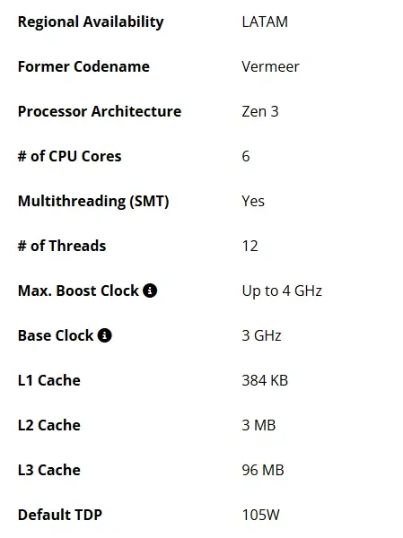

## **כן, שוב AM4 – והפעם עם מעבד X3D מוזל**

למרות שהושקה כבר לפני 8 שנים, פלטפורמת AM4 של AMD מסרבת למות. וההוכחה? השקה שקטה של **Ryzen 5 5500X3D**, מעבד גיימינג חדש וזול, עם טכנולוגיית 3D V-Cache.

זהו ה־X3D **הזול והאיטי ביותר ש־AMD ייצרה עד כה**, אבל הוא מיועד למטרה אחת ברורה: מחשבי גיימינג בתקציב מוגבל.

## **5500X3D: כמו 5600X3D, אבל איטי יותר**

המעבד החדש כולל:

- **6 ליבות ו־12 תהליכונים (threads)**
    
- **תדר בסיס: 3.0GHz**, תדר טורבו: עד 4.0GHz
    
- **זיכרון מטמון L3 בנפח מלא – 96MB**
    
- **צריכת חשמל: 105W**
    

לשם השוואה, ה־5600X3D פועל ב־3.3GHz בסיס ו־4.4GHz בטורבו. ה־Ryzen 5 5500 הרגיל אפילו מהיר יותר (3.6GHz), אך עם **16MB בלבד של מטמון L3**.

מה שמסביר את ההבדל: **שבבי X3D פועלים לאט יותר בגלל תהליך הערימה האנכית (die stacking)**, שמוביל לחימום מוגבר וניהול תרמי שונה.

## **ביצועים: גיימינג כן, רינדור לא**

ה־5500X3D לא מתיימר להוביל את השוק, אבל ה־96MB של זיכרון מטמון כן מעניקים לו **יתרון מובהק בגיימינג** – במיוחד בכותרים כמו CS2, Apex ו־Valorant, שמבוססים על CPU.

אבל לא מומלץ למי שעובד עם תוכנות כמו Blender, Premiere או Visual Studio. **המעבד איטי יותר בתהליכים מרובי ליבות** – וללא תמיכה ב־PCIe 5 או DDR5, הוא מתאים לדור קודם של לוחות אם.

## **שוק ישראלי: למה זה כן מעניין?**

- **שדרוג מושלם למחשב ישן עם AM4**
    
- **לוח אם B450 או B550? לא צריך להחליף**
    
- **עלות צפויה: כ־150 דולר (כ־600 ₪ לפני מע"מ)**
    

בישראל, שבה רבים מרכיבים מחשב לבד או קונים חלקים בנפרד – מעבד כזה יכול להיות **פתרון חכם לשדרוג בלי לפרק את הארנק**.

## **מגבלות זמינות: כרגע בלעדי לדרום אמריקה**

נכון ליוני 2025, המעבד מופיע באתר הרשמי של AMD – אך נמכר בפועל רק במדינות בודדות. לא ידוע מתי (ואם) יגיע לישראל.

יבואני חומרה יוכלו להכניס אותו דרך הזמנות פרטיות או משלוחים, ואם המחיר יישמר – הוא יהפוך במהרה ללהיט בשוק היד שנייה ובפורומים של הרכבת מחשבים.

## **שורה תחתונה: עוד לא סיימנו עם AM4**

בזמן שאינטל ואפילו AMD עצמן מתקדמות ל־AM5 ו־DDR5, ה־Ryzen 5 5500X3D הוא תזכורת לכך ש**לשוק התקציבי יש עדיין מקום להפתעות**.
