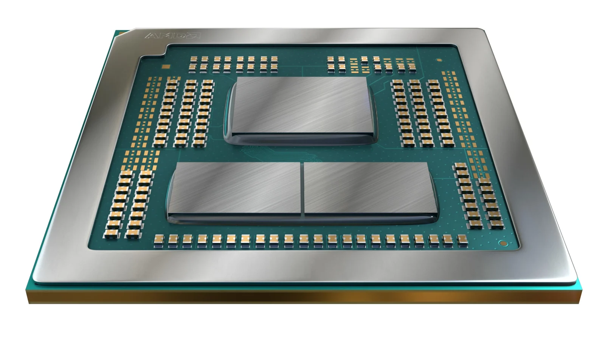

**סדרת "Dragon Range Refresh" מגיעה לשוק המחשבים הניידים עם ביצועים ברמה של מחשבי דסקטופ, תדרים גבוהים, תמיכה בזיכרון DDR5 וגרפיקה מובנית.**

## **שדרוג משמעותי למחשבים ניידים ב־2025**

AMD הכריזה רשמית על סדרת Ryzen 8000HX החדשה, ממשיכת דרכה של סדרת 7000HX, עם ליבות **Zen 4** ותדרים שמגיעים עד **5.4GHz**. המעבדים נועדו להציע **ביצועי דסקטופ בלפטופים**, במיוחד לגיימרים וליוצרי תוכן.

המעבד המוביל בסדרה – **Ryzen 9 8945HX** – כולל **16 ליבות ו־32 תהליכונים**, עם זיכרון מטמון של 80MB ו־TDP שנע בין 55 ל־75 וואט.

## **כל המעבדים החדשים בסדרה**

| דגם | ארכיטקטורה | ליבות / תהליכונים | תדר בסיס / בוסט | זיכרון מטמון | TDP |
| --- | --- | --- | --- | --- | --- |
| [Ryzen 9 8945HX](https://www.amd.com/en/products/processors/laptop/ryzen/8000-series/amd-ryzen-9-8945hx.html) | Zen 4 | 16 / 32 | 2.5 / 5.4 GHz | 80 MB | 55–75W |
| [Ryzen 9 8940HX](https://www.amd.com/en/products/processors/laptop/ryzen/8000-series/amd-ryzen-9-8940hx.html) | Zen 4 | 16 / 32 | 2.4 / 5.3 GHz | 80 MB | 55–75W |
| [Ryzen 7 8840HX](https://www.amd.com/en/products/processors/laptop/ryzen/8000-series/amd-ryzen-7-8840hx.html) | Zen 4 | 12 / 24 | 2.9 / 5.1 GHz | 76 MB | 45–75W |
| [Ryzen 7 8745HX](https://www.amd.com/en/products/processors/laptop/ryzen/8000-series/amd-ryzen-7-8745hx.html) | Zen 4 | 8 / 16 | 3.6 / 5.1 GHz | 40 MB | 45–75W |

## **מה חדש ומה חשוב לדעת?**

- ✅ **ארכיטקטורת Zen 4**: יעילות אנרגטית גבוהה וביצועים יציבים.
    
- ✅ **תמיכה ב־DDR5 ו־PCIe 5.0** – תשתית מודרנית ומהירה במיוחד.
    
- ✅ **גרפיקה מובנית Radeon 610M (RDNA 2)** – מתאימה לשימושים קלים ולמערכות ללא GPU חיצוני.
    
- ✅ **תמיכה מלאה במחשבים ניידים לגיימינג מתקדם**, כולל שילוב עם כרטיסי מסך כמו RTX 5080 / 5090.
    

## **מה לגבי Ryzen 9000HX?**

במקביל, AMD כבר שוקדת על סדרת **Ryzen 9000HX "Fire Range"** שתשתמש בליבות **Zen 5** החדשות. הדגם Ryzen 9 9955HX3D יציע גם **טכנולוגיית 3D V-Cache**, אידאלית לגיימרים שרוצים לשלב ביצועים גולמיים עם חיסכון בחשמל.

## **למי זה מתאים?**

אם אתם שוקלים לרכוש **מחשב נייד לגיימינג ב־2025**, סדרת 8000HX צפויה להציע **תמורה מצוינת למחיר**, במיוחד במחשבים מתקדמים של ASUS, MSI ו־Lenovo. הביצועים קרובים לאלה של דסקטופ – והמחיר עדיין משתלם ביחס למעבדי הדגל עם Zen 5.
