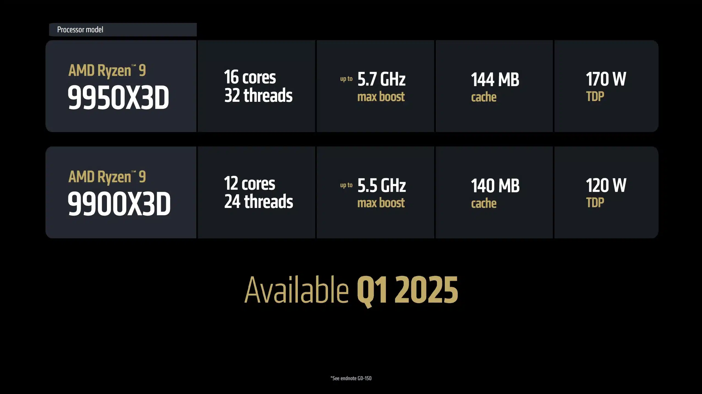

**AMD** מתכוננת להשקה גדולה במרץ 2025 עם המעבדים החדשים **Ryzen 9000X3D** וכרטיסי המסך **Radeon RX 9070**. עם ארכיטקטורה חדשה ושיפורים משמעותיים, החברה מציבה את עצמה כמתחרה חזקה מול **Intel** ו-**NVIDIA** בתחום הגיימינג.

## **🔹 סדרת Ryzen 9000X3D – מעבדים אופטימליים לגיימינג**

🚀 **השקה במרץ 2025:**  
המעבדים **Ryzen 9 9950X3D** (16 ליבות) ו-**Ryzen 9 9900X3D** (12 ליבות) היו אמורים לצאת **בנובמבר 2024**, אך נדחו ל-2025 לצורך אופטימיזציה.

🛠 **ארכיטקטורת Zen 5 + 3D V-Cache:**  
שיפור של **13% בביצועי גיימינג** לעומת הדור הקודם, הודות לשילוב **זיכרון מטמון 3D** וטכנולוגיות מתקדמות.

⚡ **תאימות וצריכת חשמל:**  
המעבדים עובדים על **תושבת AM5**, עם צריכה חשמלית מבוקרת ותדרי Boost של עד **5.2GHz**.

📊 **מפרט מלא של סדרת Ryzen 9000**:

## **🎮 Radeon RX 9070 – התשובה של AMD ל-NVIDIA**

🗓 **השקה עולמית במרץ 2025:**  
כרטיסי המסך **RX 9070 XT/XTX** יהיו זמינים מיד עם ההשקה, כולל גרסאות מותאמות אישית של יצרניות חומרה.

🔍 **ארכיטקטורת RDNA 4 – שיפור ניכר בביצועים:**  
📌 **16GB זיכרון GDDR6** עם ממשק **256-bit**, המספק **רוחב פס של 644.6GB/s**.  
📌 **כמות ליבות עיבוד** בין **3,584 ל-4,096** ותדרי Boost של עד **3.1GHz**.  
📌 **FSR 4** – שדרוג טכנולוגיית ה-FidelityFX Super Resolution עם **בינה מלאכותית** לשיפור איכות התמונה.

💰 **מחירים ותחרות מול NVIDIA:**  
🆚 עם מחיר משוער של **450-599 דולר**, כרטיסי **RX 9070** מתחרים ישירות מול **RTX 5070/5080**, ומציעים **ביצועים קרובים ל-RTX 4080** ב-**Rasterization**.

## **🔄 אסטרטגיה ותחרות – איך AMD מתכננת לכבוש את השוק?**

🔥 **השקה מסונכרנת של מעבדים וכרטיסי מסך:**  
AMD מנסה **למשוך את תשומת הלב של גיימרים ויוצרי תוכן**, במיוחד לקראת **השקת RTX 50 של NVIDIA** ו-**מעבדי Arc B570 של Intel**.

⏳ **עיכובים ואופטימיזציות:**  
הדחייה של **Ryzen 9000X3D** ו-RDNA 4 נובעת מהצורך **בפיתוח דרייברים** והטמעת **FSR 4 בצורה חלקה**, כדי לספק מוצר מוגמר ואופטימלי.

✅ **שורה תחתונה:**  
השקת המעבדים והכרטיסים החדשים **באותו חודש** נועדה **למקסם את המשיכה למערכת אקולוגית של AMD**, שבה **CPU ו-GPU עובדים בצורה מושלמת יחדיו**.

- AMD תשיק במרץ 2025 את מעבדי Ryzen 9000X3D עם ארכיטקטורת Zen 5 ו-3D V-Cache לשיפור ביצועי הגיימינג.
- כרטיסי Radeon RX 9070 יגיעו עם RDNA 4, תמיכה ב-FSR 4 וביצועים המתחרים ב-RTX 4080 של NVIDIA.
- ההשקה המסונכרנת של CPU ו-GPU נועדה למקסם את כוחו של אקוסיסטם AMD מול NVIDIA ו-Intel.
