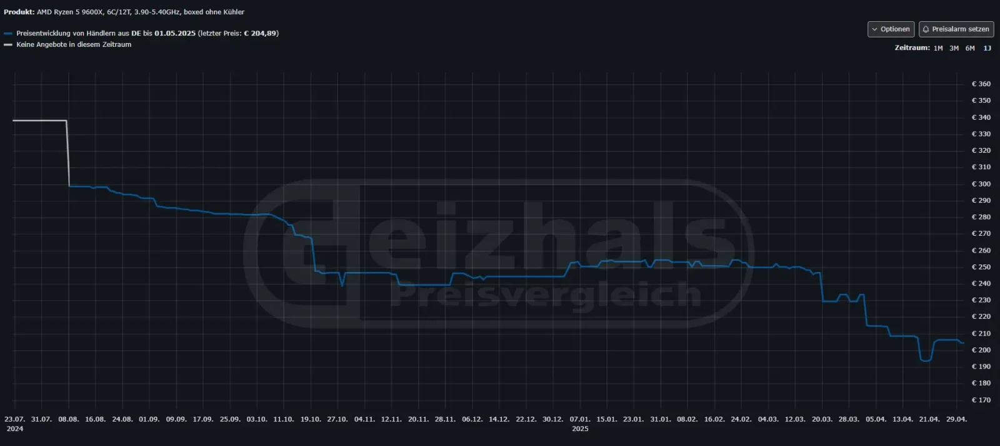
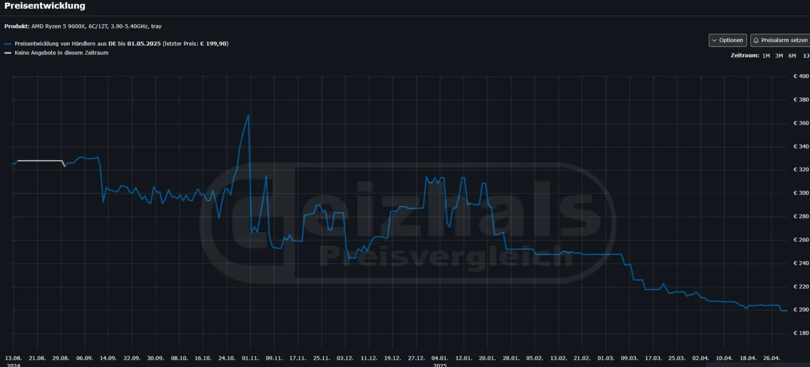

שוק המעבדים מתחמם מחדש: **AMD Ryzen 5 9600X**, מהמעבדים הפופולריים בסדרת Zen 5, ירד לראשונה למחיר של **200 אירו בלבד באירופה** – כמעט 100 אירו פחות ממחיר ההשקה באוגוסט 2024.

לפי אתר Geizhals, המחירים החדשים חלים גם על גרסת ה־boxed וגם על גרסת ה־tray, כאשר האחרונה אף זמינה בפחות מ־200 אירו. מדובר בירידת מחיר שמציבה את ה־9600X כבחירה אטרקטיבית במיוחד למחשבי גיימינג בתקציב בינוני.

## **ירידה חדה – והשפעה רחבה על השוק**

ה־9600X נמכר כעת במחיר שמשקף **185–193 דולר (אחרי ניכוי מע"מ)**, ובהשוואה למחיר ההשקה – מדובר בקיצוץ של כמעט 35%.  
לשם השוואה, מעבד Ryzen 5 7600X מהדור הקודם עדיין נמכר בגרמניה ביותר מ־200 אירו.  
בארה"ב, המעבד כבר הגיע למחיר נמוך יותר — סביב 185 דולר באמזון, מה שהופך אותו לדיל יוצא דופן.

> ה־9600X נמכר כעת במחיר שמשקף 185–193 דולר (אחרי ניכוי מע"מ), ובהשוואה למחיר ההשקה – מדובר בקיצוץ של כמעט 35%.

> > גם גרסת ה־tray (ללא מארז) נחתה מתחת לרף 200 אירו – מה שלא קרה מאז ההשקה.

## **מה זה אומר על שוק המעבדים?**

1. **לחץ על אינטל** – AMD מנסה לדחוק את סדרות Core i5 של אינטל ולבסס שליטה בשוק הביניים.
    
2. **עודפי מלאים או האטה בביקוש** – ייתכן שירידת המחיר מגיעה גם בעקבות מלאים גבוהים מהצפוי או ירידה בקצב השדרוגים אצל המשתמשים.
    
3. **שדרוג משתלם יותר לצרכנים** – משתמשים מרוויחים, ומקבלים **ביצועים משופרים במחיר של דור קודם.**
    

## **ומה המשמעות עבור השוק הישראלי?**

- 💸 **מחירים צפויים לרדת בקרוב** – המעבד כבר נמכר בישראל סביב 850–900 ₪, וצפוי להתקרב ל־750 ₪ בהמשך.
    
- 🖥️ **שדרוג אידאלי לגיימרים בתקציב בינוני** – עם 6 ליבות, תדר מקסימלי של 5.5GHz, ושיפור של 14% בביצועים לעומת 7600X.
    
- 🏪 **נוכחות גוברת על מדפי החנויות** – הוזלה כזו עשויה לגרום ליבואנים לדחוף את AMD יותר, על חשבון אינטל.
    

## **מה משתלם לשלב עם Ryzen 9600X?**

- לוחות אם: B650 / B850 (החל מ־400 ₪)
    
- כרטיסי מסך מומלצים:
    
    - AMD Radeon RX 9060 XT (השקה בקרוב)
        
    - NVIDIA GeForce RTX 5060 Ti (כבר זמין)
        

זהו בסיס מצוין למחשב 1080p או 1440p עוצמתי, גם למשחקים וגם לעבודה.

## **ומה עם גרסת X3D?**

נכון לעכשיו, **AMD טרם הכריזה על Ryzen 5 9600X3D**, שהייתה אמורה לצאת ברבעון הראשון של 2025. 
ייתכן שהפוקוס עבר ל־**סדרת Ryzen 9000G** (שם קוד: Gorgon Point), עם מעבדי APU חדשים.

## **לסיכום:**

ה־Ryzen 5 9600X נחת למחיר שובר שוק – והפך למעבד מהמשתלמים ביותר בקטגוריית הביניים.  
בין אם אתם גיימרים, בונים מחשב חדש או רק רוצים שדרוג חכם – זה בדיוק הזמן להסתכל עליו מחדש.
