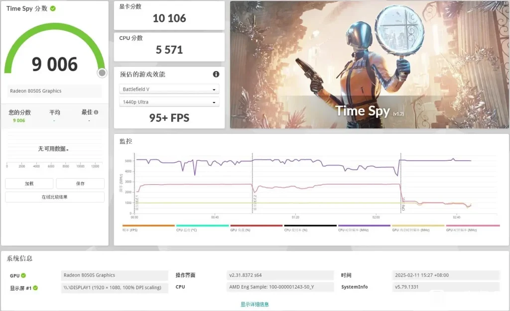

הדלפות חדשות חושפות את ביצועי ה-**AMD Ryzen AI MAX+ 395 "Strix Halo"**, מעבד עוצמתי למחשבים ניידים עם כרטיס גרפי מובנה **Radeon 8060S**. מבחני הביצועים ב-_3DMark Time Spy_ מצביעים על ביצועים מרשימים שיכולים לשנות את שוק המחשבים הניידים.

## **כרטיס גרפי מובנה שמתחרה בפתרונות ייעודיים**

לפי המבחנים האחרונים, יחידת העיבוד הגרפי **Radeon 8060S** השיגה **10,106 נקודות** במבחן _3DMark Time Spy_, תוצאה שממקמת אותה ברמה של **RTX 3060** וקרוב מאוד ל-**RTX 4060** ול-**RX 7600**.

### **השוואת ביצועי גרפיקה (3DMark Time Spy)**

| כרטיס גרפי | ניקוד ב-3DMark Time Spy |
| --- | --- |
| Intel Arc B580 | 14,700 |
| AMD Radeon RX 7600 | 10,990 |
| NVIDIA RTX 4060 | 10,614 |
| **AMD Radeon 8060S (Strix Halo iGPU)** | **10,106** |
| NVIDIA RTX 3060 | 8,746 |
| Intel Arc 140V | 3,996 |
| AMD Radeon 890M (כרטיס גרפי מובנה קודם) | 3,367 |

עם ביצועים כאלה, **ה-APU הזה יכול להפעיל משחקים ברזולוציית 1080p ואפילו 1440p ללא צורך בכרטיס מסך חיצוני** – זינוק טכנולוגי אדיר לעולם הכרטיסים הגרפיים המובנים.

## **המפרט הטכני של Ryzen AI MAX+ 395 "Strix Halo"**

ה-**Ryzen AI MAX+ 395** תוכנן עבור מחשבים ניידים עוצמתיים ותחנות עבודה ניידות, והוא כולל:

- **16 ליבות Zen 5 עם 32 תהליכונים**
- **40 יחידות עיבוד RDNA 3.5** (פי שניים מהדורות הקודמים של AMD)
- **רוחב פס זיכרון של 256GB/s**
- **TDP עד 120W**
- **תמיכה מתקדמת בכלי AI ויצירת תוכן**

השילוב של CPU עוצמתי ו-GPU מתקדם הופך את ה-**Strix Halo** לפתרון אידיאלי עבור **יוצרי תוכן, מפתחים וגיימרים ניידים**.

## **שיפור של פי 3 בהשוואה לדורות הקודמים של AMD**

אחד ההיבטים המרשימים ביותר ב-**Radeon 8060S** הוא ההתקדמות העצומה ביחס לדור הקודם. בהשוואה ל-**Radeon 890M** (עם 16 יחידות עיבוד), ה-**iGPU החדש מציג שיפור של 300% בביצועים**.

- **Radeon 890M**: 3,367 נקודות
- **Radeon 8060S**: 10,106 נקודות

השיפור מגיע בזכות **מספר יחידות עיבוד כפול (40 CU במקום 16)** ושימוש בזיכרון מהיר בהרבה.

## **למה זה יכול לשנות את שוק המחשבים הניידים?**

ה-**AMD Ryzen AI MAX+ 395** עם ה-**Radeon 8060S** יכול לחולל מהפכה בתעשיית המחשבים הניידים בשל היתרונות הבאים:

1. **פחות תלות בכרטיסי מסך ייעודיים**  
    → מאפשר יצירת **מחשבי גיימינג דקים וקלים יותר** ללא צורך ב-GPU חיצוני.
    
2. **שיפור משמעותי בצריכת החשמל**  
    → ה-**iGPU צורך פחות אנרגיה** ומייצר פחות חום לעומת כרטיסים גרפיים חיצוניים.
    
3. **ביצועים גבוהים בגיימינג ויצירת תוכן**  
    → ניתן לבצע **עריכת וידאו, עיבוד גרפי ומשחקים ברזולוציה 1440p** ללא בעיה.
    

## **זמינות וציפיות לעתיד**

המחשבים הראשונים עם **Ryzen AI MAX+ 395** צפויים להגיע לשוק **במחצית הראשונה של 2025**. עם ביצועים כאלו, AMD עשויה **לערער את הדומיננטיות של אינטל ו-NVIDIA** בשוק המחשבים הניידים.

העתיד של **כרטיסי מסך מובנים** נראה מבטיח יותר מאי פעם, ו-AMD מוכנה **להגדיר מחדש את הסטנדרטים** עם סדרת **Strix Halo** החדשה שלה.
