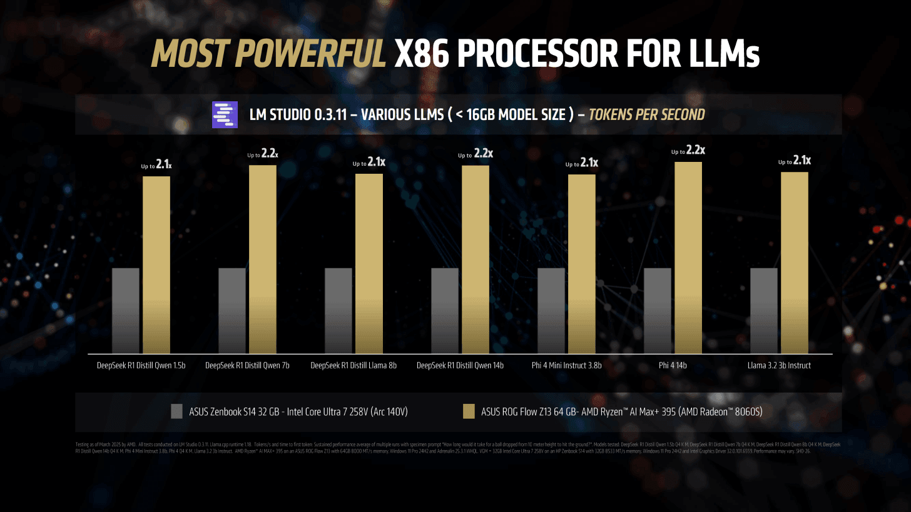
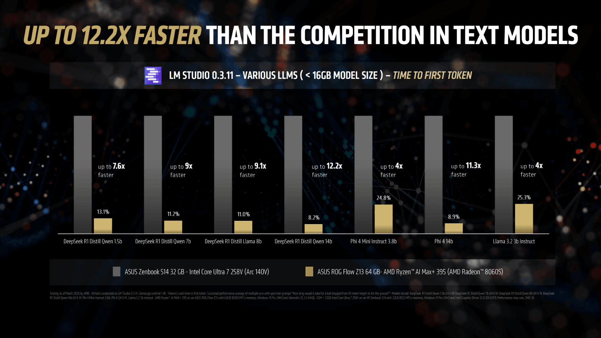
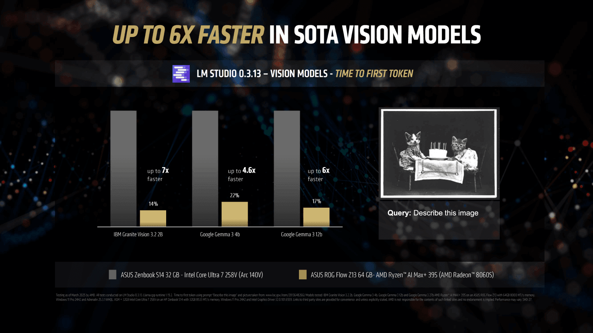
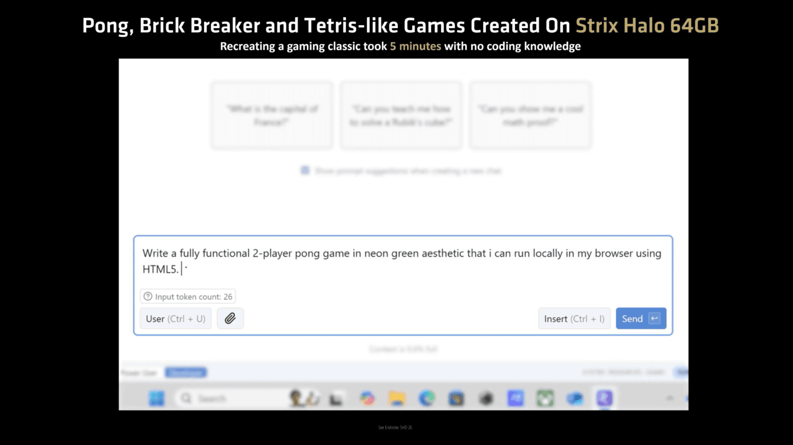
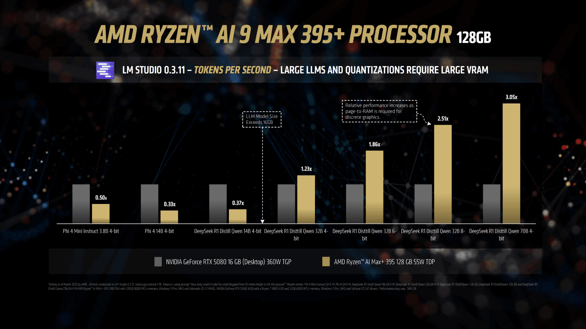

## **AMD מכוונת למהפכה בתחום ה-AI עם Ryzen AI MAX+ 395**

AMD חושפת את **Ryzen AI MAX+ 395 "Strix Halo"**, מעבד שמציג **ביצועים חסרי תקדים בעיבודי AI**, ואף מתעלה על כרטיסי מסך ייעודיים כמו **RTX 5080** במספר מבחנים.

המעבד הזה, שמיועד **למחשבים ניידים דקים ויוקרתיים**, משלב:

- **ליבות Zen 5** לעוצמה חישובית מרשימה
- **NPU מסוג XDNA 2 עם 50 TOPS**, המותאם ל-AI
- **מעבד גרפי משולב** שמאתגר פתרונות גרפיים חיצוניים

השורה התחתונה? **ביצועים מעולים בעבודה עם מודלי AI מתקדמים**, כולל **Llama.cpp ו-LM Studio**, המאפשרים להריץ מודלים גדולים מקומית, ללא צורך בחיבור לשרתים וללא ידע טכני מתקדם.

## **ביצועי AI שמשאירים את התחרות מאחור**

לפי AMD, **Ryzen AI MAX+ 395** מציג יתרון משמעותי על פני פתרונות כמו **Copilot+ של אינטל ו-NVIDIA**.

### **📊 ביצועים במודלי שפה (LLM)**

- **מהיר פי 2.2 מ-Intel Arc 140V** בהפקת טוקנים
- **פי 4 מהיר יותר בתגובה ראשונית עבור מודלים קטנים כמו Llama 3.2 3b**
- **עד פי 9.1 מהיר יותר במודלים בגודל 7-8B פרמטרים**
- **פי 12.2 מהיר יותר מאינטל Core Ultra 258V במודלים של 14B פרמטרים**

### **👁️ ביצועים בעיבוד תמונה וראייה ממוחשבת**

- **פי 7 מהיר יותר מ-IBM Granite Vision 3.2 3b**
- **פי 4.6 מהיר יותר מ-Google Gemma 3 4b**
- **פי 6 מהיר יותר מ-Google Gemma 3 12b**

### **💾 יתרון משמעותי בזיכרון**

בזמן שהמתחרים מוגבלים ל**32GB של זיכרון מאוחד**, **Strix Halo מציע עד 128GB**, כאשר **96GB מהם ניתנים להמרה ל-VRAM** בעזרת **Variable Graphics Memory**.

התוצאה? ניתן להריץ **מודלים גדולים כמו Google Gemma 3 27B**, שלמעבדים אחרים אין בכלל אפשרות להתמודד איתם.

## **איך Strix Halo מביס את RTX 5080 בעבודה עם AI?**

היתרון המרכזי של **Strix Halo** על פני **RTX 5080** טמון **בניהול זיכרון מתקדם**.

### **📈 ניהול זיכרון יעיל יותר**

- **Ryzen AI MAX+ 395** – משתמש ב-**128GB של זיכרון מאוחד**
- **RTX 5080** – מוגבל ל-**16GB VRAM ייעודי**
- **RTX 5090** – מגיע עם **32GB VRAM**, אך צורך **575W**!

כשמודלי AI חורגים מ-**16GB VRAM**, היתרון של **Strix Halo** בא לידי ביטוי עם **שיפור של עד פי 3.05 בביצועים** לעומת **RTX 5080**.

### **⚡ יחס ביצועים-צריכה עדיף על GPU חיצוני**

- **RTX 5080 צורך 360W**
- **RTX 5090 צורך 575W**
- **Strix Halo צורך הרבה פחות ומציע פתרון מובנה חסכוני יותר**

כשמודלי AI **נכנסים לתוך מגבלת הזיכרון של RTX 5080 ו-RTX 5090**, **כרטיסי המסך של NVIDIA נותנים תוצאות טובות יותר**.  
אבל **Strix Halo מספק אלטרנטיבה חכמה** – פתרון משולב, חסכוני, ומושלם **למחשבים ניידים קלי משקל עם ביצועים מתקדמים**.

## **Strix Halo: האם זו האלטרנטיבה המושלמת עבורכם?**

אם אתם **חוקרי AI, יוצרים, או משתמשים מתקדמים**, ורוצים **ביצועים גבוהים ללא צורך ב-GPU כבד ויקר**, **Ryzen AI MAX+ 395 "Strix Halo" יכול להיות בדיוק מה שאתם צריכים**.

- **מריצים מודלי AI באופן מקומי?** עם **128GB של זיכרון מאוחד**, אין חשש לצוואר בקבוק.
- **מחפשים כוח עיבוד חזק עם חיסכון באנרגיה?** **Strix Halo** צורך פחות מהמתחרים, אך מספק ביצועים קרובים ואף טובים יותר ביישומי AI מסוימים.
- **צריכים מחשב חזק וקל לנשיאה?** **APU משולב מציע פתרון אידיאלי** למחשבים ניידים דקים ויוקרתיים, בלי להתפשר על ביצועים.

אם **AI הוא חלק מהעבודה שלכם**, Strix Halo יכול להיות **אחת האפשרויות המעניינות ביותר בשוק**.

