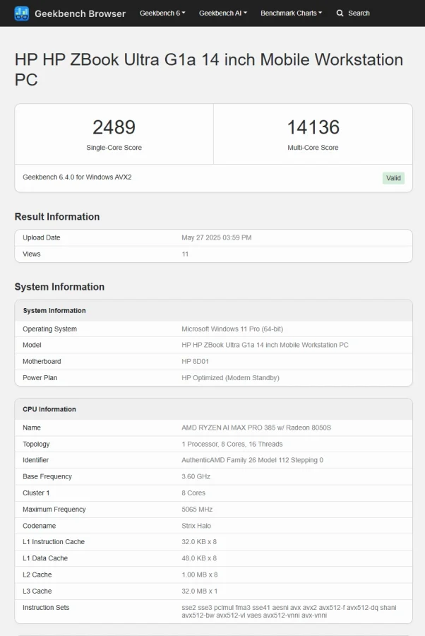
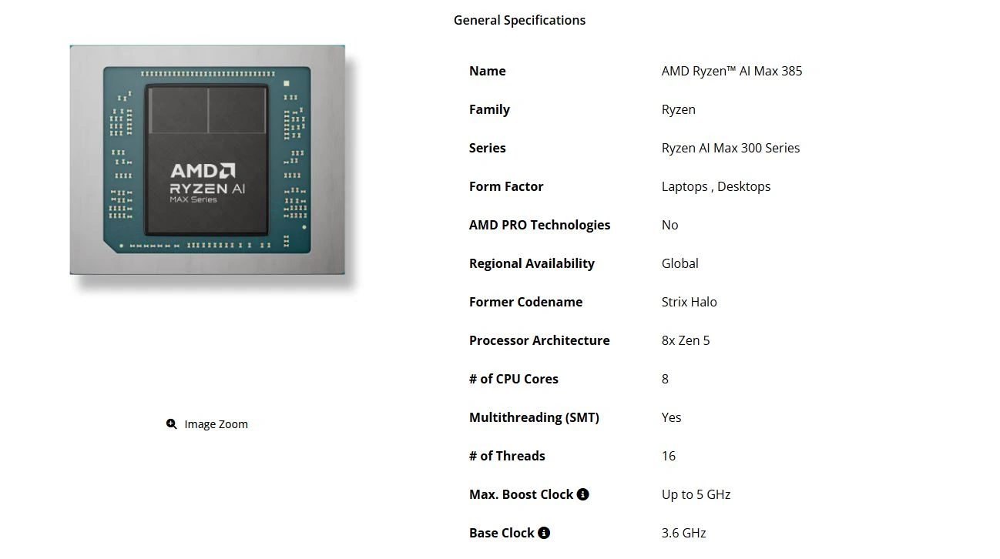

## **🧠 מעבד Strix Halo חדש – סוף סוף גם במחיר שפוי**

אחרי חודשים של דומיננטיות לדגמי הפרימיום בסדרת **Strix Halo** מבית AMD, נחשף סוף־סוף דגם נייד ובינוני יותר: **Ryzen AI Max Pro 385**.  
לא מדובר רק בגרסה מוחלשת – אלא בפתרון שמכוון לקהל חדש: יוצרי תוכן, אנשי מקצוע ואפילו גיימרים מזדמנים, שרוצים ביצועים גבוהים בלי לקרוע את הכיס.

## **🔍 מה קיבלנו ב־Pro 385?**

- **מעבד 8 ליבות / 16 תהליכונים (Zen 5)**
    
- תדר בסיס: **3.6GHz** | תדר Boost: **5.0GHz**
    
- **כרטיס גרפי מובנה Radeon 8050S** (מבוסס RDNA 3.5)
    
- ביצועי AI מרשימים: **עד 50 TOPS NPU** ו־**100+ TOPS בסך הכול**
    

למרות שמדובר בדגם "ביניים", הוא מגיע עם חלקים טכנולוגיים מהשורה הראשונה. גרסת ה־8050S למשל, נחותה ב־8 יחידות עיבוד בלבד לעומת 8060S מהדגם הבכיר (Pro 395).

## **📊 תוצאות Geekbench: מבט ראשון לביצועים**

המעבד נבחן במחשב נייד מסוג **HP ZBook Ultra G1a**:

| מבחן | תוצאה |
| --- | --- |
| Single-Core | 2489 נקודות |
| Multi-Core | 14136 נקודות |

⚠️ יש לזכור: **Geekbench לא מייצג ביצועים ריאליים בכל שימוש**, אך כן מספק אינדיקציה כללית. למי שמכוון לעבודה גרפית, עריכה או פרודוקטיביות – מדובר במעבד ראוי בהחלט.

## **🎮 ומה עם גיימינג?**

למרות שזו לא המטרה העיקרית של המעבד, ה־**Radeon 8050S** מסוגל להריץ **משחקים ב־1080p בקצב פריימים סביר**.  
הוא לא מתחרה ב־RTX 4070, אבל למי שמחפש גיימינג מזדמן במחשב נייד קל – זו בשורה מעודדת מאוד.

## **💰 מחיר שובר שוק – גם בדולרים וגם בשקלים**

בעוד מחשבים עם Ryzen AI Max Pro 395 עולים **כ־$2000 ומעלה**  
(בערך **7,300 ש"ח**),  
מחשבים ניידים או Mini-PCs עם **Ryzen AI Max Pro 385 צפויים להימכר בפחות מ־$1500** – כלומר כ־**5,500 ש"ח** בלבד.

## **🎯 למי זה מתאים?**

- אנשי תוכן שזקוקים לגרפיקה טובה בלי GPU חיצוני
    
- מקצוענים שדורשים יכולות AI מתקדמות (כמו עיבוד שפה, וידאו, אודיו)
    
- סטודנטים ומהנדסים עם צרכים גבוהים, אבל תקציב מוגבל
    
- גיימרים מזדמנים שמעדיפים ניידות על פני כרטיס גרפי חזק
    

## **🗓 מתי נראה את זה בשוק?**

AMD עדיין לא הכריזה רשמית על זמינות, אבל הופעת המעבד ב־Geekbench מצביעה על **השקה קרובה מאוד**.  
ההימור שלנו: קיץ 2025, יחד עם גל חדש של מחשבים ניידים חכמים.
