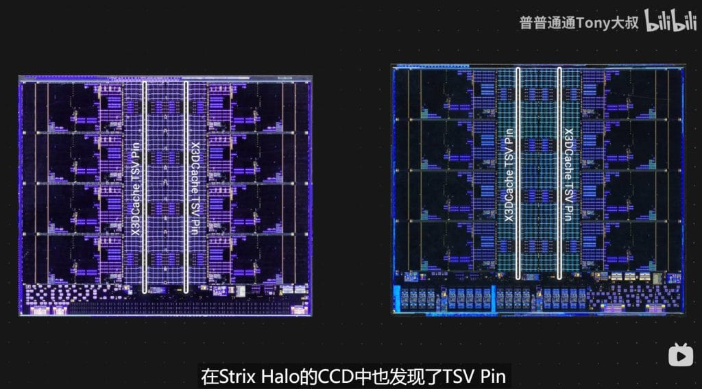
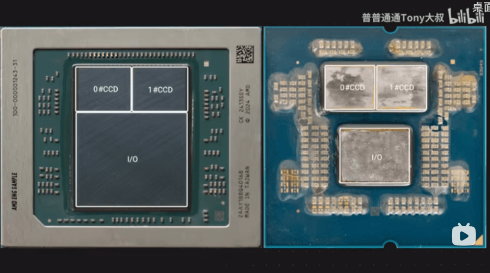

- AMD עשויה להביא את 3D V-Cache ללפטופים – הדלפה חדשה מציעה כי מעבדי Strix Halo כוללים חיבורי TSV המאפשרים שילוב של מטמון L3 נוסף.
- שיפור אדיר בביצועים – אם יתממש, זה יוכל להגדיל ביצועים בגיימינג, עריכת וידאו וחיסכון בחשמל.
- צפי להשקה בסוף 2025 – AMD טרם אישרה רשמית, אך הסימנים מראים שמעבדי Strix Halo X3D עשויים להגיע בקרוב.

## **האם AMD תביא את ה-3D V-Cache ללפטופים?**

סדרת **AMD Strix Halo** נחשפה לאחרונה, ועכשיו דליפה חדשה מגלה כי AMD עשויה לקחת את השדרוג הזה צעד קדימה. לפי מקורות ב-_ASUS China_, נמצאו ראיות לכך שמעבדי **Ryzen AI Max+ 395 ו-390** כוללים חיבורי TSVs (Through-Silicon Vias), מה שיכול לאפשר **שילוב של זיכרון מטמון L3 נוסף באמצעות טכנולוגיית 3D V-Cache**.

אם זה נכון, אנחנו עשויים לראות את **מעבדי Strix Halo X3D** – גרסאות משודרגות עם ביצועים גבוהים יותר לעיבוד נתונים, גיימינג ויצירת תוכן.

* * *

## **איך 3D V-Cache ישדרג את מעבדי Strix Halo?**

לפי **ASUS**, המבנה של Strix Halo כולל **מערכת חיבורים חדשה** שמקטינה את גודל המעבד ב-42.3% ומשפרת את **השהיית הנתונים וצריכת החשמל**.

**כיתוב תמונה:** _השוואה בין Strix Halo (משמאל) ל-Ryzen 9950X (מימין). ניתן לראות את המבנה החדש של ה-CCD וה-I/O._

טכנולוגיית ה-**3D V-Cache** מאפשרת לערום שכבת מטמון נוספת על גבי ליבות ה-Zen 5, מה שמגדיל את הזיכרון הזמין ליישומים כבדים כמו **משחקים, עריכת וידאו ועיבוד נתונים אינטנסיבי**.

## **מה זה אומר ללפטופים?**

אם AMD תשלב **3D V-Cache** ב-Strix Halo, היתרונות יהיו משמעותיים:

✅ **שיפור בביצועי גיימינג** 🎮  
זיכרון המטמון הנוסף יפחית השהיות ויגדיל את קצב הפריימים במשחקים.

✅ **חיסכון בצריכת חשמל** 🔋  
מיעול ניהול המשאבים יוכל להאריך את חיי הסוללה של לפטופים.

✅ **ביצועים טובים יותר בעריכת וידאו ו-3D** 🖥️  
תוכנות כמו Premiere Pro ו-Blender ירוויחו מביצועים מהירים יותר בזכות **השהיית נתונים נמוכה יותר**.

**כיתוב תמונה:** _חיבורי TSV ב-Strix Halo מעידים על תמיכה עתידית ב-3D V-Cache, בדומה לסדרת Ryzen X3D למחשבים שולחניים._

## **מה עם הביצועים של Strix Halo היום?**

גם בלי 3D V-Cache, המעבדים החדשים של AMD מציעים **יכולות גיימינג מרשימות**, עם כרטיס מסך מובנה **Radeon 8060S** שמספק ביצועים **קרובים ל-RTX 4070 Laptop**.

| **מעבד / כרטיס מסך** | **ניקוד 3DMark Time Spy** |
| --- | --- |
| Intel Arc B580 | **14,700** |
| AMD Radeon RX 7600 | **10,990** |
| NVIDIA RTX 4060 | **10,614** |
| **AMD Radeon 8060S (Strix Halo iGPU)** | **10,106** |
| NVIDIA RTX 3060 | **8,746** |
| Intel Arc 140V | **3,996** |
| AMD Radeon 890M (הדור הקודם) | **3,367** |

אם AMD תוסיף **3D V-Cache**, הביצועים של מעבדי Strix Halo עשויים להתחרות **במעבדים נייחים** ברמת Ryzen 9 X3D!

## **מתי נוכל לראות Ryzen X3D ללפטופים?**

כרגע, AMD לא הכריזה רשמית על מעבדי **Strix Halo X3D**, אבל **הדלפות מצביעות על כך שגרסה כזו עשויה להגיע בסוף 2025**.

🛠 **אם זה יתממש, מדובר בקפיצת מדרגה משמעותית שתהפוך את שוק הלפטופים על פיו.**

📢 **מה דעתכם? האם 3D V-Cache יכול לשנות את חוקי המשחק בלפטופים כמו שעשה במחשבים נייחים?**
