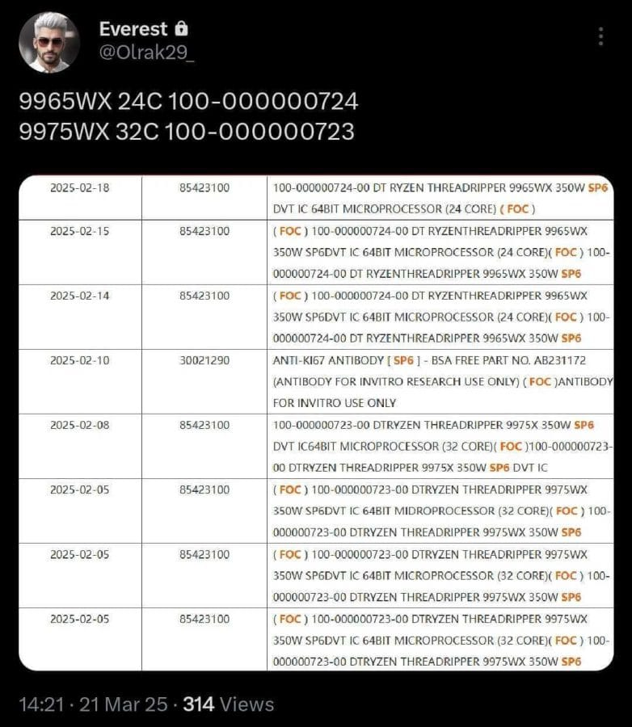

שני מעבדים חדשים ממשפחת Threadripper PRO 9000 של AMD דלפו ברשומות שילוח, וחושפים חלק מהמפרט הטכני: עד 32 ליבות, 64 נימים ו-TDP של 350W. אבל לפני שאתם מתלהבים – האם זה באמת רלוונטי לרוב המשתמשים?

## **מה אנחנו יודעים עד כה?**

לפי רישומי שילוח שדלפו השבוע, AMD מתקרבת להשקה של סדרת **Threadripper PRO 9000**, שתתבסס על ארכיטקטורת Zen 5. שני מעבדים בולטים נחשפו:

- **Threadripper PRO 9975WX** – עם 32 ליבות ו-64 נימים
    
- **Threadripper PRO 9965WX** – עם 24 ליבות ו-48 נימים
    

שני המעבדים מיועדים לשוק ה-HEDT (High-End Desktop), ובעיקר לשימושים מקצועיים כבדים. הם ממשיכים את קו הסדרה הקודמת, Threadripper PRO 7000, עם אותה תצורת ליבות אך ארכיטקטורה משופרת.

_שני דגמי ה-Threadripper החדשים כפי שהופיעו בלוג השילוח_

## **מפרט טכני: מוכר, אך יעיל יותר**

שני המעבדים צפויים להגיע עם **TDP של 350W**, בדומה לסדרה הקודמת – אך בזכות המעבר לארכיטקטורת Zen 5 ולתהליך ייצור ב-4 ננומטר, הם יהיו **יעילים יותר בצריכת החשמל ובביצועים**.

- **תושבת:** SP6, כמו בדור הקודם
    
- **תמיכה ב-PCIe מרובה** – קריטי לעבודה עם כרטיסי מסך, כרטיסי אחסון ופתרונות רשת מקצועיים
    
- **ללא שינוי במספר הליבות**, אך שיפורים משמעותיים במהירות השעון ובאופטימיזציה לתהליכי עבודה מקבילים
    

## **אבל רגע – מי בכלל צריך את זה?**

זוהי נקודת המפתח. **Threadripper אינו מיועד לגיימרים רגילים או לשימוש ביתי**. מדובר במעבדים לשוק מקצועי: עורכי וידאו, אנימטורים, מהנדסי נתונים, מפתחי תוכנה, יוצרי תוכן 3D ועוד.

התגובות בפורומים הבינלאומיים מדגישות את זה היטב:

> "אם אתה מתלונן על המחיר – כנראה שאתה לא קהל היעד", כתב אחד המגיבים.

הסדרה הזו **נועדה לספק כוח עיבוד קיצוני עבור תהליכים שמריצים עשרות חישובים במקביל** – וזה שונה מאוד משימוש יומיומי או אפילו מערכות גיימינג מתקדמות.

## **למה אין תחרות, ולמה זה חשוב?**

מאז ש-Intel נטשה את תחום ה-HEDT לצרכן הביתי, AMD נשארה כמעט לבדה בזירה. זה הביא לעלייה משמעותית במחירים ולפחות אלטרנטיבות ביניים. כיום, כל מי שצריך יותר מ-16 ליבות נמצא במצב לא פשוט:

- **אין אמצע** בין Ryzen לשוק ה-Threadripper/EPYC
    
- **המחירים התחילו באלף דולר רק למעבד**, שלא לדבר על לוחות אם ופתרונות קירור
    

כמה מגיבים אף ציינו שצריך פתרון ביניים, כמו שהיה פעם עם סדרות Core X של אינטל. כרגע – אין כזה.

## **ומה עם 3D V-Cache?**

הרבה גיימרים קיוו לראות גרסת Threadripper עם זיכרון מטמון תלת-ממדי, כמו ב-Ryzen X3D – אבל הסיכוי לכך קלוש מאוד. לפי הדלפות מהשבוע:

- AMD **לא תשלב את הטכנולוגיה הזו בדור הנוכחי**
    
- V-Cache נחשב לטכנולוגיה יקרה ונישתית, שמתאימה רק לתרחישים מאוד מסוימים כמו מסדי נתונים או חישובים מדעיים
    

## **לסיכום: כוח שלא מיועד לכולם**

סדרת Threadripper PRO 9000 מביאה את כל מה שהיינו מצפים לו: **ביצועים מעולים, שדרוג טכנולוגי, ותגובה לצרכים של מקצוענים אמיתיים**. אבל היא לא מיועדת לרוב המשתמשים – ואולי אפילו לא לרוב הגיימרים.

אם אתם עורכים סרטים כבדים, מריצים סימולציות מורכבות או בונים תחנות עבודה עתירות GPU – המעבדים האלו נועדו לכם.

אבל אם מה שאתם צריכים זה מחשב גיימינג מהיר, או אפילו מחשב עבודה חזק, יש פתרונות הרבה יותר משתלמים. Threadripper נשאר מוצר על – חזק, מרשים, אבל רחוק מהשולחן של המשתמש הממוצע.
