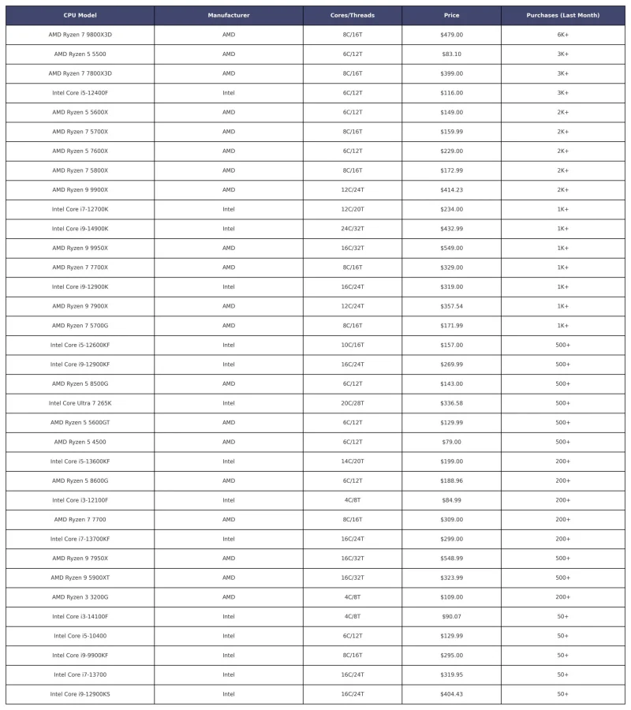

AMD ממשיכה לדרוס את אינטל, והפעם עם נתונים שממחישים עד כמה: לפי נתוני Amazon ארה"ב לחודש מרץ 2025, AMD אחראית לכמעט **80% מהמכירות** – וגם גרפה **פי חמישה יותר הכנסות** מהמתחרה.

## **מי המעבדים הכי נמכרים בתחילת 2025 לפי Amazon ארה"ב?**

במקום הראשון – ללא הפתעות – **Ryzen 7 9800X3D**, שמכר מעל **6,000 יחידות** במהלך החודש. לפי ההערכות, המספר הסופי מתקרב ל־7,000. המעבד הזה ממשיך להיות הבחירה המובילה לגיימרים רציניים, למרות מחיר של כ־479 דולר.

ולצידו, דווקא מעבד בסיסי מצליח להפתיע: **Ryzen 5 5500** עם תג מחיר של פחות מ־90 דולר, מכר מעל **3,000 יחידות** – והוכיח שוב ש־**AM4** רחוקה מלהיעלם.

גם **Ryzen 7 7800X3D** שמר על פופולריות גבוהה מאוד, עם מכירות דומות לאלה של Ryzen 5 5500.

## **אינטל? רק שני נציגים בטופ 10**

רק שני מעבדים של Intel נכנסו לעשירייה הראשונה:

- **Core i5 12400F** – מתחרה ישיר של Ryzen 5 5600X עם תמורה מעולה למחיר
    
- **Core i7 12700K** – 12 ליבות ו־24 תהליכונים בפחות מ־235 דולר, בחירה חכמה ליוצרי תוכן וגיימרים בתקציב מוגבל
    

לעומת זאת, סדרת **Core Ultra 200S** של אינטל נכשלה בינתיים. הדגם הנמכר ביותר, **Core Ultra 7 265K**, לא עבר אפילו את רף ה־500 יחידות.

## **סדרות Ryzen 5000 ו־7000 ממשיכות להוביל**

למרות ש־AMD השיקה את סדרת Ryzen 9000, המשתמשים עדיין מעדיפים את הסדרות הקודמות. **Ryzen 5 7600X** הוא הדגם הלא־X3D הפופולרי ביותר בסדרת Zen 4, והיחיד מסדרת 9000 שנכנס לעשירייה הראשונה הוא **Ryzen 9 9900X**.

גם **Ryzen 9 9950X** רשם נוכחות, אבל רק אחרי **Core i9 14900K**, עם מכירות של מעל 1,000 יחידות.

## **המספרים לא משקרים**

סיכום חודש מרץ 2025 לפי Amazon ארה"ב:

- **AMD** – כ־31,600 יחידות (78.7%) והכנסות של כ־7.8 מיליון דולר
    
- **Intel** – רק 7,500 יחידות (21.3%) והכנסות של כ־1.5 מיליון דולר
    

## **למה AMD כל כך מצליחה?**

ההצלחה של AMD לא מקרית. היא נובעת משילוב של כמה גורמים:

- **תמחור חכם** – החברה מציעה פתרונות חזקים גם בטווחי מחיר נגישים מאוד
    
- **תמיכה בפלטפורמות ותיקות** – במיוחד AM4, שממשיכה למשוך קהל רחב
    
- **הובלה טכנולוגית ב־X3D** – השבבים עם זיכרון מטמון תלת-ממדי מוכיחים את עצמם בגיימינג
    
- **ביצועים יציבים לאורך זמן** – גם בדגמים ישנים יחסית
    

בינתיים, אינטל מתקשה להמריא עם הסדרות החדשות שלה. כל עוד זה המצב, AMD צפויה להמשיך להוביל – לפחות בזירת המכירות המקוונות.
