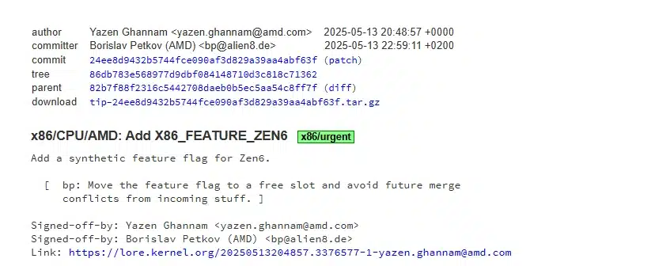
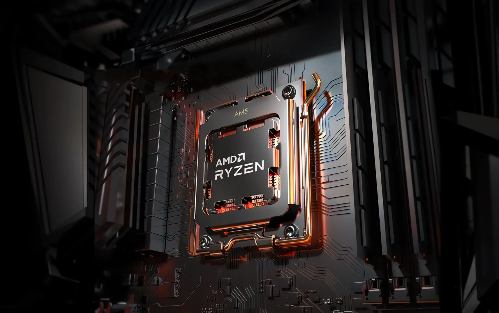

## **מה חדש בעדכון Zen 6?**

לפי [Phoronix](https://www.phoronix.com/news/AMD-Zen-6-Linux-Kernel-Start), AMD שחררה את עדכון Zen 6 הראשון ללינוקס. מדובר בעדכון "X86\_FEATURE\_ZEN6" שמסמן את נוכחות ליבות Zen 6 במערכת.

העדכון אינו חושף הרבה מידע על הארכיטקטורה עצמה, אך הוא מהווה את הבסיס לכל העדכונים העתידיים עבור Zen 6 בלינוקס. המידע המרכזי שעלה בעדכון:

- **שילוב מאפיין X86\_FEATURE\_ZEN6:** זיהוי ראשוני של ליבות Zen 6 במערכת.
    
- **שימוש בקוד משפחה 1Ah:** בדומה ל-Zen 5, אך עם מזהי דגם שונים, מה שעשוי להצביע על שדרוג קל בארכיטקטורה.
    

עדכון זה נחשב לבסיסי אך חשוב, מכיוון שהוא מאפשר למערכת ההפעלה לזהות את ליבות Zen 6 ולהתכונן לתמיכה רחבה יותר בהמשך.

### **מה המשמעות?**

- **זיהוי ליבות Zen 6:** העדכון נועד לאפשר למערכת ההפעלה לזהות את המעבדים החדשים בעתיד.
    
- **קוד משפחה 1Ah:** Zen 6 יישאר תחת אותו קוד משפחה כמו Zen 5, אך עם מזהי דגם שונים.
    

## **Medusa Ridge ו-EPYC Venice – מה מחכה לנו?**

לפי הדיווחים, Zen 6 יגיע במספר גרסאות עם דגמים שונים המיועדים גם לשוק הביתי וגם לשוק השרתים. הנה מה שאנחנו יודעים עד כה:

- **מעבדי שולחן עבודה Medusa Ridge:** 12, 24 ו-32 ליבות.
    
- **מעבדי שרתים EPYC Venice:** גרסאות Zen 6c ו-Zen 6 עם עד 256 ליבות דחוסות ו-128 MB זיכרון מטמון לכל CCD.
    

## **מתי נראה את Zen 6 בשוק – ומה מצפה לנו בהמשך??**

העדכון ללינוקס מסומן כ"דחוף", ולכן ייתכן שנראה את Zen 6 כחלק מהמחזור של Linux 6.15.

בדרך כלל, הופעת עדכונים ללינוקס עבור ארכיטקטורות חדשות מרמזת על כך ש-AMD כבר החלה בתהליך האימות המוקדם של המעבדים, מה שמרמז על הכרזות קרובות.

### **למה Zen 6 עשוי לשנות את כללי המשחק?**

- **תמיכה בליבות צפופות (Zen 6c):** מהלך שעשוי להגדיל את מספר הליבות בשרתים באופן משמעותי.
    
- **שימוש בתהליך N3E של TSMC:** המעבר לתהליך ייצור מתקדם יותר מבטיח שיפור בביצועים ובחיסכון באנרגיה.
    
- **השוואה ל-Zen 5:** במבט ראשון, נראה כי Zen 6 ישמור על קווי הדמיון עם Zen 5, אך עם תוספות ייחודיות לשרתים (Zen 6c) ולשוק הביתי (Medusa Ridge).
