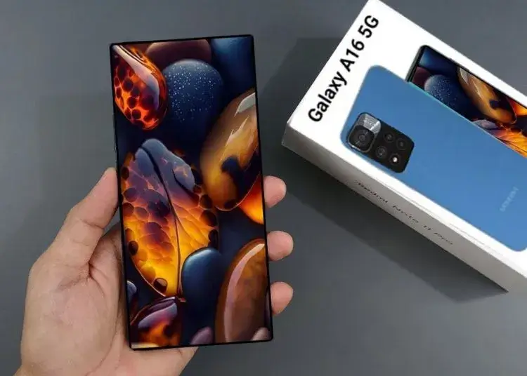
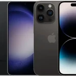
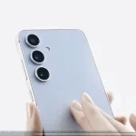

# ההכרזה הזו של סמסונג עשויה לשנות לחלוטין את שוק הסמארטפונים

הסמארטפון הבא של סמסונג בקטגוריית הכניסה, ה-Galaxy A16 5G, יקבל עדכונים למשך 6 שנים. זהו שיא אריכות ימים למכשיר בקטגוריה זו.

© Samsung - Galaxy A16 5G

סמסונג כבר משקיעה מאמצים להאריך את חיי המוצרים שלה. דגמי ה-Galaxy S24 והסמארטפונים המתקפלים האחרונים של החברה יקבלו עדכוני אבטחה ועדכוני מערכת הפעלה של אנדרואיד במשך 7 שנים. נראה כי החברה הקוריאנית מתכננת להשיק גם סמארטפון בקטגוריית הכניסה שיקבל עדכונים למשך 6 שנים.

על פי שמועות, ה-Galaxy A16 5G, הדגם הבא בקטגוריית הכניסה של סמסונג, יקבל 6 שנים של עדכוני אבטחה ו-6 עדכוני גרסאות אנדרואיד. ייתכן שהשקה בהודו תתרחש כבר בספטמבר.

אם סמסונג אכן תציע 6 שנות עדכונים לדגם ה-Galaxy A16 5G, זה עשוי לשנות את שוק הסמארטפונים, שבו כיום מקובל להציע עדכונים למשך 3 שנים בלבד.

## Galaxy A16 : מה המפרט הטכני?

האתר The Tech Outlook לא מציין את המחיר של דגם ה-Galaxy A16 5G העתידי, אך הוא כן מספק פרטים על המפרט הטכני. על פי הדיווח, ל-Galaxy A16 5G יהיה מסך ברזולוציית FHD+ עם קצב רענון של 90Hz. החברה תציע גרסה אחת עם שבב Dimensity 6300 וגרסה נוספת עם שבב Exynos 1330. כמו כן, המכשיר יכלול שלושה חיישני צילום בגב המכשיר.

מבחינת עיצוב, המכשיר צפוי לכלול מסך ללא שוליים מקדימה וגב פלסטיק עם אפקט מראה. בסך הכל, מדובר במפרט של מכשיר בקטגוריית הכניסה, אך ה-Galaxy A16 5G עשוי למשוך משתמשים שמחפשים מכשיר שישמש אותם לאורך שנים מבלי להשקיע הון במכשירי פרימיום.

- Galaxy A16 5G יגיע עם מסך FHD+ וקצב רענון של 90Hz, מה שמספק חוויית צפייה חלקה.
- שתי גרסאות של המכשיר יוצעו: אחת עם שבב Dimensity 6300 והשנייה עם שבב Exynos 1330.
- המכשיר יכלול שלושה חיישני צילום בגב ועיצוב עם מסך ללא שוליים וגב פלסטיק עם אפקט מראה.

חדשות אחרונות 

### [הנה רשימת 10 הסמארטפונים הפופולריים ביותר](https://techhorizons.co.il/top-10-most-popular-smarthpones-2024/)

### [Ghost of Yōtei: ההמשך השאפתני של Ghost of Tsushima](https://techhorizons.co.il/ghost-of-yotei-%d7%94%d7%94%d7%9e%d7%a9%d7%9a-%d7%94%d7%a9%d7%90%d7%a4%d7%aa%d7%a0%d7%99-%d7%a9%d7%9c-ghost-of-tsushima/)

### [לינקין פארק משיקים המנון ליג 2024](https://techhorizons.co.il/%d7%9c%d7%99%d7%a0%d7%a7%d7%99%d7%9f-%d7%a4%d7%90%d7%a8%d7%a7-%d7%9e%d7%a9%d7%99%d7%a7%d7%99%d7%9d-%d7%94%d7%9e%d7%a0%d7%95%d7%9f-%d7%9c%d7%99%d7%92-2024/)

### [Palworld: נינטנדו תובעת, Pocketpair לא נכנעים](https://techhorizons.co.il/palworld-pocketpair-justice/)

### [דליפת וידאו של Galaxy S24 FE](https://techhorizons.co.il/galaxy-s24-fe-leak/)
