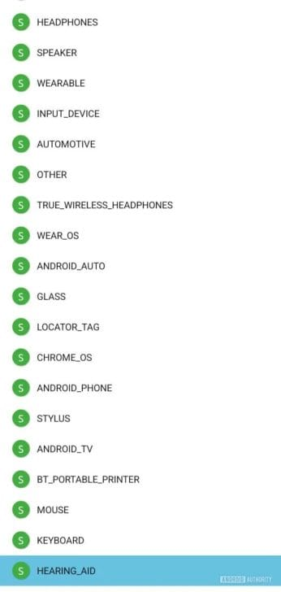

## חיבורי שמיעה חכמים: גוגל ממשיכה את המגמה

בעקבות Apple שהובילה מהפכה בשוק מכשירי השמיעה עם ה-AirPods Pro 2 שלה, Google מצטרפת למאמץ להפוך את החיים לקלים יותר עבור משתמשי מכשירי שמיעה. גוגל פועלת להנגשת הטכנולוגיה שלה ולהפיכת חיבור מכשירי השמיעה למכשירי אנדרואיד לפשוט ונוח יותר, כחלק מהמאמץ להרחיב את האפשרויות עבור קהל משתמשים רחב יותר.

## Android 15 והחידושים בחיבור מכשירי שמיעה

Google כבר הציעה את תכונת Fast Pair לחיבור מהיר של רמקולים ואוזניות, אך כעת, עם Android 15, הטכנולוגיה מתרחבת גם למכשירי שמיעה.

- **Bluetooth LE Audio ו-ASHA:**
    - טכנולוגיות חדשות המאפשרות שיפור באיכות הצליל.
    - הפחתת השיהוי ושיפור חיי הסוללה.
- **Fast Pair מותאם למכשירי שמיעה:**
    - זיהוי מיידי של מכשירי השמיעה כהתקן Bluetooth.
    - ביטול הצורך בהתאמות ידניות והפיכת החיבור לאינטואיטיבי יותר.

## המאמצים של גוגל לשיפור הנגישות

עדכון בתכונת ה-Fast Pair, שהתגלה בגרסת הבטא של Google Play Services 24.50.32, מדגיש את המחויבות של Google לפשט תהליכים ולהנגיש את מוצריה עבור משתמשים עם צרכים ייחודיים. החיבור המיידי מונע תהליכים מורכבים, ומספק פתרון מהיר ואפקטיבי.

## מה צפוי בהמשך?

כרגע, לא נמסר מידע מדויק על מותגי מכשירי השמיעה שיתמכו ב-Fast Pair, אך ברור ש-Google שואפת להרחיב את הנוחות והנגישות למשתמשים רבים ככל האפשר. עם צעדים אלה, Android 15 מציבה סטנדרט חדש בגישה לשירותים בריאותיים מבוססי טכנולוגיה.

- Fast Pair למכשירי שמיעה: חיבור מיידי ואינטואיטיבי ללא צורך בהתאמות ידניות.
- שיפורי Bluetooth LE Audio: איכות צליל גבוהה יותר, שיהוי מופחת וחיי סוללה ארוכים יותר.
- נגישות משופרת: גוגל פועלת להנגשת טכנולוגיה למשתמשים רחבים עם פתרונות חכמים ובריאותיים.
