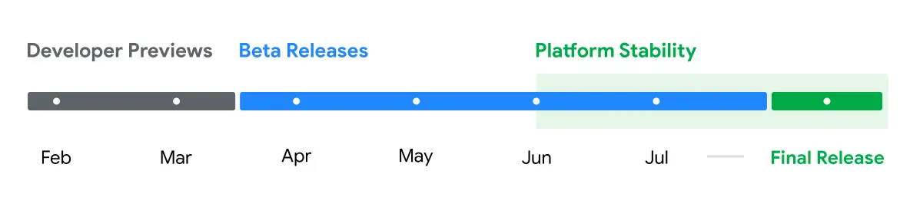
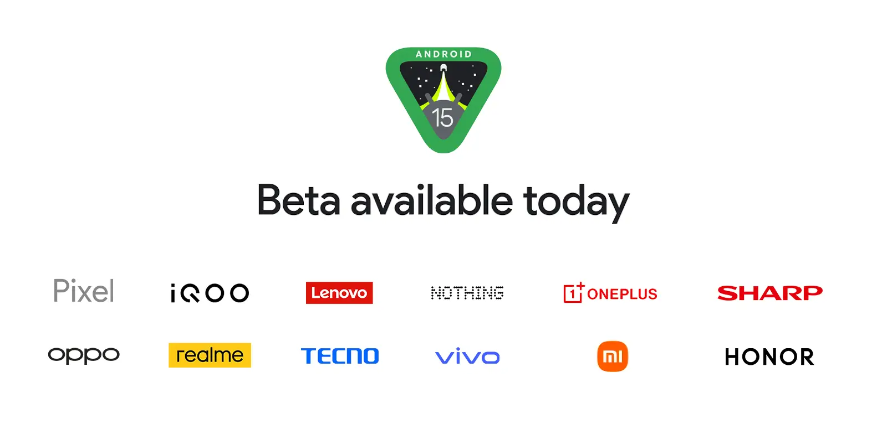
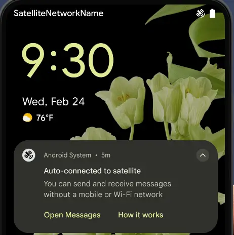
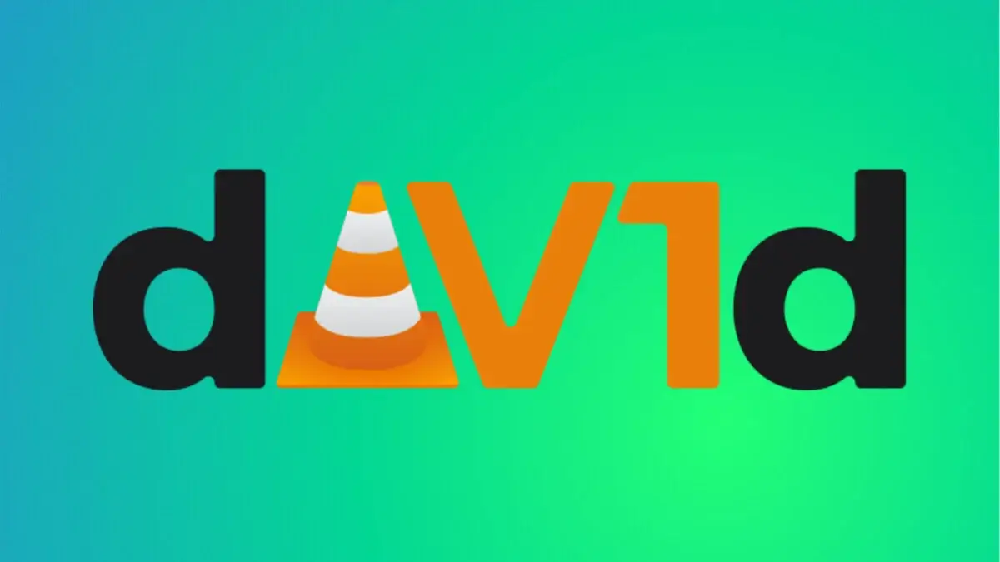
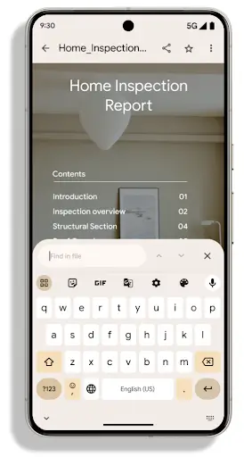
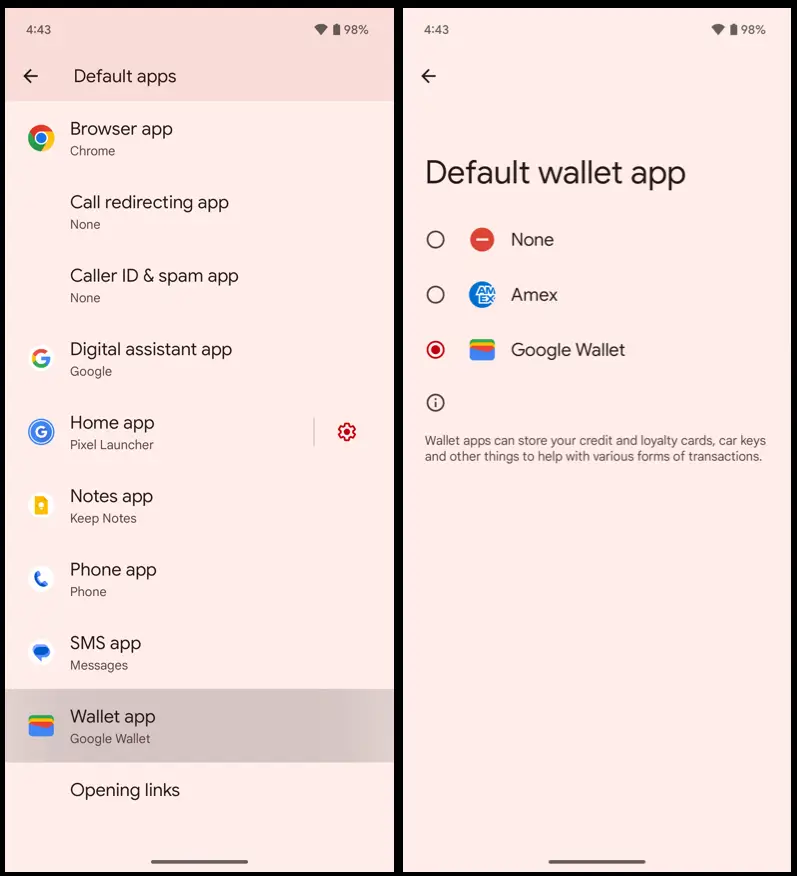
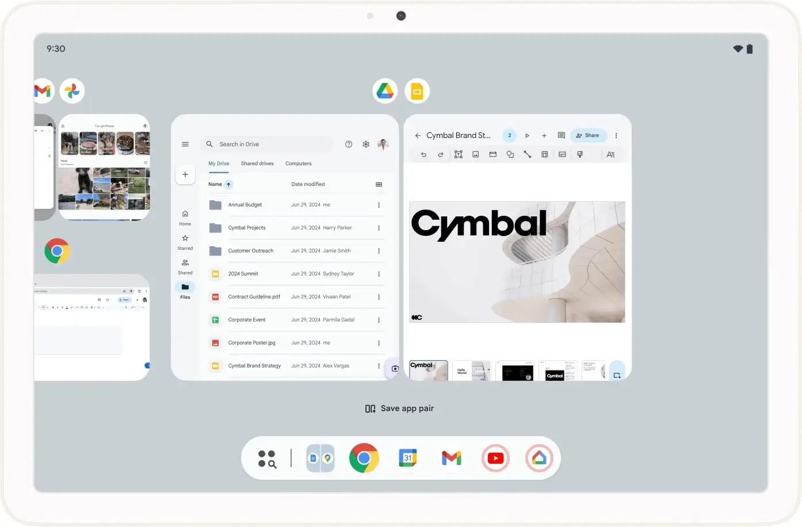
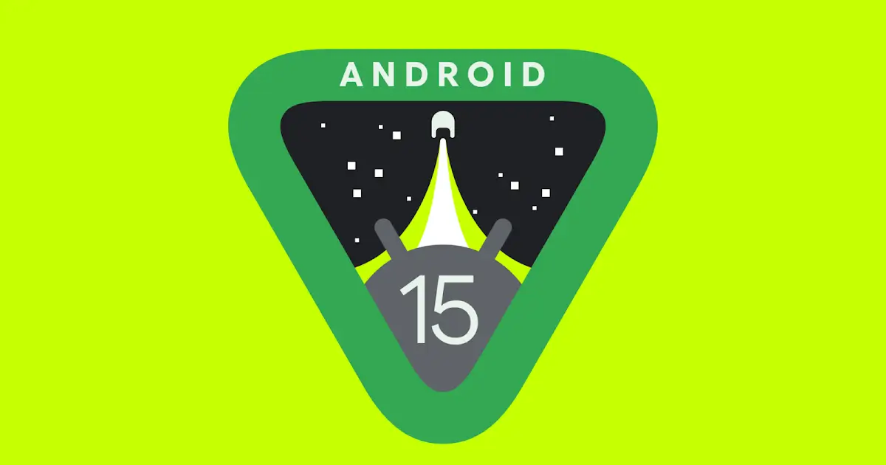
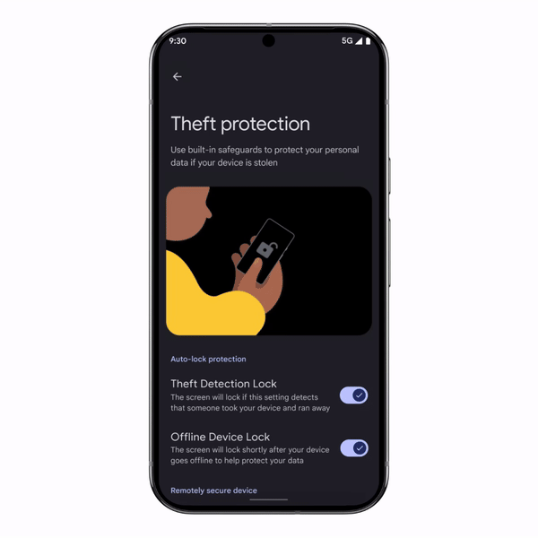

הנה זה מגיע! ההפצה של עדכון Android 15 החלה, והגרסה היציבה זמינה כעת רשמית. גוגל עבדה על הפיתוח במשך כמה חודשים כדי לשפר וללטש את הגרסה החדשה של מערכת ההפעלה לניידים. הנה כל מה שידוע עד כה, החל מתאריכים חשובים ועד למכשירים התואמים והפיצ'רים החדשים.

אגב, השם של הקינוח שמקושר ל-Android 15 הוא "גלידת וניל". פרט קטן ומעורר תיאבון שמזכיר את הימים שבהם שמות הקינוחים היו חלק משם הגרסאות הרשמיות של מערכת ההפעלה. לבסוף, יש לנו גם מדריך מעודכן ל-iOS 18, אם אתם מעדיפים את מערכת ההפעלה של אפל.

## מתי יצא Android 15 ?

‏Android 15 יצא רשמית ב-15 באוקטובר 2024 במסגרת הפצה הדרגתית, שהחלה במכשירי Google Pixel התואמים. עם זאת, זהו רק סופו של תהליך פיתוח ממושך.

נזכיר כי הכול התחיל ב-16 בפברואר 2024, אז יצאה לראשונה Developer Preview 1 של Android 15. חשוב לדעת: גרסאות ה-Developer Preview הן גרסאות מוקדמות מאוד של העדכונים, המיועדות בעיקר למפתחים, כך שיוכלו להתחיל להתאים את האפליקציות שלהם לגרסה החדשה, עוד לפני השקת הבטא הראשונה.

במרץ 2024, יצאה ה-Developer Preview 2 של Android 15, שכבר הציגה כמה חידושים לפני שהבטא הראשונה של Android 15 הושקה באפריל. לאחר מכן, הקצב עלה עם Android 15 Beta 2, שחשפה חידושים רבים במהלך אירוע Google I/O 2024.

ביוני 2024, פיתוח מערכת ההפעלה נכנס לשלב "יציבות הפלטפורמה" עם בטא 3 של Android 15. כלומר, משלב זה המטרה העיקרית הייתה לתקן תקלות ובאגים במערכת. המטרה הייתה לוודא שהגרסה שתושק בסתיו תהיה יציבה לחלוטין.

## ‏הסמארטפונים התומכים ב-Android 15

נכון לעכשיו, גרסת ה-Android 15 היציבה זמינה באירופה במכשירי Google.

להלן רשימת הסמארטפונים (והטאבלט) התומכים ב-Android 15 יציב:

- Google Pixel 6
- Google Pixel 6 Pro
- Google Pixel 6a
- Google Pixel 7
- Google Pixel 7 Pro
- Google Pixel 7a
- Google Pixel Fold
- Google Pixel 8
- Google Pixel 8 Pro
- Google Pixel 8a
- Google Pixel 9
- Google Pixel 9 Pro
- [Google Pixel 9 Pro XL](https://techhorizons.co.il/pixel-9-pro-xl-vs-xiaomi-14-ultra/)
- Google Pixel 9 Pro Fold
- Google Pixel Tablet

נוסיף שה-Vivo X Fold 3 Pro היה המכשיר הראשון שקיבל את Android 15 בגרסה היציבה, אם כי המכשיר לא נמכר באירופה.

כמו כן, גוגל חשפה את רשימת המותגים השותפים לתוכנית הבטא של Android 15: Iqoo, Lenovo, Nothing, OnePlus, Sharp, Oppo, Realme, Tecno, Vivo, Xiaomi ו-Honor.

בנוסף, OnePlus מיהרה לחשוף את תאריך ההשקה של OxygenOS 15 (מבוסס על Android 15).

הנה רשימת המכשירים, מלבד Google Pixel, הזכאים לגרסת הבטא של Android 15:

- Nothing Phone (2a)
- [Xiaomi 14](https://techhorizons.co.il/xiaomi-14t-pro/)
- [Xiaomi 13T Pro](https://techhorizons.co.il/xiaomi-14t-pro-vs-xiaomi-13t-pro/)
- OnePlus 12
- OnePlus Open
- Honor Magic 6 Pro
- Honor Magic V2
- Realme 12 Pro Plus
- Oppo Find N3
- Vivo X100
- Iqoo 12
- Tecno Camon 30 Pro 5G
- Sharp Aquos Sense 8

בנוסף, יש כמה טאבלטים התומכים בגרסה זו: Xiaomi Pad 6S Pro 12.4 ו-Lenovo Tab Extreme. כמו כן, יש גם 39 סמארטפונים של סמסונג שצפויים לקבל את Android 15 בעתיד.

## ‏החידושים ב-Android 15

### **‏חיבור לווייני**

בגרסת DP2 של Android 15, נעשתה התקדמות נוספת לקראת שימוש בחיבור לווייני. ראשית, הממשק שופר עם אינדיקטור ברור יותר בשורת המצב וסוגי התראות שמודיעות על מעבר אוטומטי של רשת הסמארטפון לחיבור לווייני.

השינויים מתמקדים בעיקר באופן הפעולה של אפליקציות המסרים. ב-Android 15, אפליקציות אלו יוכלו לנצל API חדש שמאפשר להן לזהות מתי המכשיר מחובר ללוויין, וכך להבין טוב יותר מדוע שירותי רשת מלאים עשויים להיות לא זמינים, מסבירה גוגל.

כך, תוכל להמשיך לשלוח ולקבל הודעות SMS ו-MMS דרך החיבור הלווייני ב-Android 15, בתנאי שהסמארטפון שלך תומך בכך. עם זאת, רק אפליקציות מסרים "מובנות מראש" יוכלו להשתמש בפונקציות RCS במצבים כאלה. כלומר, אפליקציית Google Messages תהיה בעדיפות.

### **‏התקדמות נוספת ב-AV1**

גוגל ממשיכה לקדם את קודק הווידאו AV1, שמציע דחיסה יעילה יותר בהשוואה ל-H.264 או H.265/HEVC, והוא גם חופשי לשימוש. עם זאת, AV1 דורש דרישות חומרה מסוימות. עבור מכשירים שאינם תומכים בו, יש צורך בתוכנה ייעודית שתמלא את החסר. ב-Android 15 Beta 2, גוגל מדגישה את הכלי של העמותה הצרפתית VideoLAN: [dav1d](https://code.videolan.org/videolan/dav1d).

‏"dav1d יעיל עד פי שלושה מהמפענח הקודם של AV1, מה שמאפשר השמעת וידאו ב-HD ב-AV1 עבור יותר משתמשים, כולל במכשירי ביניים ומכשירי כניסה", כך נכתב בהערות של חברת גוגל.

### **‏קבצי PDF במרכז הבמה**

גם בתחום ה-PDF יש שינויים ב-Android. אפליקציות שיכולות לפתוח קבצי PDF יקבלו יכולות נוספות. יהיה ניתן לפתוח קבצים המוגנים בסיסמה, להוסיף הערות למסמך, למלא טפסים ולהשתמש בפונקציות חיפוש והעתקה.

במילים אחרות, אפליקציות ייעודיות לחלוטין ל-PDF יהפכו לפחות חיוניות עבור פעולות שרוצים לבצע במהירות מהסמארטפון.

כדי לאפשר את החידושים הללו, גוגל עיצבה מחדש את הכלי PDFRenderer המיועד למפתחי אפליקציות. כעת הוא הופך למודול המנוהל ישירות דרך Google Play. המשמעות היא שעדכוניו לא יהיו תלויים עוד בגרסת ה-Android המותקנת בטלפון.

### **‏כספת מאובטחת**

בדומה למה שמציעות ממשקים של יצרנים שונים, גוגל משלבת ב-Android 15 אפשרות ליצור כספת מאובטחת לשמירת קבצים ואפליקציות רגישות במיוחד, הדורשות שכבת הגנה נוספת.

### **‏המתחרים של Google Wallet**

בהתאם להנחיות של חוק השווקים הדיגיטליים (DMA) באירופה, Android 15 תאפשר לבחור בארנק דיגיטלי אחר כברירת מחדל במקום Google Wallet. זהו יתרון משמעותי עבור שירותים מתחרים.

### **‏טעינה אלחוטית באמצעות NFC**

הבטא הראשונה של Android 15 חושפת פונקציה מעניינת: טעינה אלחוטית באמצעות NFC. הטכנולוגיה לא חדשה, והיא מציעה הספק נמוך בהרבה בהשוואה לסטנדרטים Qi ו-Qi 2. עם זאת, היא קלה הרבה יותר לשילוב במכשירים קטנים מכיוון שאינה זקוקה לבובינה גדולה כדי לפעול.

כך, טעינה אלחוטית באמצעות NFC עשויה להיות נוחה כדי להטעין את המכשירים שלכם, כמו ה-Bluetooth trackers, באמצעות הסמארטפון. במיוחד עכשיו, כשגוגל השיקה סוף סוף את הרשת שלה לאיתור מכשירים, "Find My Device". גם סטיילוסים עשויים להרוויח מאופציה כזו.

### **‏סמארטפונים מתקפלים בצורת צדפה (Flip)**

גוגל מאמינה בסמארטפונים מתקפלים ורוצה לשפר את החוויה עבור אלו שבחרו בפורמט ה-Flip. המכשירים הללו כוללים מסך חיצוני קטן, שהשימוש בו משתנה. מדובר באתגר קטן, מכיוון שהפורמט המוקטן של המסכים הללו יכול להקשות על השימוש באפליקציות.

בעוד שגוגל עובדת על פתרון לבעיות הללו, Android 15 כולל פונקציה המאפשרת למפתחים להציע את האפליקציות שלהם בקלות רבה יותר על המסכים החיצוניים של סמארטפונים מתקפלים. זה תלוי בהם אם הם רוצים לנצל את האפשרות הזו, אך ייתכן שנראה יותר אפליקציות מתאימות בפורמט הזה. הבעיה עם התצוגה תימשך.

זה מזכיר את היתרונות של Samsung Good Lock על ה-Galaxy Z Flip 5. עם זאת, עם Android 15, לא יהיה צורך תיאורטית בכלים כאלה כדי לאלץ את הצגת האפליקציות על המסכים החיצוניים.

### **‏ריבוי משימות על מסך גדול**

גוגל מבטיחה חוויה נוחה יותר לביצוע ריבוי משימות במכשירים עם מסכים גדולים, כמו טאבלטים או סמארטפונים מתקפלים.

_**"המשתמשים יכולים להדביק את שורת הכלים על המסך כדי לעבור במהירות בין אפליקציות שונות או לשמור את השילובים המועדפים שלהם של אפליקציות במצב תצוגה מחולקת לגישה מהירה."**_

### **‏ניהול טוב יותר של עוצמת הקול**

מגרסת ה-DP2, Android 15 אימצה את תקן עוצמת הקול CTA-2075. תקן זה מבטיח אחידות טובה יותר בעוצמת הקול כשעוברים מאפליקציה לאפליקציה. זה נכון גם עבור אוזניות וכובעי אוזניים, כמו גם עבור רמקולים.

אבל זה לא הכל. Android 15 תומך גם באודיו מרחבי דינמי. כדי ליהנות מחוויה יותר immersive, יש צורך בציוד עם חיישני תנועה, כמו ה-Pixel Buds Pro של גוגל.

### **‏חידושים בנוגע לרעידות**

מפתחי האפליקציות ב-Android 15 יקבלו יותר אפשרויות לגבי סוגי הרעידות שיתעוררו בהתאם לסוג ההודעה. כך, תוכלו לא להסתכל על הטלפון כדי לנחש איזו התראה קיבלתם.

בנוסף, Android 15 עשוי להפוך את הרעידות לפחות מלחיצות על ידי התאמתן לסביבה שבה נמצא הסמארטפון. לדוגמה, אם המכשיר נמצא על משטח קשה, הוא יכול לרעוד פחות חזק כדי להיות נעים יותר לשימוש.

### **‏שיפור בפונקציית מצלמת הרשת**

עם Android 15, סמארטפוני Google Pixel התואמים יכולים להפוך למצלמת רשת איכותית שתחליף את מצלמת המחשב שלכם במהלך שיחת וידאו. אנו בעצמנו ניסינו את האפשרות ב-DP2 שהותקנה על Pixel 8. חשוב לציין שהפונקציה עצמה לא חדשה, והיא קיימת מאז Android 14 QPR1. עם זאת, עכשיו ישנה אפשרות "HQ" שמטרתה לשפר את הגדרת התמונה המוקלטת.

שימו לב, יש לחבר תמיד את הסמארטפון למחשב באמצעות כבל כדי ליהנות מהפונקציה הזו.

### **‏שימוש טוב יותר בחומרה**

זה עדיין די מעורפל ונצטרך לחכות למידע נוסף בנושא. עם זאת, גוגל כבר הצהירה שהיא רוצה לאפשר למפתחי האפליקציות לנצל טוב יותר את החומרה של הסמארטפונים. זה כולל את עוצמת הפלאש עבור אפליקציות המשתמשות במצלמה, התאמת תדרי ה-GPU וה-CPU, וכן שימוש ביכולות הבינה המלאכותית.

לפי כל הסימנים, הגדרות אלו יעסקו בעיקר בסמארטפונים מהקטגוריה הגבוהה.

### **‏אבטחה מוגברת**

כדי למנוע בעיות אבטחה, מכשירים המריצים Android 15 לא יוכלו להתקין אפליקציות שאינן תואמות, לפחות, את Android 7.0 Nougat. במקרה זה, האפליקציות לא ייחשבו לבטוחות מספיק.

### **עזרה במניעת גניבות ושיקום מכשירים גנובים מהר יותר**

ה-Lock1 החדש לאיתור גניבות משתמש בבינה מלאכותית כדי לשמור על הנתונים שלכם בטוחים. אם הטלפון מזהה גניבה ונראה שמישהו מנסה לברוח, לרכב או לנהוג, המכשיר ננעל אוטומטית. בנוסף, אפשר להשתמש ב-Remote Lock כדי לנעול את המכשיר במהירות מכל מכשיר אחר באמצעות מספר הטלפון שלכם ובדיקה פשוטה של אבטחה. תכונות אלו זמינות כבר עבור רוב מכשירי Android 10 ומעלה.

עם Android 15, גוגל מציעה הגנות נוספות שמונעות מגנבים לנחש את הסיסמאות שלכם ולהגיע למידע רגיש. לדוגמה, היא מוסיפה דרישות אימות עבור הגדרות חשובות, כמו הסרת ה-SIM או כיבוי Find My Device. אם המערכת מזהה ניסי כישלון מרובים באפליקציות והגדרות, המכשיר ננעל אוטומטית. עדכונים אלה מקשים על גנבים לאפס ולמכור מכשירים גנובים, ועוזרים למנוע יותר גניבות לפני שהן מתרחשות. תוכלו ללמוד יותר על תכונות ההגנה החדשות בגניבות בבלוג האבטחה של גוגל.

### **‏הפעלה קלה יותר של חזרה חיזוי**

בעת השימוש בניווט באמצעות מחוות, חזרה חיזוי מאפשרת לדעת לאיזה מסך תגיעו ברגע שתתחילו את המחווה. פונקציה זו בדרך כלל ניתנת להפעלה באפשרויות המפתחים, אך מ-Android 15 Beta 2 זה לא יהיה המצב.

### **‏הזדקנות האחסון**

Android 15 משחקת על קלף שקיפות החומרה. כך, אינדיקטור חדש יראה את רמת הזדקנות האחסון של הסמארטפון שלכם. מידע זה יהיה זמין בתפריט האבחון של המכשיר.

**‏תמונה בתוך תמונה חלקה יותר**

מצב התמונה בתוך תמונה (PiP) ב-Android 15 נהנה מאנימציה חלקה יותר, מה שמספק חוויה נעימה יותר.

## ‏שאלות נפוצות שלכם

### **מה הגרסה האחרונה של Android כיום?**

נכון לעכשיו, Android 14 היא הגרסה היציבה האחרונה הזמינה במכשירים תומכים. היורש שלה, Android 15, נמצא בפיתוח ובשלב הבטא שלו.

### **אילו גרסאות Android בשימוש ב-2024?**

אין גרסה אחת ויחידה של Android בשימוש. הפיצול במערכת ההפעלה של גוגל משמעותי, ולכן ישנם מספר דגמים שונים בכל שנה. לדוגמה, גרסת KitKat 4.4 עדיין פעילה על 0.4% מהמכשירים בעולם, לפי הנתונים הרשמיים האחרונים.

בשנת 2024, Android 13 היא הגרסה הנפוצה ביותר, ואחריה Android 11 ו-Android 10. חשוב לציין ש-Android 14 עדיין לא נחשב על ידי גוגל.

### **מה תאריך ההשקה של Android 15?**

איננו מכירים את תאריך ההשקה המדויק , אך גוגל שואפת להתחיל בהפצה של הגרסה היציבה בתחילת שנת 2024.

- הגרסה האחרונה של Android כיום היא Android 14, זמינה במכשירים תומכים.
- הגרסה החדשה נמצאת בפיתוח ובשלב הבטא שלה.
- אין גרסה אחת של Android בשימוש, מה שיוצר פיצול משמעותי במערכת ההפעלה.
- נכון ל-2024, Android 13 היא הגרסה הנפוצה ביותר, ואחריה Android 11 ו-Android 10.
- גוגל מתכננת להשיק את הגרסה החדשה בתחילת שנת 2024, אך התאריך המדויק עדיין לא ידוע.
