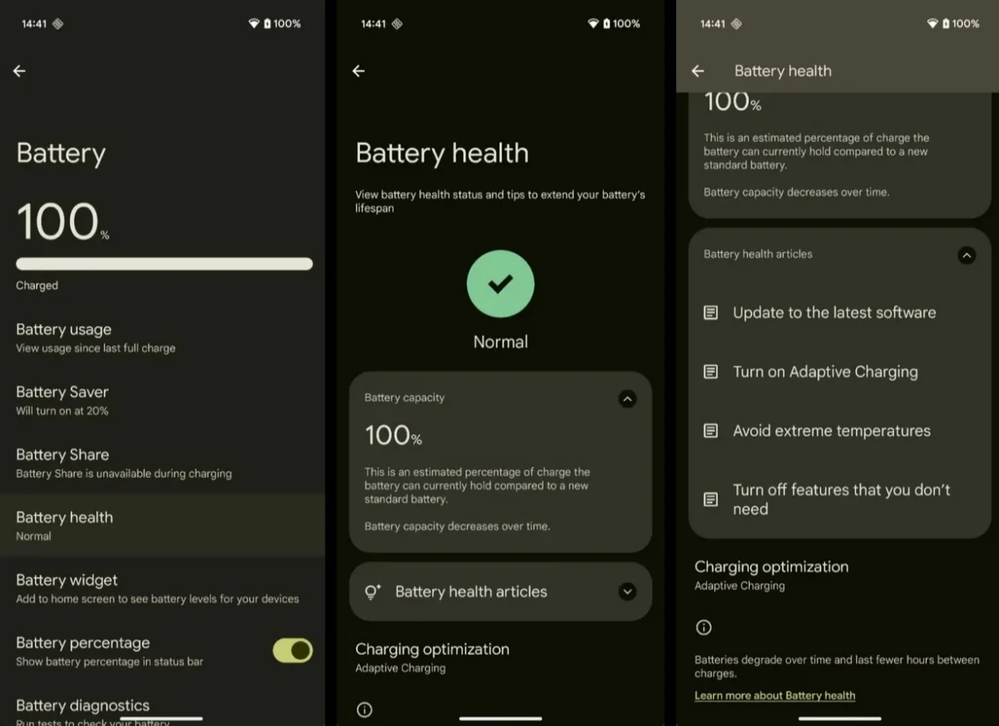

_Google_ הכריזה בחשאי על עדכון משמעותי ל-_Android 16_: פונקציית "בריאות הסוללה" שתאפשר למשתמשים לבדוק את מצב הסוללה האמיתי שלהם, כולל אחוזי שחיקה ונתוני טעינה. אך למרבה האכזבה, הפיצ’ר יהיה זמין רק למספר מצומצם של מכשירי _Pixel_ – כשהוותיקים נותרו בחוץ.

## **אילו מכשירים ייהנו מהפונקציה החדשה?**

לפי תגובה של נציג _Google_ בפורום התמיכה, פונקציית **בריאות הסוללה** זמינה כעת בגרסת הבטא השלישית של _Android 16_ רק למכשירים הבאים:

- Pixel 8a
    
- Pixel 9
    
- Pixel 9 Pro Fold
    

המשמעות: **דגמי Pixel 8, Pixel 8 Pro ו-Pixel 8 XL לא יקבלו את הפונקציה החדשה.**

## **למה דווקא Pixel 8a?**

לפי המידע הרשמי, הסיבה לכך היא שינוי במבנה הסוללה של _Pixel 8a_. הדגם החדש מתהדר ביכולת לשמור על 80% מכושר הסוללה לאחר **1000 מחזורי טעינה**, לעומת **800 מחזורים** בלבד בדגמים הקודמים.

ייתכן שהמבנה המעודכן מאפשר לקרוא נתוני סוללה מדויקים יותר – מה שמסביר את הדרת הדגמים הקודמים מהפונקציה החדשה.

## **מפרט טכני – פונקציית בריאות הסוללה**

| פרמטר | נתון |
| --- | --- |
| מכשירים נתמכים | Pixel 8a, Pixel 9, Pixel 9 Pro Fold |
| גרסה | Android 16 Beta 3 |
| מחזורי טעינה | 1000 מחזורים ל-80% |
| זמינות | כרגע למפתחים בלבד |
| הצגת נתוני סוללה | אחוז בריאות, מספר מחזורים, התראות |

 

## **מה צפוי בהשקה הרשמית של Android 16?**

_Android 16_ ייחשף רשמית ב-_Google I/O 2025_, שיחל ב-20 במאי. שם נקבל את כל הפרטים על שאר הפונקציות החדשות, שדרוגי מערכת אפשריים ומידע על מכשירים נוספים שיקבלו את העדכון.

## **סיכום**

העדכון של _Android 16_ עשוי להוות קפיצת מדרגה בכל הקשור למידע על בריאות הסוללה – אך רק למי שמחזיק במכשיר Pixel מהדור החדש. המהלך של _Google_ מעלה תהיות לגבי התמיכה במכשירים קודמים, במיוחד לאור העובדה שהשינוי במבנה הסוללה הגיע רק ב-_Pixel 8a_ והלאה.

מתכננים לעדכן ל-_Android 16_? כדאי לבדוק קודם את רשימת המכשירים הנתמכים.
