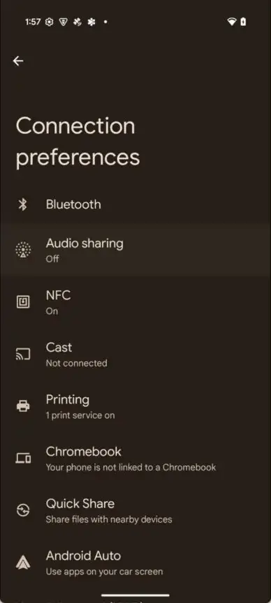
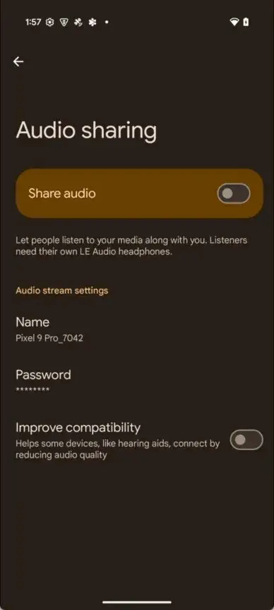
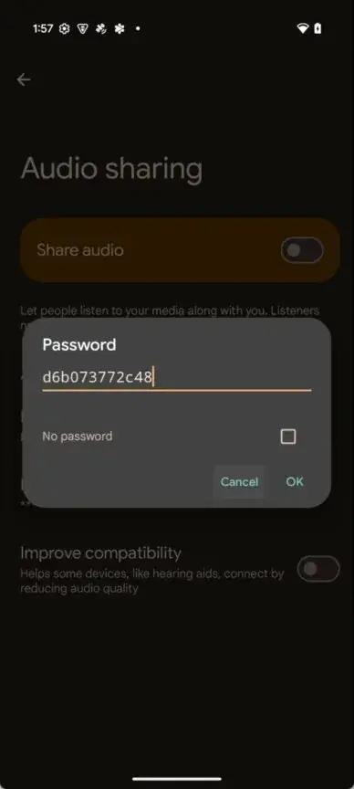

[**Google**](https://techhorizons.co.il/technology/smartphones/google/) שחררה אתמול את גרסת המפתחים הראשונה של **Android 16**, מה שנותן הצצה ראשונה למה שמצפה לנו בעדכון הגדול של השנה הבאה. כרגיל, החברה לא הדגישה שינויים בולטים למשתמשים בפוסט הרשמי שלה, וזה מובן מכיוון שמדובר בגרסת מפתחים.

## תכונת שיתוף השמע

לאחר התקנת העדכון על מכשיר ה-Pixel שלי, גיליתי כי **שיתוף שמע באמצעות Bluetooth** – פיצ'ר שעקבתי אחריו קרוב ל-10 חודשים – הופעל סוף סוף בגרסת DP1. מדובר בתכונה שאפשרה שיתוף שמע עם מספר מכשירי Bluetooth במקביל, ונראתה לראשונה בגרסאות מוקדמות של Android 15, אך לא נכללה בגרסה הסופית של העדכון.

## איפה ניתן למצוא את הפיצ'ר?

שיתוף השמע זמין כעת בגרסת המפתחים הראשונה של Android 16 עבור [**Pixel 9 Pro**](https://techhorizons.co.il/google-pixel-9-pro-xl-vs-google-pixel-8-pro/). ניתן למצוא את האפשרות תחת:  
**הגדרות > מכשירים מחוברים > שיתוף שמע**.

## מה זה אומר עבור המשתמשים?

הפעלת הפיצ'ר בגרסת המפתחים מרמזת כי **Google** מתכננת לכלול אותו באופן רשמי בעדכון Android 16. מדובר בתכונה משמעותית שמביאה חוויית שמע משופרת, במיוחד למשתמשים שמחברים מספר אוזניות או רמקולים במקביל.

  

## התאמה אישית של שיתוף שמע ב-Android 16

בעמוד ההגדרות של **שיתוף שמע** ניתן להפעיל את התכונה על ידי הפעלת הכפתור "שיתוף שמע". בנוסף, קיימות אפשרויות התאמה אישית:

- **שינוי שם הזרמת השמע**: ניתן להעניק שם מותאם אישית לזרם השמע המשותף.
- **הגדרת סיסמה**: ניתן להגדיר סיסמה כדי להגביל גישה, או להסיר את הדרישה לסיסמה לחלוטין.
- **שיפור תאימות**: אפשרות זו נועדה להקל על חיבור מכשירים מסוימים, כמו מכשירי שמיעה. עם זאת, הפעלת תאימות מוגברת עשויה לפגוע מעט באיכות השמע.

התאמות אלו מאפשרות חוויית שימוש גמישה וכוללת יותר, המותאמת לצרכים שונים של המשתמשים.

## איך פועל שיתוף שמע ואילו מכשירים נתמכים?

לאחר הפעלת **שיתוף שמע**, תופיע התראה שמציינת כי השמע משותף. כמו כן, כפתור ייעודי יופיע בתפריט ההגדרות המהירות של Bluetooth.

### **אילו מכשירים תומכים?**

חשוב לדעת כי תכונת שיתוף השמע זמינה אך ורק ב-Pixel 8 ומעלה (למעט Pixel 8a). הסיבה לכך היא שהפיצ'ר דורש תמיכה ב-Bluetooth LE Audio broadcasting, הידוע גם בשם **Auracast**.

### **מה זה Auracast?**

**Auracast** הוא חלק מהסטנדרט של Bluetooth LE Audio, שמאפשר למכשירים לשדר שמע למספר מכשירים קרובים באמצעות Bluetooth Low Energy, ללא צורך בזיווג ישיר. זה מזכיר מעט את האופן שבו רדיו לרכב פועל.

### **איך זה עובד?**

בעזרת **Auracast**, ניתן לשתף שמע מהמכשיר למספר מכשירים סמוכים כל עוד גם הם תומכים ב-Auracast. המכשירים המקבלים את השמע חייבים להיות מחוברים לאוזניות תואמות Auracast, כמו **Pixel Buds Pro 2** או **Galaxy Buds Pro 3**.

## חדשות טובות למשתמשי אנדרואיד

עם ההשקה של **שיתוף שמע** ב-Android 16, צפויה עלייה בתמיכה ב-Auracast במכשירי אנדרואיד. כבר היום מכשירים נבחרים מבית **Samsung**, **Xiaomi** ו-**Sony** תומכים ב-Auracast. כך שגם אם לא לכל המשתמשים יש Pixel 8, ניתן ליהנות מהפיצ'ר במשקי בית עם מכשירים תומכים שונים.

תכונת **שיתוף שמע** הופכת את חוויית השמע ליעילה יותר ומציעה אפשרויות מתקדמות לשיתוף מוזיקה, פודקאסטים או כל תוכן שמע אחר עם מספר מכשירים בו-זמנית.

- שיתוף שמע מתקדם: Android 16 מציע שיתוף שמע למספר מכשירי Bluetooth תומכי Auracast בו-זמנית, ללא צורך בזיווג ישיר.
- מוגבלות תמיכה: התכונה זמינה ב-Pixel 8 ומעלה, אך תואמת גם מכשירים ואוזניות תומכי Auracast ממותגים נוספים.
- נוחות וגמישות: אפשרות התאמה אישית של שם השידור, סיסמה ושיפור תאימות למכשירים מסוימים כמו מכשירי שמיעה.
