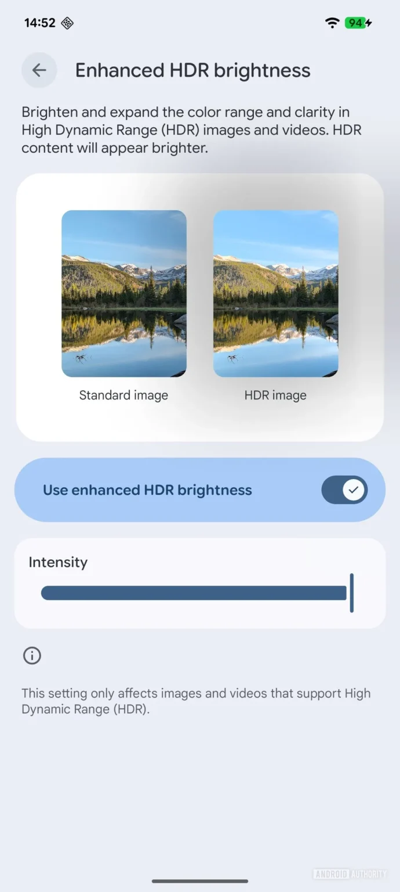
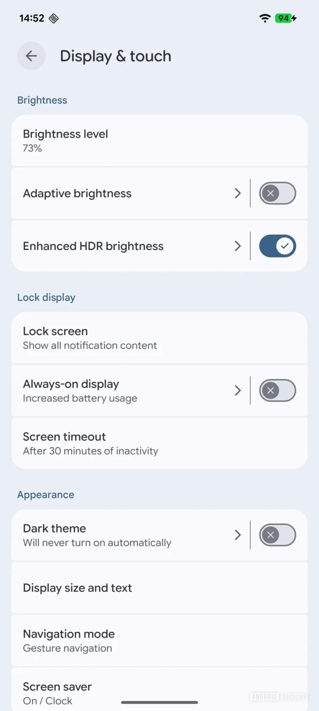

## **סוף סוף פתרון לתמונות שמסנוורות בלילה**

אם אי פעם דפדפתם בגלריה או באינסטגרם בחושך – אתם מכירים את זה: פתאום תמונה אחת קופצת עם בהירות לא הגיונית, כאילו השמש בתוך המסך. ברוב המקרים מדובר בתמונות או סרטונים בפורמט **HDR** או **Ultra HDR** — שנראים מהמם ביום, אבל הרבה פחות נעים לעין בלילה 🌙.

📱 התמונות הללו כוללות **מטא-דאטה מיוחדת** שגורמת למסך להאיר בעוצמה, גם אם שאר התמונות ב-SDR נראות רגועות ונעימות יותר.

## **Android 16: שליטה חדשה בבהירות HDR**

בגרסה החדשה של אנדרואיד 16, גוגל סוף סוף פותרת את הבעיה. לפי דיווח של [_Android Authority_](https://www.androidauthority.com/android-canary-hdr-settings-3576420/), נוספה **אפשרות חדשה בתפריט התצוגה** שמאפשרת לשלוט על רמת הבהירות של תכנים בפורמט HDR — גם תמונות וגם סרטונים.

📍 אפשרות זו זמינה כעת בגרסת **Canary** של אנדרואיד (גרסה ניסיונית), ומצויה בתפריט ההגדרות תחת התצוגה.

🧪 Canary היא גרסה מוקדמת, לא יציבה, אך דרכה אפשר להתנסות בתכונות חדשות לפני שהן מגיעות למשתמשים כלליים.

<figure>

<figcaption>

canary-hdr-controls-2-scaled.jpg

</figcaption>

</figure>

<figure>

<figcaption>

canary-hdr-controls-1-scaled.jpg

</figcaption>

</figure>

## **HDR מול SDR – איזון חדש ונחוץ**

באופן טבעי, HDR נועד להציג טווח דינמי גבוה יותר – מה שמוביל לאיכות תמונה טובה יותר, אך גם ל**בהירות מוגזמת** במקרים מסוימים. כעת, עם השליטה החדשה, אפשר **לאזן** את העוצמה הזו — ועדיין ליהנות מהיתרונות של HDR.

🎯 מדובר בשדרוג קטן, אך חשוב, במיוחד עבור משתמשים שצורכים הרבה תוכן בלילה או בחדרים חשוכים

## **מתי זה יגיע?**

התכונה זמינה כרגע למפתחים ולנסיינים בגרסת **Android 16 Canary**, וצפויה להתגלגל למשתמשים רגילים בהמשך השנה. ככל הנראה תגיע למכשירי **Pixel** ראשונים, ואחר כך גם למכשירים של סמסונג, שיאומי ושות'.
