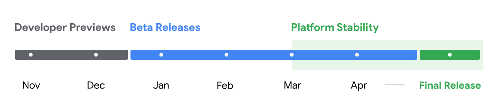

בדרך כלל, לקראת השקה של גרסת אנדרואיד חדשה, יש לא מעט באזז: הדלפות, תכונות חדשות, עיצובים מרעננים. אבל הפעם – השקת אנדרואיד 16 מרגישה אחרת.  
אחרי ארבע גרסאות בטא ציבוריות, Google עדיין לא הטמיעה חלק גדול מהפיצ'רים שדלפו במהלך החודשים האחרונים. למה? ככל הנראה, חלק מהיכולות עדיין לא בשלות להשקה. וחלק אחר – כנראה נשמרים בבלעדיות זמנית לדגמי Pixel 10 שיגיעו באוגוסט.

השקה בשני שלבים היא לא דבר חדש, אבל הפיצול הפעם יוצר מצב מוזר: למרות שהמערכת נמצאת בידי מפתחים ובודקים כבר כמה חודשים, **לא רואים כמעט אף אחד מהשדרוגים שהובטחו**. בהתחשב בכך שאנדרואיד 15 שוחררה רק לפני חצי שנה, ייתכן שגוגל פשוט לא הספיקה להשלים את הפיתוח והבדיקות של כל מה שתכננה מראש.

ואם זה לא מספיק, גוגל עצמה מבלבלת את השטח עוד יותר: הפיצ'רים שמגיעים בעדכוני Pixel Drop לפעמים מקדימים את גרסת האנדרואיד הרשמית.  
כך שלפעמים **תכונה חדשה באה עם עדכון רבעוני**, ולא כחלק מ"אנדרואיד 16" הרשמית – וזה מטשטש את ההבדלים בין עדכוני מערכת לעדכוני חומרה.

https://www.youtube.com/watch?v=YXa5rwvF1Zc&t=480s&ab\_channel=9to5Google

## **אז מה עדיין לא כאן?**

✔️ **ווידג'טים במסך הנעילה** – תכונה שזמינה כבר בטאבלט Pixel, תגיע לסמארטפונים רק בעדכון QPR1. הווידג'טים יהיו בגודל 3x4 משבצות, יתמכו ב-Dynamic Color, אך לא יהיו ניתנים להתאמה על ידי יצרניות בשלב הראשון.

✔️ **עיצוב מחדש של התפריט העליון (Quick Settings)** – כולל הצגת שעה מודגשת כמו במסך הנעילה, כפתורים חדשים לניקוי התראות והיסטוריה, ורקע אטום מלא. עיצוב שמרגיש הרבה יותר מסודר ונקי.

✔️ **מחוות חדשות** – החלקה מצד שמאל תפתח התראות, מצד ימין – הגדרות מהירות. אין מעבר ביניהן במחווה אחת, אך מופיעים כפתורים לקיצור.

✔️ **שינויים בשורת הסטטוס** – סמל ה-Wi-Fi יציג 3 קווים במקום 5, אייקון הסוללה יתעדכן: צבע אחיד בלבן, אדום כשהסוללה חלשה, ירוק כשהיא בטעינה. המספר יוצג בצורה בולטת יותר, והאייקון עצמו יתהפך.

✔️ **תפריט עוצמת קול מעודכן** – יכלול סרגל אנכי עם קצה עגול וחלוקה צבעונית עדינה, לפי קווים עיצוביים של Material You.

✔️ **חזרה של שינוי צורת האייקונים** – תכונה שהוסרה באנדרואיד 12, חוזרת עם אפשרות להתאים את מראה האפליקציות במסך הבית (ואולי גם במסך הנעילה). ייתכן שיכלול גם אפקטים של מזג אוויר.

✔️ **סיכומי התראות** – אפשרות להצגת תצוגה מתומצתת של התראות (בדגש על שיחות), עם אפשרות לכבות זאת לפי אפליקציה. ניסוי לטובת מי שמוצף בהתראות.

✔️ **מולטיטאסקינג משופר** – באנדרואיד 16 יהיה ניתן להריץ עד 3 אפליקציות בו-זמנית במצב מסך מפוצל, בעיקר בטאבלטים. תכונה שנראתה כבר בממשקי יצרנים (כמו Samsung), ועכשיו עושה את דרכה לגרסה הרשמית של אנדרואיד.

✔️ **שיפורים בשימוש במסכים חיצוניים** – כולל שיפור בתנועת סמן בין מסכים, אפשרות למעבר בין שיקוף להרחבה, והתנהגות שקרובה יותר למחשב שולחני.

✔️ **אריח חדש לשיחות וידאו** – תפריט מהיר עם אפשרות לטשטוש רקע, תיקון תאורה, ריכוך פנים וסינון רעשי מיקרופון – בדומה לכלים שמוכרים מאפליקציות כמו Zoom ו־Meet.

✔️ **שיפורים קטנים נוספים** – כמו "הקשה כפולה" להדלקה/כיבוי, סריקת טביעת אצבע כשהמסך כבוי, ועוד תוספות קטנות שעדיין לא הופיעו בפועל.

## **אז מתי נראה את כל זה?**

ההערכה הרווחת: **הפיצ'רים הגדולים יגיעו רק עם השקת Pixel 10**, או בעדכון ה־Pixel Feature Drop שיגיע מיד אחריו.  
גוגל כבר עשתה זאת בעבר – עם פיצ'רים כמו Pixel Weather שהגיעו לפיקסל 9 לפני כולם. ייתכן שגם הפעם תנסה להציע "בלעדיות רכה" עבור הדגם החדש.

אם זה יקרה – ייתכן שדווקא הפיקסלים הקודמים (6 ומעלה) יקבלו את החידושים רק בהמשך השנה, אולי בדצמבר עם QPR1.

### **סיכום**

אנדרואיד 16 מביאה הרבה הבטחות – אבל בשלב הזה, רוב ההבטחות נשארו על הנייר.  
גוגל נזהרת, אולי בצדק, מלהשיק פיצ'רים לא מוכנים – או פשוט שומרת אותם לרגע המתאים: ההשקה של Pixel 10.

בינתיים, שווה לזכור: לא כל מה שמדליף הופך למציאות. ובאנדרואיד, לפעמים המציאות מגיעה... רק אחרי שלושה עדכונים.
