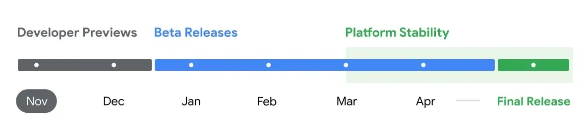
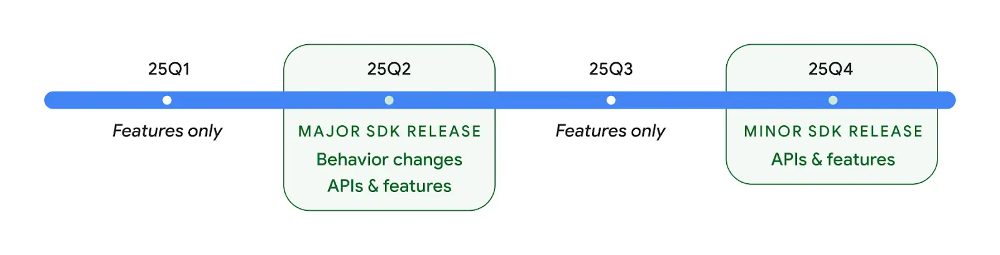
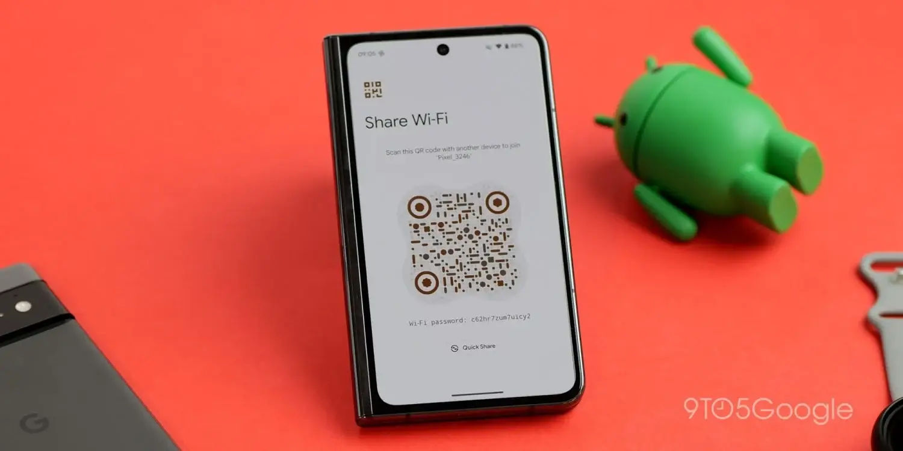
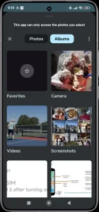
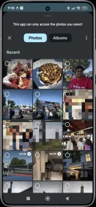
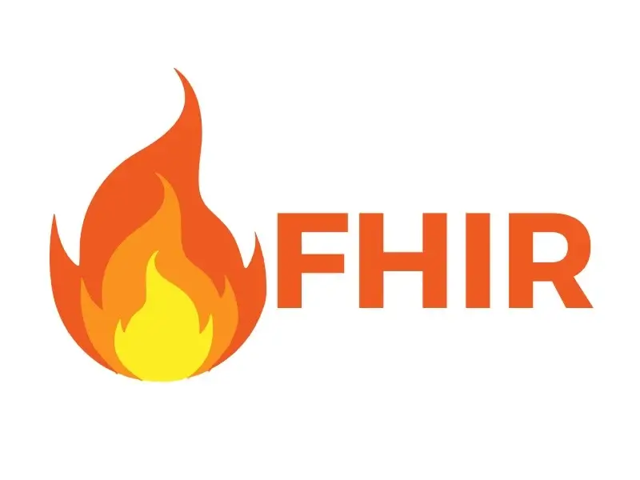

**Android 16** הוא העדכון הגדול הבא של מערכת ההפעלה המיועדת לסמארטפונים, טאבלטים, טלוויזיות ומכשירים חכמים נוספים.

ב-18 בנובמבר 2024, Google שחררה את גרסת המפתחים הראשונה (**Developer Preview 1**) של Android 16, המיועדת למפתחי אפליקציות.

## מתי יושק Android 16?

Google פרסמה לוח זמנים ראשוני לפיתוח Android 16:

- **גרסת הבטא הראשונה** צפויה לצאת בתחילת 2025.
- **הגרסה היציבה** מתוכננת להשקה באביב 2025.

הפעם, Google מקדימה משמעותית את לוחות הזמנים בהשוואה לגרסאות קודמות. לדוגמה, גרסת המפתחים הראשונה של [**Android 15**](https://techhorizons.co.il/android-15/) יצאה בפברואר, והגרסה היציבה הושקה רק באוקטובר של אותה שנה.

## שתי גרסאות של אנדרואיד ב-2025?

Google מתכננת להשיק שתי גרסאות של Android במהלך שנת 2025. לאחר שחרור **Android 16** באביב 2025, החברה מתכננת עדכון נוסף שייצא בסוף אותה שנה.

Google מכנה את העדכון הזה "שדרוג מינורי של ה-SDK". עדיין לא ידוע איך העדכון ייקרא באופן מסחרי, אך ייתכן שמדובר בגרסה שתיקרא **"Android 16.1"** או **"Android 16L"**, במקום מעבר ישיר ל-Android 17.

גישה זו מאפשרת ל-Google לספק שיפורים ועדכונים מבלי להמתין לגרסה מרכזית חדשה.

## החידושים של Android 16

**Google** מוסיפה חידושים בגרסאות המפתחים והבטא של **Android 16**. הנה החידושים המרכזיים שנחשפו עד כה:

### **עדכון Material Design**

Google ממשיכה לשפר את העיצוב האחיד של [**Material Design**](https://techhorizons.co.il/google-calendar-update/) במערכת Android. לדוגמה, שיתוף Wi-Fi באמצעות קוד QR קיבל עיצוב מחודש במכשירי Google Pixel.

### **בוחר תמונות חדש**

Android 16 מציגה כלי חדש למפתחים, שיהיה תואם אחורה עד לגרסת Android 4.4, דרך עדכון Google Play Services.

 

- מאפשר למפתחים לשלב את בוחר התמונות ישירות בממשק האפליקציה שלהם.
- שומר על שליטת המשתמש ועל פרטיות התמונות תוך שיפור חוויית השימוש.

### **שיתוף שמע ב-Bluetooth**

Android 16 מוסיפה את [**Auracast**](https://techhorizons.co.il/android-16-bluetooth/), טכנולוגיה שמאפשרת לשתף שמע לשני אוזניות Bluetooth במקביל. שימושי במיוחד במצבים כמו טיסות או נסיעות ברכבת.

### **דאטה רפואית ותאימות ל-FHIR**

מודול **Health Connect** מאפשר כעת למפתחים לקרוא ולשמור נתונים רפואיים בתקן **FHIR** (Fast Healthcare Interoperability Resources).

- יאפשר שיתוף נתונים רפואיים עם אנשי מקצוע בתחום הבריאות בקלות רבה יותר.

### **מצב בהירות נמוכה במיוחד**

Android 16 מוסיפה מצב חדש של **בהירות נמוכה במיוחד**, שמתאים במיוחד לשימוש בלילה.

- זמין כרגע רק ב-Pixel 9.

### **גרסה חדשה לטאבלטים ולמחשבים?**

יש שמועות ש-Google עובדת על שילוב של **Chrome OS** ישירות בתוך Android.

- המטרה: ליצור מערכת חזקה יותר עבור טאבלטים ומחשבים, במטרה להתחרות באייפד של Apple.

Google כבר החלה לשלב אלמנטים של Android ב-Chrome OS, כמו ליבת Linux של Android, אך ייתכן שהפרויקט לא יושלם לפני מספר שנים.

### **האם Android 16 יספק את ההבטחה?**

עם כל החידושים האלו, Android 16 מבטיחה להפוך את חוויית המשתמש לעשירה ומתקדמת יותר, עם דגש על פונקציונליות והתאמה אישית.

## מכשירים תואמים

מכשירי [**Google**](https://techhorizons.co.il/technology/smartphones/google/) הם הראשונים לקבל את Android 16 בגרסת המפתחים הראשונה (DP1) עבור הדגמים הבאים:

- **Google Pixel 6a**, **Pixel 6**, **Pixel 6 Pro**
- **Google Pixel 7a**, **Pixel 7**, **Pixel 7 Pro**
- **Google Pixel Fold** ו-**Google Pixel Tablet**
- **Google Pixel 8a**, **Pixel 8**, [**Pixel 8 Pro**](https://techhorizons.co.il/google-pixel-9-pro-xl-vs-google-pixel-8-pro/)
- **Google Pixel 9**, **Pixel 9 Pro**, [**Pixel 9 Pro XL**](https://techhorizons.co.il/pixel-9-pro-xl-vs-xiaomi-14-ultra/), **Pixel 9 Pro Fold**

כמובן, רוב הסמארטפונים שהושקו ב-2024 ו-2025 צפויים לקבל עדכון ל-Android 16. גם מכשירים ישנים יותר, שהיצרנים שלהם מספקים תמיכה תוכנתית ממושכת, ייתכן ויקבלו את העדכון.

לדוגמה, [**Samsung**](https://techhorizons.co.il/technology/smartphones/samsung/) הבטיחה 4 שנות עדכונים ל-Galaxy S22 שהושק ב-2022, ולכן הוא צפוי לקבל את Android 16 ב-2025.

## כיצד להתקין את Android 16?

בשלב זה, איננו ממליצים להתקין את Android 16, מכיוון שההתקנה עשויה למחוק את כל הנתונים במכשיר.

## צל משפט Google

שנת 2025 עשויה להיות שנה יוצאת דופן עבור Google. ענקית הטכנולוגיה מתמודדת עם משפט היסטורי בארצות הברית, כאשר באוגוסט 2024 הכריעה מערכת המשפט האמריקאית ש-Google נמצאת במצב של **שליטה דומיננטית**. עם זאת, ההשלכות של קביעה זו עדיין לא נקבעו.

### **אילו תרחישים אפשריים?**

1. **מכירת Google Chrome:** ייתכן ש-Google תיאלץ למכור את דפדפן **Google Chrome** לחברה אחרת. מצב זה עשוי לשנות לחלוטין את הדפדפן המובנה במערכת **Android**.
    
2. **פירוק Android מ-Google:** תרחיש דרמטי יותר הוא הפרדת **Android** מ-Google לחלוטין, מה שעשוי לשנות את עתיד מערכת ההפעלה באופן מהותי.
    
3. **שינוי פוליטי:** בינואר 2025, עם חזרתו של דונלד טראמפ לנשיאות, הממשלה האחראית על התביעה עשויה לשנות כיוון. טראמפ עשוי להפסיק את המתקפה נגד Google כדי לתמוך בענקיות אמריקאיות במאבקן מול מתחרות סיניות.
    

### **מה צופן העתיד?**

אם המשפט ימשיך כמתוכנן, מערכת המשפט צפויה להכריע בנושא באביב 2025. החלטה זו עשויה להיות מכרעת עבור עתיד Google, Android, והשוק הטכנולוגי העולמי כולו.

המצב נותר בלתי צפוי, אך 2025 עשויה להיות שנה שמשנה את פני התעשייה.

- משפט היסטורי: Google מואשמת בשליטה דומיננטית בארה"ב, עם השלכות אפשריות כמו מכירת Chrome או פירוק Android.
- שינוי פוליטי: חזרתו של דונלד טראמפ לנשיאות עשויה לשנות את כיוון התביעה או לבטל אותה לחלוטין.
- הכרעה קרובה: מערכת המשפט צפויה להכריע באביב 2025, עם השפעה מכרעת על עתיד Google ותעשיית הטכנולוגיה.
