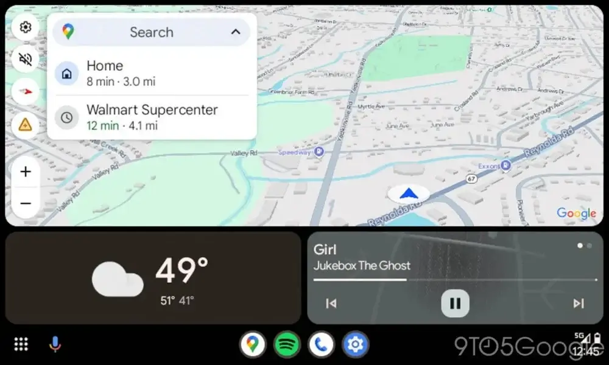
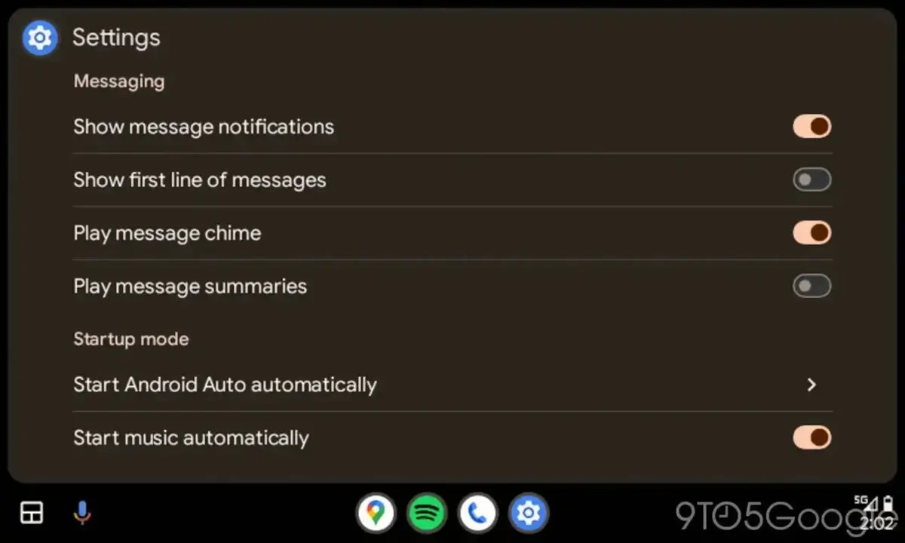

נגמרו הממשקים המונוטוניים ברכב שלכם! העדכון האחרון של **Android Auto** מביא משב רוח מרענן עם שילוב של **Material You**, שפת העיצוב החתימה של Google.

## מה זה Material You?

**Material You**, שהושק בשנת 2021 עם **Android 12**, הוא הרבה יותר משינוי אסתטי בלבד. הגישה הזו מתאימה באופן דינמי את צבעי הממשק בהתאם לרקע של הטלפון החכם שלכם.

**עדכון 13.4 של Android Auto מציג את החידוש הזה בהדרגה.**  
נכון לעכשיו, **Material You** מתפרס בעיקר בארבעה תחומים מרכזיים.

**הגדרות המערכת נהנות מתמיכה מלאה,**  
מה שמספק חוויה ויזואלית אחידה שמתאימה לטלפון החכם שלכם. גם ההתראות מאמצות את שפת העיצוב החדשה עם התאמה דינמית של הצבעים.

**גם כרטיסי התפריט עוברים שינוי,**  
עם כפתורים ורקעים מותאמים אישית. אפילו אפליקציות המולטימדיה שלכם נהנות מהעדכון הזה, עם התאמה עדינה של הצבעים סביב עטיפות האלבומים.

- Material You מגיע ל-Android Auto: עיצוב דינמי שמתאים את צבעי הממשק לרקע הטלפון.
- שיפור חוויית המשתמש: הגדרות מערכת, התראות ואפליקציות מולטימדיה מקבלות עיצוב חדש ועדכני.
- אחידות חזותית מלאה: חיבור מושלם בין הטלפון החכם לממשק ברכב עם עיצוב מותאם אישית.
