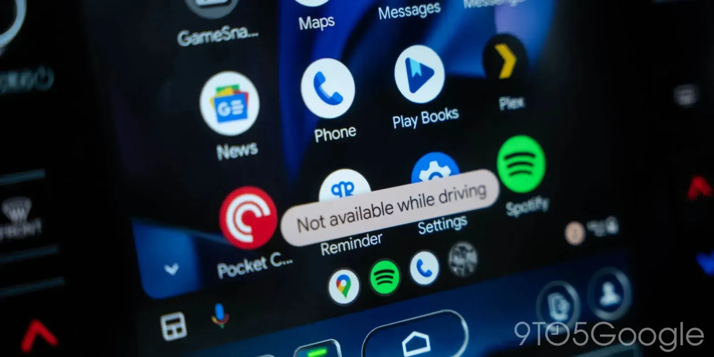

**העדכון שכל נהג מונית בישראל  חיכה לו הגיע סוף־סוף – Android Auto מאפשר לשחק ברכב, אבל רק בעצירה. העדכון החדש מביא איתו משחקים מוכרים כמו Angry Birds — אבל כמובן, יש קאץ’.**

גוגל שחררה את גרסת הבטא 14.1 של Android Auto, והיא כוללת תוספת מפתיעה: אפשרות לשחק במשחקי אנדרואיד דרך המסך של הרכב — כל עוד אתם לא בתנועה.

## **משחקים ברכב: רק כשהרכב בעצירה**

הפיצ'ר החדש הופיע בסוף מרץ 2025 עבור משתמשי גרסת הבטא דרך Google Play. ברגע שאתם בעצירה (בחניה או ברמזור ארוך), תוכלו לשחק ישירות על מסך הרכב — כולל תצוגה במסך מלא.

אבל חשוב לדעת: ברגע שהרכב מתחיל לזוז, המשחקים נחסמים אוטומטית. בטיחות מעל הכל.

הפיצ'ר החדש הופיע בסוף מרץ 2025 עבור משתמשי גרסת הבטא דרך Google Play. ברגע שאתם בעצירה (בחניה או ברמזור ארוך), תוכלו לשחק ישירות על מסך הרכב — כולל תצוגה במסך מלא.

אבל חשוב לדעת: ברגע שהרכב מתחיל לזוז, המשחקים נחסמים אוטומטית. בטיחות מעל הכל.

## **אילו משחקים זמינים?**

https://www.youtube.com/watch?v=drwGyMIC4zI

נכון לעכשיו, מדובר ברשימה קטנה אך מוכרת:

- **Angry Birds 2**
    
- **Beach Buggy Racing**
    
- **Candy Crush Soda Saga**
    
- **Farm Heroes Saga**
    

המשחקים חייבים להיות מותקנים מראש על הסמארטפון שלכם כדי שיופיעו באפליקציה, והם נפתחים בקלות כשאתם בחניה. כשתרצו לצאת מהמשחק, פשוט החליקו מהחלק העליון של המסך ולחצו על כפתור "Quit".

## **לא הפעם הראשונה, אבל הפעם זה רציני**

זו לא הפעם הראשונה שגוגל מנסה לשלב משחקים ב-Android Auto. בשנת 2021 היא הוסיפה את GameSnacks – משחקי HTML5 פשוטים שלא ממש תפסו. הפעם מדובר בשדרוג משמעותי עם משחקים פופולריים ומוכרים, ויש כאן פוטנציאל אמיתי.

עם זאת, נכון לעכשיו הפיצ'ר הזה קיים רק בבטא 14.1. הגרסה היציבה האחרונה היא 14.0, ולא ברור מתי הפיצ’ר יגיע לכלל המשתמשים.
