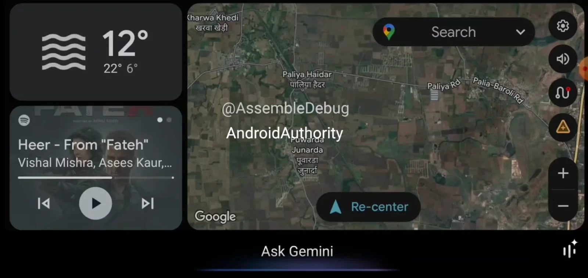
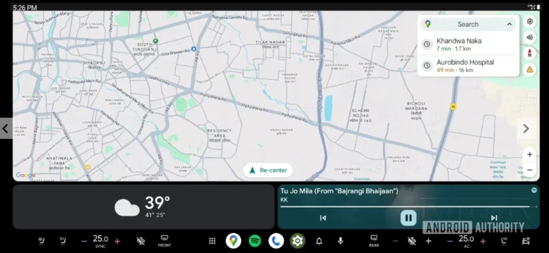

**Android Auto** משתפר כל הזמן – אבל התחושה אצל משתמשים היא שעדכונים באמת משמעותיים מגיעים לעיתים רחוקות. אז מה באמת הולך להשתנות בקרוב? הנה כל מה שאנחנו יודעים, כולל פיצ'רים שצפויים להגיע כבר בחודשים הקרובים – וחלקם עוד השנה.

## **🤖 Gemini מחליף את Google Assistant**

**מתי? פרטים רשמיים צפויים בכנס Google I/O, 20–21 במאי**

לא מדובר בשמועה: גוגל אישרה רשמית שהעוזר הקולי החדש שלה, **Gemini**, יחליף את Google Assistant גם ב־Android Auto וגם ב־Android Automotive.  
Gemini צפוי להציע **תמיכה בשיחות בזמן אמת**, פקודות קוליות חכמות, והבנה עמוקה יותר של הקשר – וזה לא נגמר שם: גם ממשק המשתמש כבר מתחיל להחליף את העוזר הישן בהדרגה.

## **🌤️ מצב כהה? קבלו גם מצב בהיר**

**מתי? כנראה בקרוב מאוד**

מצב בהיר ל־Android Auto הופיע לראשונה ב־2023 – אבל עכשיו הוא כמעט מוכן לשחרור מלא. מדובר לא רק בעיצוב אסתטי יותר, אלא גם בהתאמה לחוויית Material You של אנדרואיד.  
המצב הבהיר יפעל גם על האפליקציות, האנימציות והמסך הראשי – ויציע סוף סוף אלטרנטיבה אמיתית לממשק הכהה הקלאסי של Android Auto.

## **❄️ שליטה על המזגן – מתוך Android Auto**

**מתי? לא ידוע – השאלה היא יותר של תאימות**

גוגל בונה פיצ'ר לשליטה על מיזוג הרכב ישירות מ־Android Auto. הבעיה? Android Auto **לא מקבל גישה ישירה למערכות הרכב**, ולכן נדרשת אינטגרציה עמוקה יותר מצד יצרניות הרכב.

כרגע, מדובר בעיקר בכפתורים שצצו בקוד, אבל **עוד לא ברור אם בכלל קיימות מכוניות שיתמכו בזה בפועל**. שווה לעקוב.

## **📻 שליטה על רדיו ומדיה מקומית**

**מתי? אין צפי שחרור כרגע**

עוד פיצ'ר בעבודה: שליטה על תחנות רדיו (FM/AM) ואפילו על מדיה מקומית מהרכב – ישירות מ־Android Auto. זהו צעד חשוב כדי להוריד את התלות באפליקציות סטרימינג, בעיקר במדינות כמו ישראל שבהן האזנה לרדיו עדיין רלוונטית.

## **📞 תמיכה באפליקציות שיחות נוספות**

**מתי? לא ידוע**

קוד חדש שנמצא בעדכוני אפליקציה מרמז על תמיכה ב"אפליקציות חיוג חיצוניות". זה עשוי להרחיב את התמיכה מעבר ל־WhatsApp ו־Google Voice – אולי אפילו אפליקציות שיחות ישראליות.

## **🗺️ שליטה על התרעות במפות**

**מתי? עדיין לא פעיל, אך קיים בקוד**

עדכון חדש כולל הגדרה לשליטה על התרעות של Google Maps בזמן ניווט – כולל דיווחים על תאונות, עומסים ותנאי דרך.  
אם התרעתם בעבר על ריבוי התרעות מיותרות – בקרוב תוכל לכבות אותן.

## **לסיכום – מה חדש ב־Android Auto?**

| פיצ'ר | מתי יגיע? | מצב |
| --- | --- | --- |
| **Gemini במקום Assistant** | מאי 2025 (I/O) | מאושר |
| **מצב בהיר** | בקרוב מאוד | כמעט מוכן |
| **שליטה במזגן** | לא ידוע | בתהליכי בדיקה |
| **שליטה על רדיו** | אין צפי | בפיתוח |
| **שיחות חיצוניות** | לא ידוע | בקוד בלבד |
| **שליטה על התרעות במפות** | אין תאריך | ממתין להפעלה |
