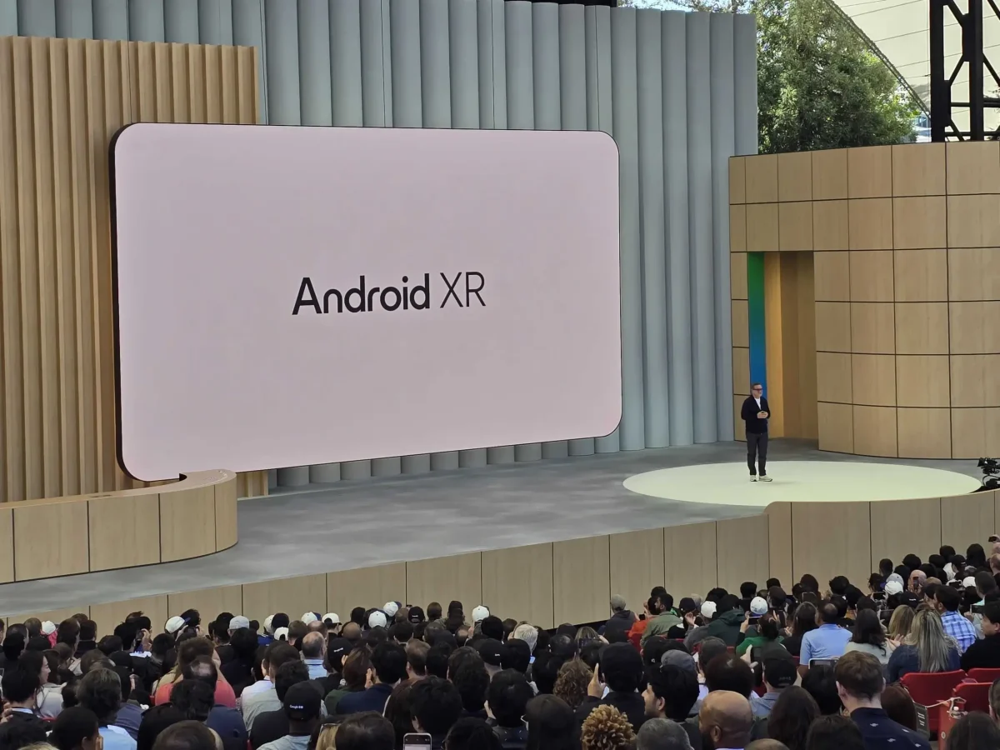
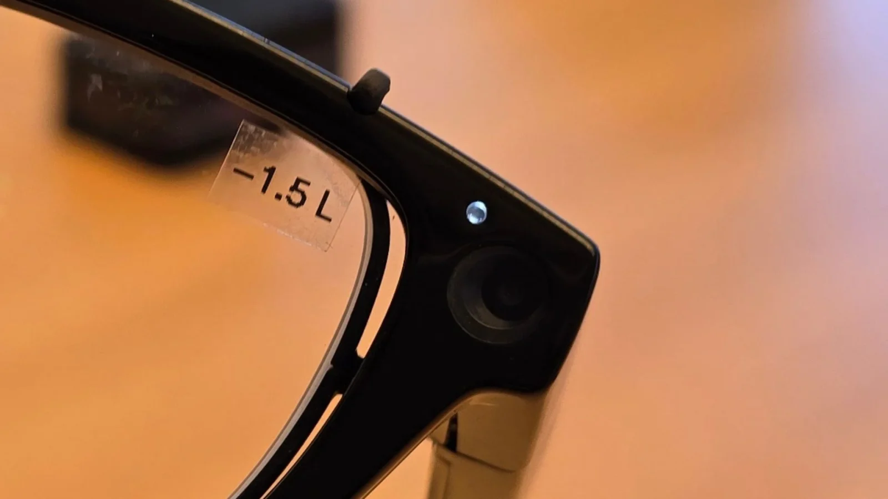
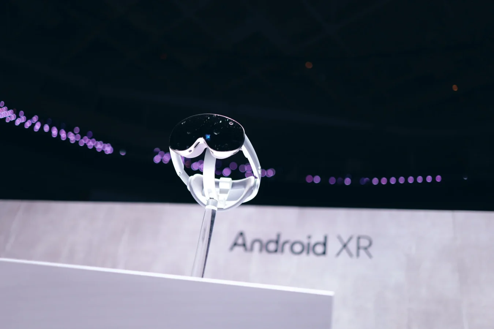

**שנים אחרי Google Glass, גוגל חוזרת למציאות – רק שהפעם היא באמת מוכנה.**

בכנס Google I/O 2025 גוגל הציגה את Android XR – פלטפורמת מציאות מעורבת חדשה שמנסה לאחד בין משקפי AR, קסדות VR, ואפילו מכשירים ללא מסך. הנה 5 נקודות מפתח שכדאי להכיר:

## **1\. חומרה שמוכנה – וגם המפתחים**

בעבר, Google Glass הקדימה את זמנה. היום, החומרה כבר כאן:

- מעבדים חזקים יותר
    
- מיזעור יעיל
    
- עיצוב נוח ואלגנטי
    

ומה לגבי מפתחים? פשוט: אם אתה יודע לפתח ל־Android, אתה כבר יודע לפתח ל־Android XR.

## **2\. Gemini הוא הלב של החוויה**

העוזר הקולי החדש של גוגל, **Gemini**, כבר לא רק מדבר – הוא _רואה_:

- מזהה תפריטים, מבנים, יצירות אמנות
    
- מבין הקשר ויזואלי + ממשק
    
- מאפשר שיחה חיה ומתמשכת – רק בטפיחה על המשקפיים
    

זה הופך אותו לאינטואיטיבי כמעט כמו אדם שמביט איתך בעולם.

## **3\. פרטיות: מצלמה דולקת רק כשצריך**

גוגל למדה מהעבר:

- **Gemini לא מצלם כל הזמן**
    
- המצלמה פעילה רק כשמצטרפים למצב "Gemini Live"
    
- אין הקלטה אוטומטית – רק צפייה כדי להבין את הסביבה
    

וגם יש חיווי ברור על כך שהמצלמה פעילה – עם נורית LED ייעודית.

## **4\. במשקפיים – מינימליזם קודם לכול**

בדקנו את Android XR על משקפיים חכמים של גוגל:

- אין מסך ענק מול העיניים
    
- אין צורך בידיים – שליטה קולית בלבד
    
- מידע מופיע בצורה ממוקדת – כמו הוראות ניווט קצרות או תזכורות
    

זה לא Science Fiction – זו פונקציונליות רגועה, כמעט בלתי מורגשת.

## **5\. בקסדות – צלילה לעומק**

ניסינו את Android XR גם על קסדת [**Project Moohan**](https://techhorizons.co.il/project-moohan-samsung-xr/) של Samsung:

- שליטה באמצעות מחוות ידיים – כמו Apple Vision Pro
    
- חוויות סוחפות במיוחד ביוטיוב וב־Google Photos
    
- מפות תלת־ממדיות במבט אחד – כאילו אתם במקום
    

ו־Gemini? עדיין איתכם – לשאלות, חיפושים, והכוונה בזמן אמת.

## **המסקנה: Android XR היא לא עוד ניסוי – היא בסיס לפלטפורמה חדשה**

עם עיצוב שמתאים את עצמו לסוג המכשיר, Gemini שמבין את העולם, וממשק שמעדיף פשטות על עומס – Android XR מציגה גישה בוגרת, חכמה ואפילו צנועה לריאליטי של המחר.
