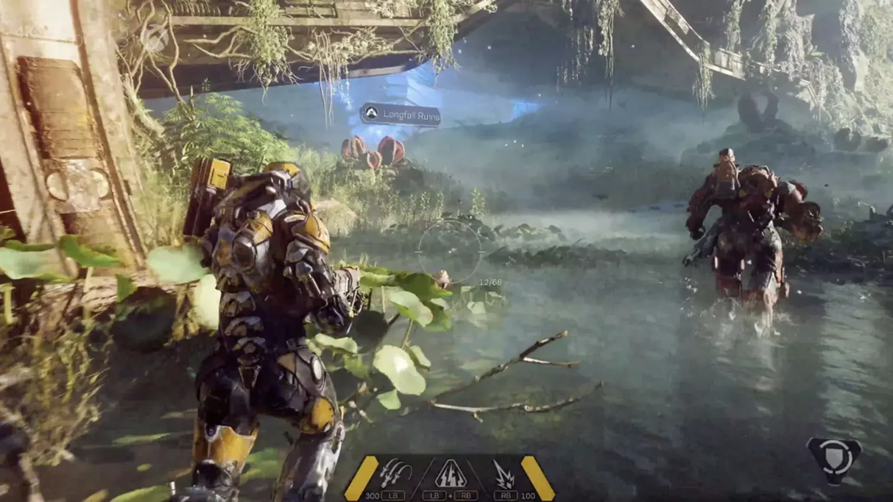
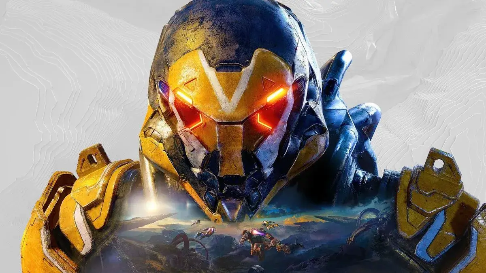

> EA is shutting down ‘Anthem’ servers  
>   
> Players will not be issued any refunds, and the game will no longer be playable after January 12th, 2026 [pic.twitter.com/GNnQJvQmyQ](https://t.co/GNnQJvQmyQ)
> 
> — Dexerto (@Dexerto) [July 3, 2025](https://twitter.com/Dexerto/status/1940841061557186606?ref_src=twsrc%5Etfw)

## **הסוף הרשמי ל־Anthem**

EA ו־BioWare הכריזו כי ב־12 בינואר 2026, Anthem ייכנס סופית להיסטוריה.  
המשחק, שיצא ב־2019 והוצג כהבטחה הגדולה של BioWare לעולם ה־Live Service, לא הצליח לעמוד בציפיות – אך בכל זאת השאיר חותם אצל חלק מהשחקנים.

## **עלייה מהירה – ונפילה כואבת**

כמו רבים, גם אנחנו כאן התלהבנו מהטריילרים. הרעיון של חליפת ג'אבלה, טיסה חופשית, עולם פתוח עם שיתוף פעולה – נשמע כמו חלום.

אבל במציאות, ההשקה הייתה מלאה בבאגים, קריסות, ומכניקות אונליין לא מלוטשות.

### **🎧 בלי תקשורת – אין משחק**

אחת הבעיות הגדולות הייתה השענות כבדה מדי על מולטיפלייר – בלי מערכת שתעודד שיתוף פעולה אמיתי.  
כששיחקת עם זרים – הרוב פשוט רצו לסיים את המשימה מהר. החוויה הפכה לאישית פחות, ומבלבלת יותר.

## **כשזה עבד – זה כן היה מהנה**

ועדיין, אי אפשר לקחת מ־Anthem את המכניקת תעופה המצוינת, הקרבות הזורמים, או התחושה של עוצמה כששיחקת עם חברים.  
לא משחק מושלם, לא קרוב – אבל עם בסיס שהיה יכול להפוך למשהו הרבה יותר טוב.

## **⏳ 193 ימים להיפרד**

השרתים ייסגרו ב־12 בינואר 2026. 
עד אז, תוכלו לשחק – אבל החל מהיום אי אפשר לרכוש עוד מטבעות פרימיום.  
כל יתרת קרדיטים תוכל לשמש עד תאריך הסגירה.

## **📝 מילה לסיום**

Anthem הוא תזכורת למה קורה כשמכניסים אולפן RPG מעולה לעולם שלא שלו – ונותנים לו יעד מסחרי במקום חזון יצירתי.  
אבל הוא גם תזכורת לכך שלפעמים, גם משחקים כושלים יכולים להבריק – לרגעים קצרים.

**נ.ב. EA מבהירה: לא יינתנו החזרים על רכישות קודמות או מטבעות שלא נוצלו.**  
**כך שאם אתם שוקלים לחזור לטוס עוד קצת לפני הסוף — כדאי לעשות את זה בקרוב.**
