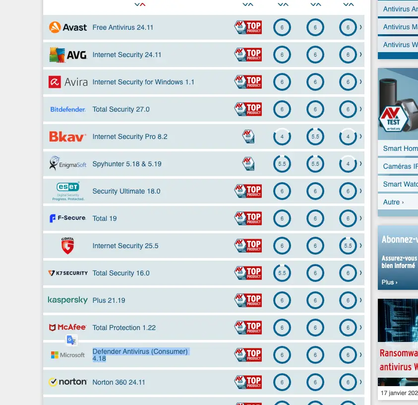

ב-2025, קרוב לשליש מהמשתמשים עדיין משלמים עבור אנטי-וירוס. עבור רבים, זו הרגל מגובה באמונה ישנה: בלי תוכנת אבטחה בתשלום, המחשב שלהם יהיה בסכנה. אבל המומחים מטילים בכך ספק יותר מתמיד. האם המחשבים שלנו באמת זקוקים לתוכנות ההגנה היקרות הללו?

### **למה כבר אין צורך באנטי-וירוס בתשלום?**

זה הפך לריטואל קבוע: מדליקים מחשב חדש, ומיד מופיעה הודעה שמציעה "שדרוג אבטחה" עם אנטי-וירוס בתשלום. חלק מהמשתמשים משתכנעים, מכניסים את פרטי האשראי ורוכשים מנוי – אך האם זה באמת נחוץ?

האמת היא שמערכות ההפעלה של ימינו עמידות הרבה יותר בפני איומים. **Windows Defender**, האנטי-וירוס החינמי של מיקרוסופט, מדורג באופן עקבי בראש מבחני האבטחה, אפילו מעל פתרונות בתשלום כמו Norton ו-McAfee.

במבחני AV-TEST האחרונים, Windows Defender קיבל **ציון מושלם של 6/6 בהגנה**. גם Apple לא נשארת מאחור – מערכת XProtect המובנית במחשבי מק מספקת שכבת הגנה יעילה. ובמובייל, החנויות של **Google Play ו-App Store מסננות את רוב האפליקציות הזדוניות** עוד לפני שהן מגיעות אלינו.

### **האיום האמיתי: טעויות של משתמשים**

האקרים כבר לא מנסים להחדיר וירוסים ישירות למחשבים – הם מעדיפים שיטות פשוטות יותר. **מתקפות סייבר כיום מתבססות בעיקר על טעויות אנוש.**

לחיצה חפוזה על קובץ מצורף מפוקפק, התעלמות מהודעת אזהרה, כניסה לאתרים מזויפים – כל אלה הם הגורמים המרכזיים לזיהומים במחשבים ובטלפונים.

וזה לא הכול: **אנטי-וירוס בתשלום יכול בעצמו להפוך לסיכון אבטחה.** כדי לפעול ביעילות, תוכנות אלו דורשות גישה עמוקה למערכת. אך אם יש בהן פרצת אבטחה – והיסטורית, זה קרה לא פעם – הן עשויות להפוך לשער כניסה ישיר להאקרים.

### **אז איך להגן על עצמנו באמת?**

החדשות הטובות הן שההגנה היעילה ביותר **לא דורשת תשלום**:

✔ עדכנו באופן קבוע את מערכת ההפעלה שלכם (במחשב ובסמארטפון)  
✔ אל תשביתו את ההגנות המובנות של Windows או macOS  
✔ הימנעו מפתיחת קבצים מצורפים והודעות חשודות  
✔ בדקו את כתובת השולח לפני פתיחת אימיילים  
✔ אל תיפלו להבטחות מפוקפקות והצעות "טובות מדי מכדי להיות אמיתיות"

### **ומה לגבי ארגונים?**

ההמלצה כאן מיועדת למשתמשים פרטיים בלבד. **בארגונים ובחברות גדולות הסיפור שונה.** שם, פתרונות אבטחה בתשלום מספקים הגנה מקיפה מפני מתקפות ממוקדות, ומשלבים טכנולוגיות מתקדמות לזיהוי איומים.

### **סיכום**

רוב המשתמשים לא באמת צריכים אנטי-וירוס בתשלום, שכן מערכות ההפעלה כבר כוללות פתרונות מובנים ואפקטיביים. האיומים המרכזיים כיום מגיעים מהטעויות שלנו, לא מחוסר תוכנה. במקום להוציא כסף על מנוי לא הכרחי, עדיף לאמץ הרגלי גלישה בטוחים ולשמור על המערכת מעודכנת.

- מערכות ההפעלה של היום כוללות הגנות מובנות חזקות כמו Windows Defender ו-XProtect, מה שהופך אנטי-וירוס בתשלום למיותר עבור רוב המשתמשים.
- האקרים מתמקדים פחות בהדבקת וירוסים ישירים ויותר בניצול טעויות אנוש, כמו פתיחת קישורים וקבצים מצורפים חשודים.
- במקום לשלם על תוכנות אבטחה, עדיף לשמור על המערכת מעודכנת, לא להשבית את ההגנות המובנות ולהימנע מהונאות רשת.
