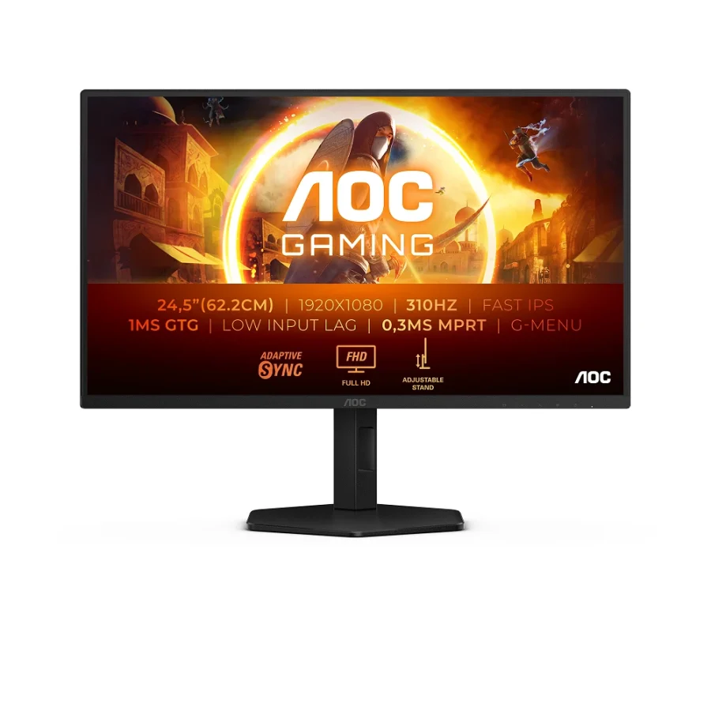
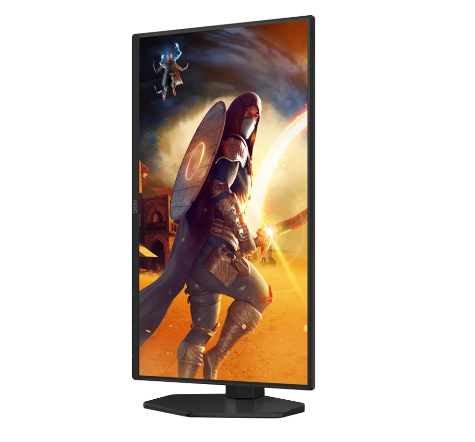
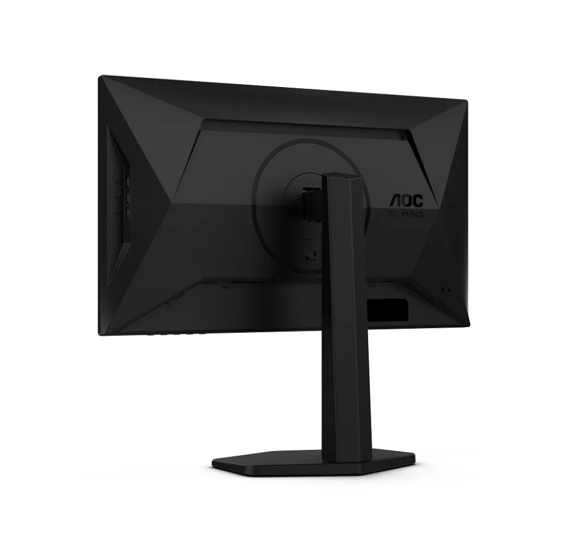
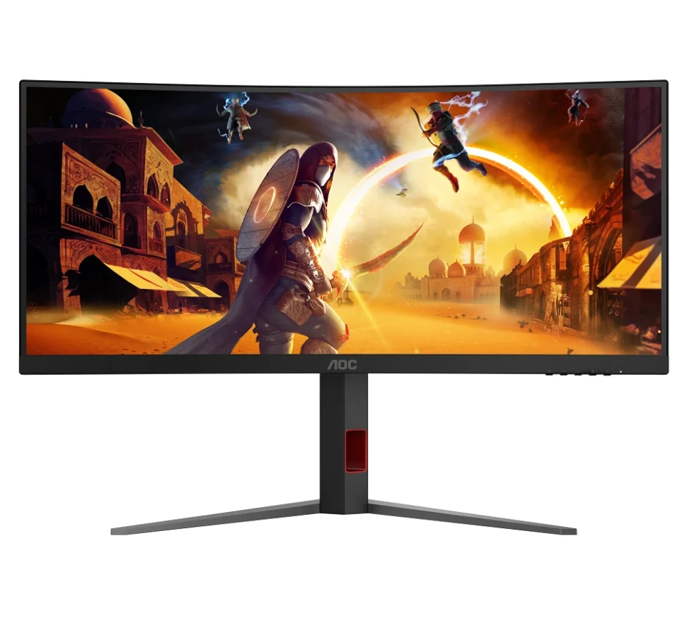
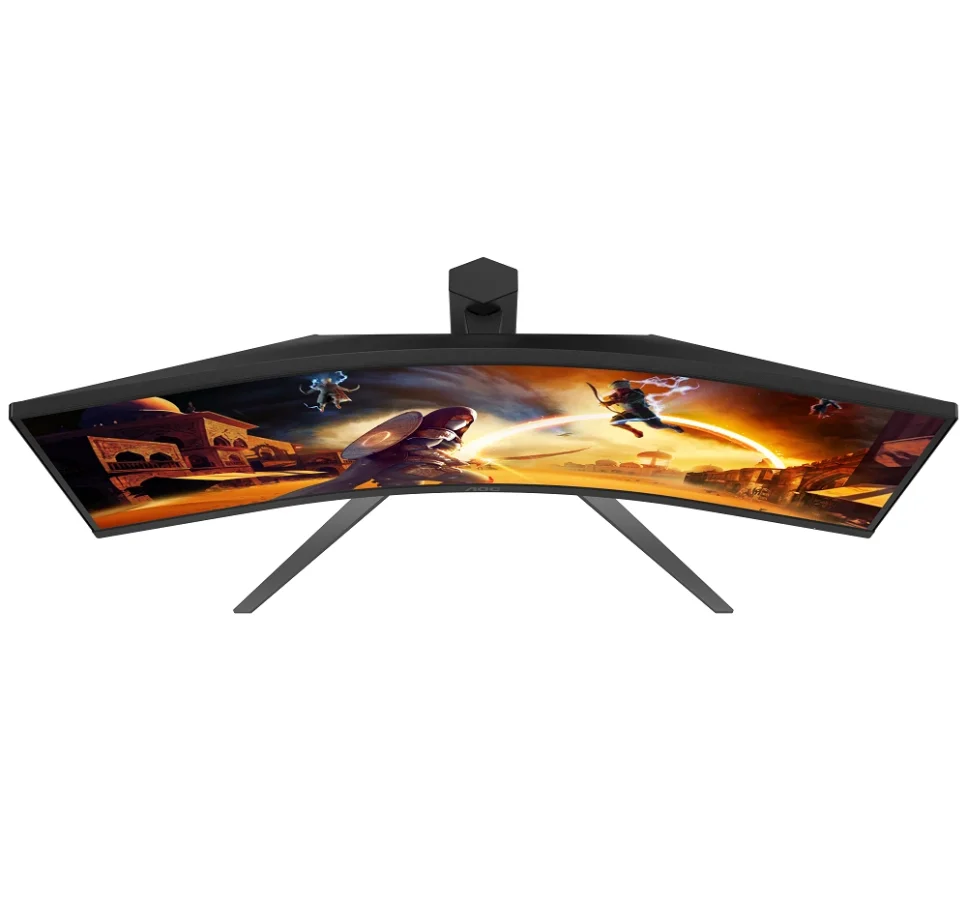
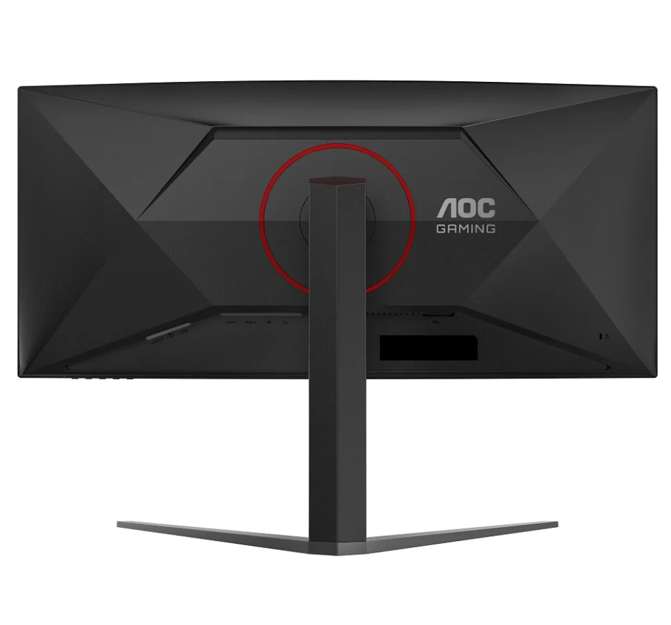

**מותג AOC, שנחשב לאחת האלטרנטיבות המשתלמות ביותר למסכי גיימינג – בישראל ובעולם – משיק שני דגמים חדשים לשחקנים תחרותיים ולחובבי חוויית משחק סוחפת.**

בעוד יצרניות כמו Samsung, LG ו־ASUS מתחרות על שוק מסכי ה־QD-OLED היקרים, חברת **AOC** מציגה שתי חלופות נגישות יותר לגיימרים:  
**AOC 25G4SXU** ו־**AOC CU34G4Z**, כל אחד מהם מיועד לקהל אחר – אך שניהם מתאימים למשחקים מהירים ותחרותיים.

**עדכון (09/05/2025):** AOC הכריזה על דגם חדש – **U27G4R**, מסך גיימינג עם מצב כפול 4K ו-FHD בקצב רענון עד 320Hz. לפרטים נוספים על הדגם החדש, **[לחצו כאן](https://techhorizons.co.il/aoc-u27g4r-320hz-dual-frame-2025/).**

## **השוואה בין שני המסכים החדשים של AOC**

| מאפיינים | AOC 25G4SXU | AOC CU34G4Z |
| --- | --- | --- |
| גודל מסך | 25 אינץ' שטוח | 34 אינץ' קעור (1500R) |
| יחס תצוגה | 16:9 | 21:9 רחב במיוחד |
| רזולוציה | Full HD (1920×1080) | WQHD (3440×1440) |
| פאנל | Fast IPS | Fast VA |
| קצב רענון | 300Hz (ניתן להמהרה ל־310Hz) | 240Hz |
| זמן תגובה | 1ms GtG / 0.3ms MPRT | 1ms GtG |
| סנכרון | תומך ב־NVIDIA G-SYNC | לא צוין |
| חיבורים | HDMI 2.1, DP 1.4, 4× USB 3.2 Gen 1 | HDMI 2.1, DP 1.4, 2× USB 3.2 Gen 1 |
| משקל | לא צויין | לא צויין |
| מחיר משוער | כ־199 פאונד (כ־930 ₪) | כ־369 פאונד (כ־1,720 ₪) |

## **מה ההבדל בין מסך שטוח למסך קעור – ומה עדיף?**

בעת בחירת מסך גיימינג, לא מדובר רק בקצב רענון או זמן תגובה – גם **צורת המסך** משפיעה רבות על חוויית השימוש:

- **מסך שטוח (Flat)** – כמו דגם ה־**25G4SXU**, מתאים במיוחד לגיימרים תחרותיים, במיוחד במשחקים כמו CS2 או Valorant. התצוגה הישרה מקלה על סריקות מהירות בשדה הקרב ומדויקת יותר למשחקים שדורשים תגובה חדה וקליטת מידע ישירה.
    

<figure>

<figcaption>

25G4SXU\_F\_2000x2000

</figcaption>

</figure>

<figure>

<figcaption>

25G4SXU\_FTR\_P\_KV

</figcaption>

</figure>

<figure>

<figcaption>

25G4SXU\_BKR

</figcaption>

</figure>

- **מסך קעור (Curved)** – כמו דגם ה־**CU34G4Z**, נועד לספק חוויה קולנועית וסוחפת. הקימור עוטף את שדה הראייה ויוצר תחושת עומק – אידיאלי למשחקי סימולציה, RPG או הרפתקאות. הוא פחות מתאים לתחרויות מהירות, אך מעולה לשחקנים שמעדיפים לשקוע בעולם המשחק.
    

לסיכום, מסך שטוח הוא הבחירה המדויקת עבור גיימרים תחרותיים – ואילו מסך קעור מתאים לגיימרים שמחפשים חוויה עמוקה ומעורבת יותר.

<figure>

<figcaption>

CU34G4Z\_F\_KV

</figcaption>

</figure>

<figure>

<figcaption>

CU34G4Z\_TOP\_KV

</figcaption>

</figure>

<figure>

<figcaption>

CU34G4Z\_B

</figcaption>

</figure>

AOC ממשיכה להציע פתרונות איכותיים לגיימרים עם דרישות שונות – בין אם אתם מחפשים יתרון תחרותי עם תצוגה מהירה במיוחד, או חוויית משחק סוחפת עם מסך רחב וקעור. שני הדגמים שהושקו מציעים מפרט טכני מרשים, עיצוב מוקפד, ותמורה מצוינת למחיר – מה שהופך אותם לבחירה חכמה לגיימרים בישראל שמחפשים לשדרג את העמדה שלהם מבלי לרוקן את הארנק.
