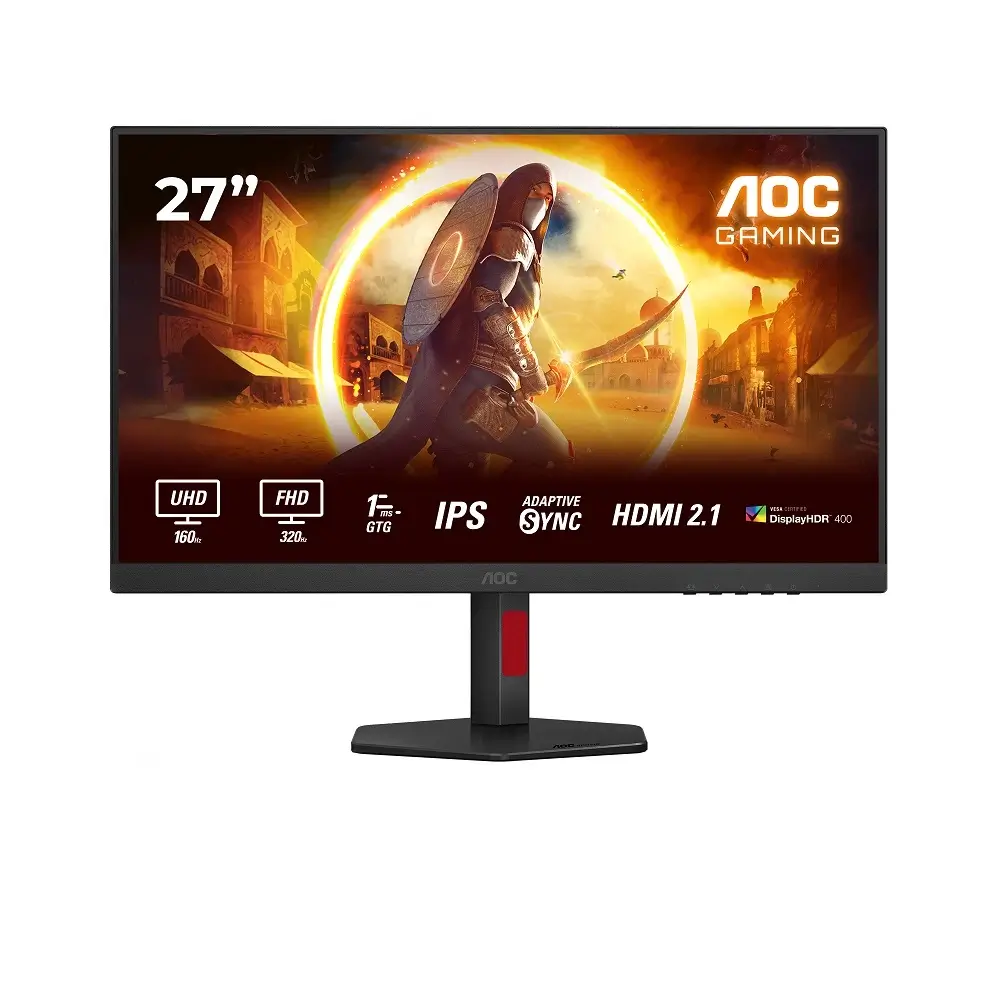
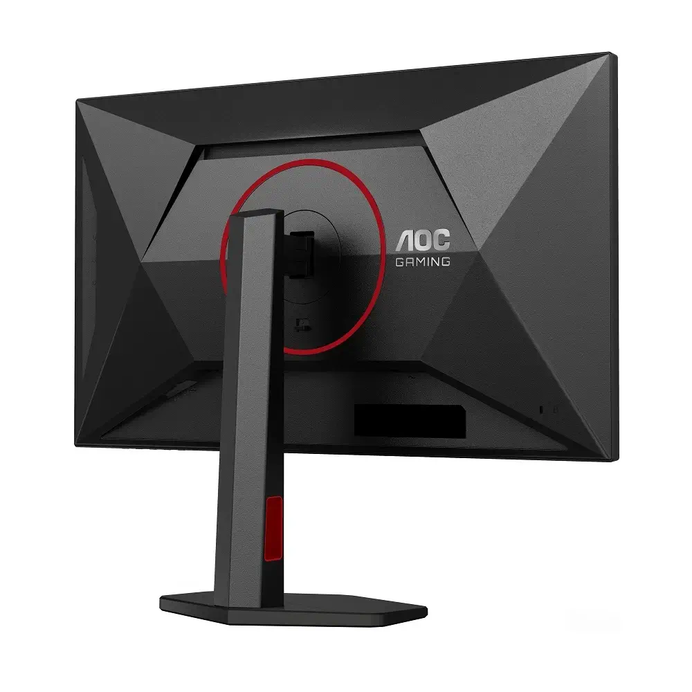
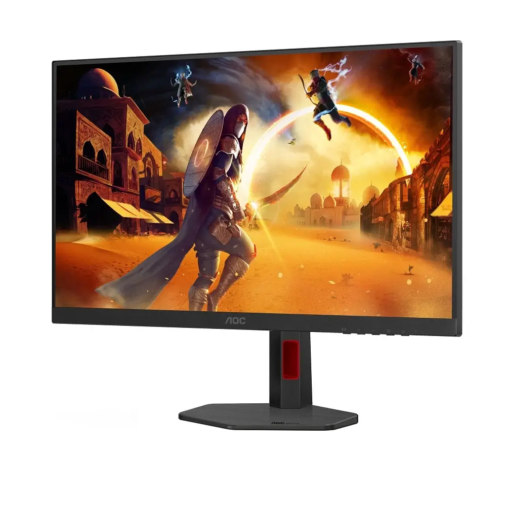
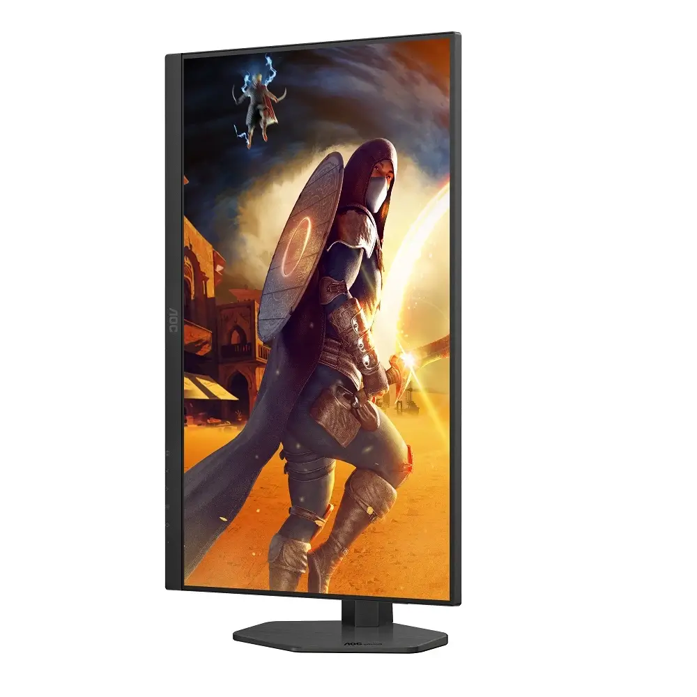

## **AOC ממשיכה להתרחב – מסך U27G4R עם 4K ו-FHD במצב כפול**

לאחר שהציגה [שני מסכי גיימינג חדשים עם קצבי רענון של 240Hz ו-310Hz](https://techhorizons.co.il/aoc-240hz-310hz-budget-gaming-monitors/), AOC משיקה כעת את **U27G4R**, מסך חדש בסדרת AGON, המיועד לגיימרים שמחפשים את השילוב המושלם בין **גרפיקה חדה לביצועים חלקים במיוחד**.  
המסך מציע **מצב כפול – 4K בקצב 160Hz ו-FHD בקצב 320Hz**, מה שהופך אותו לפתרון אידיאלי עבור משחקי AAA וגם עבור eSports תחרותיים.

## **מה מציע ה-U27G4R ?**

המסך החדש מצויד בפאנל **IPS בגודל 27 אינץ'**, עם זמן תגובה מהיר של **1ms GtG** ותמיכה ב-**HDR400** לאיכות תמונה מרהיבה.  
היכולת לעבור בין 4K@160Hz ל-1080p@320Hz מאפשרת לשחקנים ליהנות משני עולמות – חוויית גיימינג סינמטית לצד ביצועים תחרותיים חלקים במיוחד.

לדברי **César Acosta**, מנהל מוצרי הגיימינג ב-AGON:

> "ה-U27G4R משלב בין איכות תצוגה מרהיבה ב-4K לבין קצב רענון מהיר במיוחד ב-1080p, כך שהשחקנים לא צריכים לבחור בין גרפיקה חלקה לביצועים תחרותיים."

## **יכולות צבע מתקדמות**

מעבר לקצבי הרענון המרשימים, ה-U27G4R מצטיין גם בתחום הצבעים:

- **124.7% sRGB** – כיסוי מלא של טווח הצבעים הבסיסי.
    
- **95.9% DCI-P3** – צבעים עשירים ומדויקים לתכני וידאו וגרפיקה.
    

## **חיבורים ונוחות שימוש**

המסך מצויד במגוון רחב של חיבורים:

- 2x **HDMI 2.1**
    
- 1x **DisplayPort 1.4**
    
- **USB 3.1 Hub** – חיבורי USB מרובים עבור ציוד היקפי.
    

## **סדרת G4 מתרחבת – שלושה דגמים נוספים**

בנוסף ל-U27G4R, AOC השיקה עוד שלושה מסכי גיימינג בסדרת **G4**:

- **CU34G4** – מסך 34 אינץ' קעור, 200Hz – **£289** (כ-1,275 - 1,315 ₪)
    
- **24G4HA** – מסך 24 אינץ', 200Hz – **£134** (כ-590 - 610 ₪)
    
- **27G4HA** – מסך 27 אינץ', 200Hz – **£154** (כ-680 - 700 ₪)
    

המחירים לשוק הישראלי הם הערכה בלבד, בהתבסס על תוספת של 10-15% למחיר המקורי.

## **למי מתאים ה-U27G4R?**

ה-AOC U27G4R הוא מסך גיימינג מתקדם שמציע שילוב נדיר של **4K ב-160Hz** לצד **FHD ב-320Hz**, במחיר תחרותי של **£299** (כ-1,320 - 1,380 ₪).  
עם כיסוי צבעים עשיר, חיבורים נרחבים ומצבי תצוגה מגוונים, המסך החדש מכוון הן לשחקני AAA שמחפשים גרפיקה איכותית והן לגיימרים תחרותיים שמחפשים ביצועים מקסימליים.
