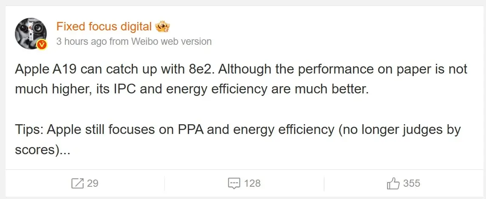

## **אפל בונה על יציבות, לא על מספרים**

שני השבבים הבאים של אפל – A19 ו־A19 Pro – שצפויים להניע את סדרת אייפון 17, עשויים לא להיות החזקים ביותר בשוק השנה. לפי הדלפות חדשות, הם יתמקדו בעיקר ביעילות אנרגטית וחיי סוללה ארוכים, בניגוד למתחרים שדוחפים את גבולות הביצועים – גם אם זה בא על חשבון הסוללה.

השבבים החדשים ייוצרו בתהליך N3P המתקדם של TSMC, אותו תהליך שבו ישתמשו גם סנאפדרגון 8 Elite Gen 2 של קוואלקום ו־Dimensity 9500 של מדיה־טק.

## **אייפון 17: ביצועים טובים, אבל לא שיאיים**

לפי הדלפות שפורסמו ברשת החברתית הסינית Weibo, אפל לא מתכוונת להיאבק על ציונים בבנצ'מרקים. במקום זה, היא תעדיף שיפור ב־IPC (כמות הפקודות למעגל שעון), כלומר – יעילות העבודה של השבב.

למרות שה־A19 צפוי להציג ביצועים חד-ליבתיים שקרובים לשבב ה־M4 למחשבים של אפל, במבחני ריבוי ליבות (multi-core) הוא ככל הנראה יהיה איטי יותר ממקביליו של קוואלקום ומדיה־טק – שצפויים להוביל את הביצועים, אך עם צריכת חשמל גבוהה בהרבה.

## **קוואלקום ומדיה־טק: מרוץ למהירות – במחיר הסוללה**

היתרון בביצועים של סנאפדרגון 8 Elite Gen 2 ו־Dimensity 9500 מרשים – אך מגיע עם מחיר. כדי להגיע לשיאים האלה, קוואלקום ומדיה־טק צורכים הרבה יותר חשמל.

מכשירי אנדרואיד יפצו על כך עם סוללות גדולות במיוחד של 4500–5000 מיליאמפר־שעה, הודות לטכנולוגיית סוללות סיליקון-פחמן החדשה. אפל עדיין לא עברה לטכנולוגיה הזו, וה־iPhone 17 Air צפוי להגיע עם סוללה קטנה של כ־2800mAh בלבד – ולכן כל אחוז יעילות חשוב.

## **השוואה בין השבבים – 2025**

| מעבד | תהליך ייצור | מיקוד עיקרי | ביצועי Single-Core | ביצועי Multi-Core | צריכת חשמל | סוללה טיפוסית |
| --- | --- | --- | --- | --- | --- | --- |
| Apple A19 | TSMC N3P | חיסכון בחשמל | שווה ל־M4 | פחות מ־Dimensity 9500 | נמוכה | 2800mAh |
| Apple A19 Pro | TSMC N3P | חיסכון בחשמל | שווה ל־M4 | פחות מ־Snapdragon 8 | נמוכה | 3000mAh (הערכה) |
| Snapdragon 8 Elite Gen 2 | TSMC N3P | ביצועים גולמיים | גבוה מ־A19 | גבוה מ־A19 Pro | גבוהה | 4500mAh+ |
| Dimensity 9500 | TSMC N3P | ביצועים במולטי-קור | נמוך מ־A19 Pro | גבוה מ־A19 Pro | גבוהה | 4700mAh+ |

## **פחות מספרים, יותר חוויה?**

האם המשתמשים באמת מרגישים את ההבדלים הקטנים בציוני הביצועים, או שמא חיי סוללה הם אלו שקובעים את איכות השימוש ביומיום? אפל בונה על התשובה השנייה.

הגישה הזו עשויה לעלות לה במאבקי היוקרה והכותרות, אבל עבור מי שמחפש חוויית שימוש חלקה, יציבה ויעילה – ייתכן שאפל שוב תנצח בקרב החשוב באמת.
