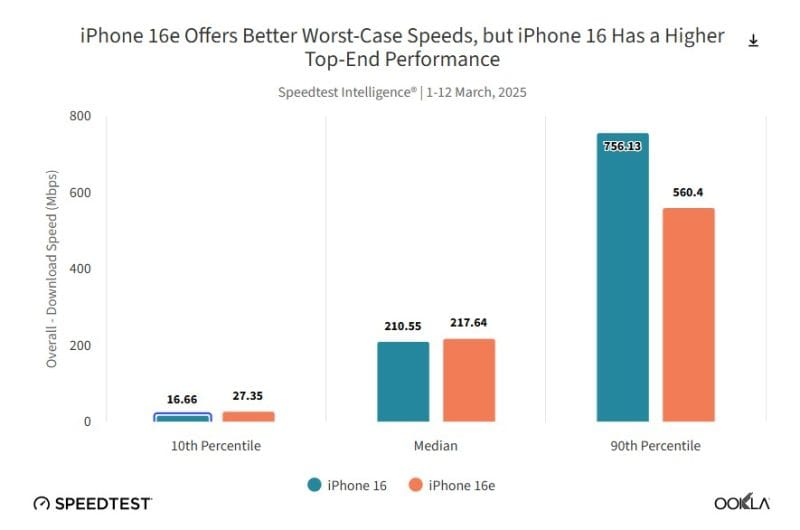
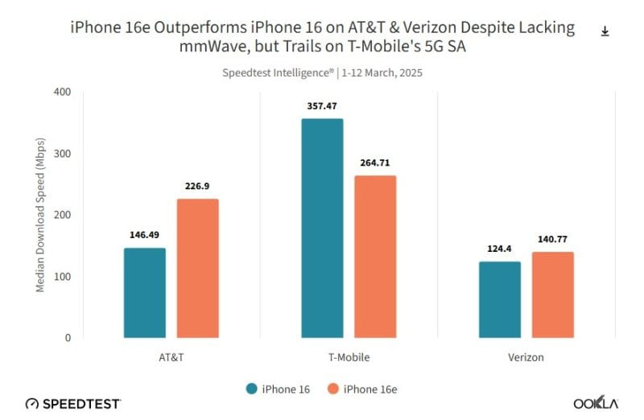

## **אפל חושפת את ביצועי מודם C1**

עם השקת iPhone 16e, אפל הציגה לראשונה את מודם ה-5G C1 שפותח כולו בתוך החברה. בתחילה, נטען כי מדובר במודם חסכוני באנרגיה אך עם מגבלות מסוימות, אך כעת בדיקות חדשות חושפות כי מודם C1 עולה בביצועיו על מודמי Qualcomm Snapdragon X71 בכמה מבחנים.

## **ייצור משולב בטכנולוגיית 4nm ו-7nm**

בניגוד לשבב A18 של iPhone 16e, שמיוצר ב-3nm, מודם C1 משלב שני תהליכי ייצור שונים:

- ליבת המודם מיוצרת ב-4nm
- המשדר (Transceiver) מיוצר ב-7nm

בחירה זו מאפשרת לאפל לאזן בין עלות ייצור לביצועים תוך חיסכון בצריכת החשמל.

## **ביצועים: מודם C1 עולה על קוואלקום בנקודות מסוימות**

לפי מבחני ביצועים שנערכו על ידי Ookla, למודם C1 של אפל יש יתרונות מסוימים מול Snapdragon X71 שבדגמי iPhone 16 האחרים:

**📊 השוואת מהירויות הורדה לפי מפעילות סלולריות**

_(AT&T, Verizon ו-T-Mobile)_

 

- **העשירון התחתון (מהירויות נמוכות)** – מודם C1 מספק ביצועים טובים יותר ממודם קוואלקום, מה שמעניק חוויית שימוש יציבה יותר באזורים עם קליטה נמוכה.
- **החציון (ביצועים ממוצעים)** – שני המודמים מציגים ביצועים דומים, עם יתרון קל לאפל.
- **העשירון העליון (מהירויות מרביות)** – המודם של קוואלקום מציג ביצועים טובים משמעותית, בעיקר בזכות התמיכה בטכנולוגיית mmWave.

**📊 השוואת ביצועים בעשירונים שונים**

_(מהירות מינימלית, חציונית ומקסימלית)_

 

## **למה היעדר תמיכה ב-mmWave לא בהכרח חיסרון?**

בהתחלה, אפל ספגה ביקורת על כך שמודם C1 לא תומך בטכנולוגיית mmWave, אך התוצאות בפועל מראות שהוא מספק חוויית רשת טובה יותר הודות לניהול אופטימלי של תדרי sub-6GHz:

- המודם חוסך בצריכת החשמל ומאריך את חיי הסוללה של iPhone 16e.
- הוא מציע מהירויות העלאה טובות יותר בכל הרשתות המרכזיות בארה"ב, במיוחד AT&T ו-Verizon.
- הביצועים בפועל (העשירון התחתון) משקפים טוב יותר את חוויית המשתמש מאשר שיאי מהירות ב-mmWave.

## **למה אפל פיתחה מודם 5G משלה?**

אפל שואפת מזה שנים להפחית את התלות שלה בקוואלקום ולשלוט באופן מלא בחומרה ובתוכנה שלה. מודם C1 מסמן את תחילת הדרך עם יתרונות כגון:

- **חיסכון בצריכת החשמל** ושיפור חיי הסוללה.
- **הפחתת עלויות ייצור**, מה שמאפשר הצעת דגמים מוזלים יותר.
- **שליטה מלאה באקוסיסטם של iPhone**, שתאפשר שיפורים משמעותיים בעתיד.

## **מסקנה: צעד ראשון מבטיח**

מודם C1 עדיין לא עוקף את קוואלקום בכל המדדים, אך הביצועים שלו בתנאי שימוש אמיתיים והיעילות האנרגטית שלו הופכים אותו לחלופה רצינית. אפל הוכיחה שהיא מסוגלת להתמודד עם השחקנים הגדולים בתחום, וצפויים שיפורים משמעותיים בדורות הבאים של המודמים שלה.
