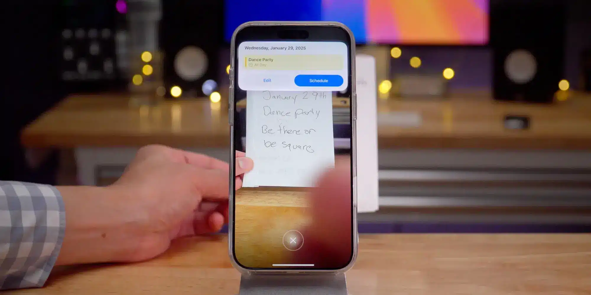

אפליקציית **Calendar** של Apple קיימת באייפון מאז ההתחלה, אך לעיתים רחוקות היא מקבלת עדכונים משמעותיים. בשנים האחרונות, משתמשים רבים עברו לחלופות כמו **Google Calendar** ואפליקציות צד שלישי כגון **Fantastical**. למרות התחרות, Apple כמעט ולא שינתה את האפליקציה במשך שנים – אבל זה מתחיל להשתנות.

## **השדרוגים המשמעותיים ב-iOS 18**

מערכת **iOS 18** הביאה עמה שדרוגים נדירים לאפליקציית **Calendar**, חלקם המשמעותיים ביותר בשנים האחרונות.

🔹 **שילוב אפליקציית Reminders** – ניתן כעת **ליצור, לערוך ולצפות בתזכורות ישירות מתוך לוח השנה**. למרות שזהו שיפור מבורך, האפשרויות עדיין מוגבלות – לא ניתן לבחור רשימות מסוימות, אלא להפעיל את כולן או אף אחת.

🔹 **עיצוב מעודכן** – שיפורים בטיפוגרפיה ובממשק המשתמש מספקים חוויית שימוש מודרנית ונוחה יותר.

🔹 **תצוגת חודש חדשה** – מאפשרת לראות את פרטי האירועים ישירות מהתצוגה החודשית.

بالنיגוד ליחס המינימלי שקיבלה בעבר, אפליקציית לוח השנה קיבלה סוף סוף **התייחסות משמעותית ב-iOS 18**, והעדכונים הללו התקבלו בהפתעה נעימה בקרב המשתמשים.

## **iOS 18.3 מוסיף יתרון חדש למשתמשי Calendar**

השדרוגים לא נעצרים כאן. עם **iOS 18.3**, אפליקציית **Calendar** מקבלת תכונה נוספת שהופכת אותה לשימושית עוד יותר.

📱 **משתמשי iPhone 16 עם Camera Control** יכולים כעת להפעיל **בינה חזותית (Visual Intelligence)** באמצעות לחיצה ארוכה.

🧠 **בינה חזותית** היא תוספת חדשה ההופכת את מצלמת האייפון לכלי AI מתקדם, המאפשר זיהוי מידע והפעלת פעולות ישירות מהמכשיר.

📅 **עם iOS 18.3, ניתן לכוון את המצלמה אל פלייר, כרזה או שלט עם תאריך – והמכשיר יציע להוסיף את האירוע ישירות ללוח השנה.**

💡 **זהו פתרון מהיר ויעיל להוספת אירועים מהעולם האמיתי ישירות ליומן הדיגיטלי שלך.**

- Apple ממשיכה לשדרג את אפליקציית Calendar, וב-iOS 18 שולבה אפשרות לנהל תזכורות ישירות מתוך היומן יחד עם עיצוב משופר ותצוגת חודש חדשה.
- העדכון ב-iOS 18.3 מוסיף תמיכה בבינה חזותית (Visual Intelligence), שמאפשרת לזהות תאריכים מפליירים ושלטים ולהוסיף אותם ישירות ללוח השנה.
- השיפורים הללו הופכים את Calendar לאופציה אטרקטיבית יותר עבור משתמשי iPhone, במיוחד עבור מי שמחפש דרך מהירה ונוחה לניהול אירועים.
