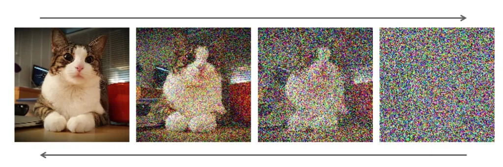
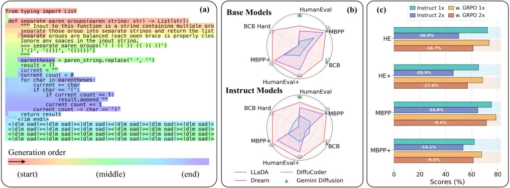
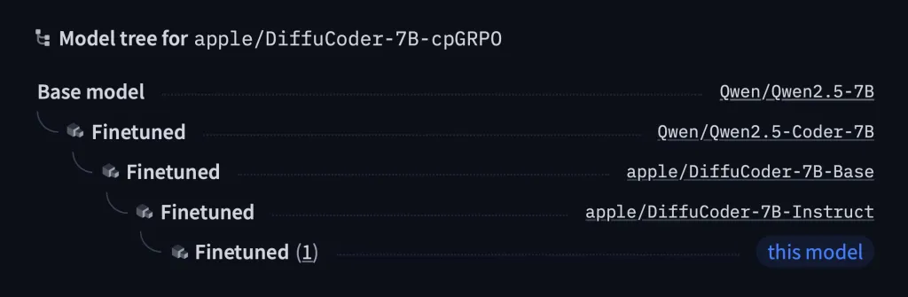
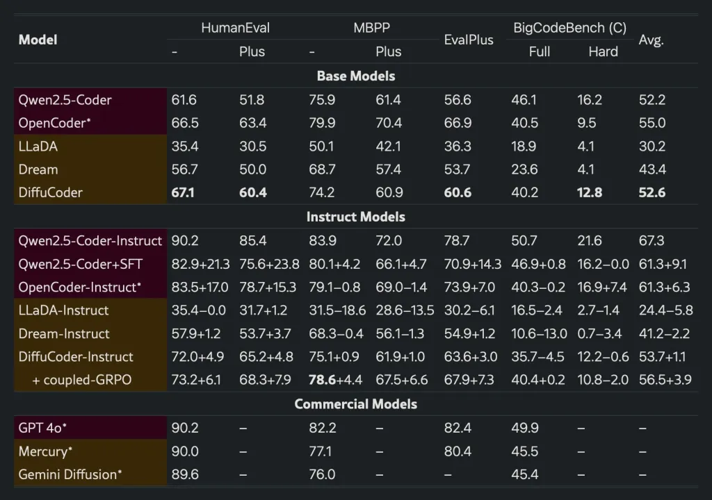

**החברה השיקה בשקט מודל קוד חדש בשם DiffuCode שמייצר קוד בצורה לא רגילה – וזה עובד מצוין.**

אפל שחררה השבוע מודל AI חדש ופתוח בשם [**DiffuCode‑7B‑cpGRPO** באתר Hugging Face](https://redirect.viglink.com/?format=go&jsonp=vglnk_175172574389011&key=c1c7d488bb2df8a8b659d5d41634d304&libId=mcqa5rtz010023dg000ULhg4fc4zi&loc=https%3A%2F%2F9to5mac.com%2F2025%2F07%2F04%2Fapple-just-released-a-weirdly-interesting-coding-language-model%2F&ccpaConsent=1---&v=1&out=https%3A%2F%2Fhuggingface.co%2Fapple%2FDiffuCoder-7B-cpGRPO&ref=https%3A%2F%2F9to5mac.com%2F&title=Apple%20just%20released%20an%20interesting%20coding%20language%20model%20-%209to5Mac&txt=DiffuCoder-7B-cpGRPO) – מודל שמסתכל על כתיבת קוד באופן שונה לחלוטין מהמקובל: במקום לכתוב קוד משמאל לימין, הוא יכול לכתוב _לא לפי הסדר_, ולשפר כמה קטעים במקביל.

התוצאה? יצירת קוד מהירה יותר וביצועים שמתחילים להתחרות במודלים הפתוחים החזקים ביותר.

## **קצת רקע טכני (בקצרה)**

- **מודלים אוטורגרסיביים** (כמו GPT) כותבים מילה אחרי מילה, לפי הסדר – מה שמאט את תהליך הכתיבה.
    
- **מודלי דיפוזיה** (כמו Stable Diffusion) יוצרים תוכן על ידי שיפור הדרגתי של רעש – ובמקרה הזה: קוד גולמי שהולך ומתחדד.
    

המודל של אפל מבוסס על שיטת דיפוזיה ליצירת קוד – וזה מה שמאפשר לו לשכתב קטעים שלמים בבת אחת, בצורה יעילה יותר.

 

## **מה אפל באמת שחררה?**

- המודל החדש **מבוסס על Qwen2.5‑7B** – מודל קוד פתוח שפותח על ידי Alibaba.
    
- אפל לקחה אותו, שילבה שיטת דיפוזיה מתקדמת, ואז fine-tuned עם יותר מ־20,000 דוגמאות קוד איכותיות.
    
- התוצאה: **קוד איכותי יותר, בפחות שלבים**.
    

בזמן שמודלים כמו GPT‑4 עדיין מציגים תוצאות טובות יותר, אפל מראה שהיא מתקדמת במהירות – עם גישה שונה ואולי גם יעילה יותר בטווח הארוך.

## **ומה עם הביצועים?**

לפי המחקר שפורסם עם המודל:

- המודל שיפר את הציון שלו ב־4.4% במדדים של יצירת קוד לעומת הגרסה הקודמת.
    
- הוא מצליח לשמור על איכות גם כשהמנוע פועל בחצי מהשלבים הרגילים.
    
- ובזכות גמישות בחיזוי הטוקנים (באמצעות שינוי “טמפרטורה”), הוא יכול להתנהג גם כמו מודל רגיל – או להיות הרבה יותר יצירתי.
    

יצירת קוד בצורה שאינה לינארית יכולה לשפר ביצועים, קוהרנטיות ואפילו לפתור בעיות מורכבות במהירות. לא מדובר רק על "עוד מודל", אלא על גישה חדשה לגמרי – עם פוטנציאל אמיתי לשלב AI עמוק בתוך סביבת הפיתוח של אפל.

האם זה יגיע ל־Xcode? האם נראה את זה ב־macOS בקרוב? עוד לא ברור – אבל אפל כבר מתחילה לבנות את התשתית.
