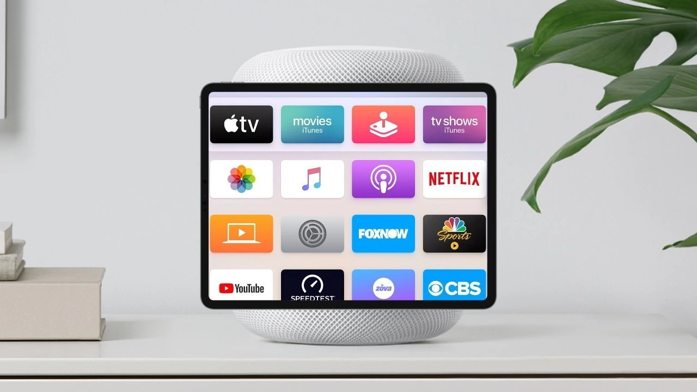
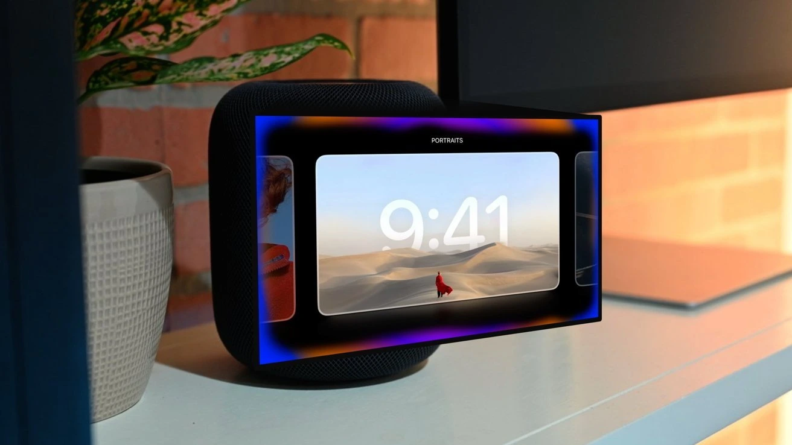

## **מה זה homeOS ומה המטרה שלו?**

לאחר שנים של שמועות, _Apple_ עשויה לחשוף בקרוב מערכת הפעלה חדשה בשם **homeOS**, שתהיה מיועדת לניהול הבית החכם.  
המערכת החדשה צפויה לשמש כמרכז שליטה חכם ותומכת במכשירים מחוברים כמו _Apple TV_, _HomePod_ ופתרונות חכמים נוספים.

## **למה דווקא עכשיו?**

במשך השנים, אפל פיתחה גרסאות ייעודיות של מערכות ההפעלה שלה:

- _watchOS_ לשעונים
    
- _iPadOS_ לטאבלטים
    
- _tvOS_ לטלוויזיות  
    כעת, נראה כי אפל מכינה את הקרקע למערכת ייעודית לניהול הבית החכם, עם פוקוס על **שליטה קולית דרך Siri**, תקשורת באמצעות **Thread** ותמיכה ב-**Matter**, התקן האחיד למכשירים חכמים.
    

## **מה נוכל לעשות עם homeOS?**

לפי השמועות, homeOS צפויה לשמש כמרכז שליטה חכם, עם יכולות כמו:

- **ניהול מכשירים חכמים:** שליטה על תאורה, תריסים, דלתות ומכשירי חשמל.
    
- **מצלמות אבטחה:** הצגת פיד וידאו בזמן אמת, זיהוי אנשים, חיות וכלי רכב.
    
- **סירי מותאם אישית:** Siri יוכל להבחין בין משתמשים שונים ולהתאים את התשובות בהתאם.
    
- **שליטה על מוזיקה ומדיה:** הפעלה קולית של Apple Music, Apple TV ו-Podcasts.
    
- **תמיכה ב-Thread:** תקשורת מאובטחת ורשת עצמאית בין מכשירים חכמים ברחבי הבית.
    

## **מסך חכם חדש מבית אפל?**

במקביל להשקת homeOS, אפל צפויה להכריז על **מסך חכם חדש**, שצפוי להיראות כמו שילוב בין iPad ל-HomePod.

- המסך החכם יוכל להציג ווידג'טים, חדשות, מתכונים ואפילו לעבור בין תצוגות שונות בהתאם למרחק המשתמש.
    
- כמו כן, המסך יוכל לשמש כמוקד שליטה מרכזי לכל מכשירי הבית החכם התומכים ב-homeOS.
    

## **תמיכה באפליקציות צד שלישי – לא בהשקה**

על פי השמועות, **גרסה ראשונית של homeOS לא תכלול תמיכה באפליקציות צד שלישי**, אלא רק באפליקציות המובנות של אפל כמו _Apple TV, Home, Music ו-News_.  
ייתכן כי אפל תוסיף תמיכה במפתחים בהמשך, במיוחד אם homeOS יהפוך למערכת רווחית ופופולרית בשוק הבית החכם.

## **מתי homeOS תיחשף רשמית?**

- אם homeOS תשולב גם במכשירים קיימים כמו _Apple TV_ ו-_HomePod_, ייתכן שנראה הכרזה כבר ב-**WWDC 2025 בקיץ הקרוב**.
    
- אם אפל תבחר להשיק את המערכת רק עם המסך החכם החדש, ההשקה עשויה להתעכב עד **סוף 2025**.
    

במידה וההשקה תידחה, ייתכן כי אפל תנצל את הזמן להוסיף תכונות נוספות ולהרחיב את התמיכה למכשירים חכמים נוספים.

## **האם homeOS היא המהפכה הבאה של אפל?**

_Apple_ מתכוננת לחשוף מערכת הפעלה חדשה לניהול הבית החכם, עם פוקוס על Siri חכם יותר, תקשורת בין מכשירים מבוססת Thread ותמיכה ב-Matter.  
האם זהו השלב הבא באסטרטגיה של אפל להתרחב לעולם האינטרנט של הדברים (IoT)?  
נראה שנגלה בקרוב, אולי כבר ב-[WWDC 2025](https://techhorizons.co.il/apple-wwdc-2025-ios19-announcement/).
